# 1.安装

安装python3
淘宝镜像下载地址：http://npm.taobao.org/mirrors/python/

选择 python-3.9.7-macos11.pkg下载

验证是否成功：


```
python3

# 安装软件包
pip3 install xxxx
```

通过上面可以看出python2 、python3可以同时存在


# 2. 初识-基础语法

## 2.1 数和表达式

```
>>> 1+(2*3)
7
>>> 1/2
0.5
>>> 1//2 //舍弃小数部分
0
>>> 5.0//2.4
2.0
>>>  1 % 2 //取余 即x % y等价于x - ((x // y) * y)
1

```

圆整后将离0更远。这意味着对于-10 // 3， 将向下圆整到-4，而不是向上圆整到-3。

幂操作

```
>>> 2 **3
8
>>> -3 ** 2
-9
>>> (-3) ** 2 //绝对值的平方
9
>>> 
```

==使用Python变量前必须给它赋值，Python变量没有默认值==

## 2.2 获取用户输入

```
>>> input("the meaning of file:")
the meaning of file:42
'42'
>>> 

>>> x = input("x:")
x:2
>>> y = input("y:")
y:3
>>> print(int(x)*int(y))
6
>>> 

```

## 2.3 if 语句

```
>>> if 1== 2 : print('one equals two')
... 
>>> if 1 == 1 : print('one is one')
... 
one is one
>>> 
```

条件不满足时什么都不做，但条件满足时，将执行冒号后面的语句(这里是一条print语句)。

## 2.4 函数

```
>>> 2 **3
8
>>> pow(2,3)
8
>>> 2 **3
8
>>> pow(2,3)
8
>>> abs(-10)
10
>>> round(2/3)
1
>>> round(2/3)
1
>>> 
```


## 2.5 模块

```
>>> import math
>>> math.floor(32.9)
32
>>> int(32.9)
32
>>> 
```

如果确定不会从不同模块导入多个同名函数，你可能不想每次调用函数时都指定模块名。在 8 这种情况下，可使用命令import的如下变种:

```
>>> from math import sqrt
>>> sqrt(9)
3.0
```

通过使用命令import的变种from module import function，可在调用函数时不指定模块前缀。

事实上，可使用变量来引用函数(以及其他大部分Python元素)。==执行赋值语句foo = math.sqrt后，就可使用foo来计算平方根。==例如，foo(4)的结果为2.0。

```
>>> foo = math.sqrt
>>> foo(4)
2.0
>>> 
```

## 2.6 cmath和复数

函数sqrt用于计算平方根。下面来看看向它提供一个负数的情况:

```
>>> from math import sqrt 13 >>> sqrt(-1)
 Traceback (most recent call last):
 ...

ValueError: math domain error 14 在有些平台上，结果如下:

>>> sqrt(-1) nan
```

注意 nan具有特殊含义，指的是“非数值”(notanumber)。

如果我们坚持将值域限定为实数，并使用其近似的浮点数实现，就无法计算负数的平方根。 负数的平方根为虚数，而由实部和虚部组成的数为复数。Python标准库提供了一个专门用于处理 复数的模块。

```
>>> import cmath >>> cmath.sqrt(-1) 1j
```

## 2.7  让脚本像普通程序一样

只需将下面的代码作为脚本的第一行， 就可在UNIX中轻松运行脚本:

```
#!/usr/bin/env python
```

不管Python库位于什么地方，这都将让你能够像运行普通程序一样运行脚本。如果你安装了 多个版本的Python，可用更具体的可执行文件名(如python3)替换python。

执行

```
$ ./main.py   
What you namezhangsna
Hello zhangsna
(venv) 
```

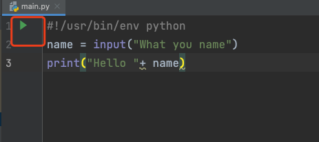


## 2.8 注释

 #为注释

```
# 打印圆的周长: 
print(2 * pi * radius)
```

## 2.9 编码

默认情况下，Python 3 源码文件以 **UTF-8** 编码，所有字符串都是 unicode 字符串。 当然你也可以为源码文件指定不同的编码：

```
# -*- coding: cp-1252 -*-
```

上述定义允许在源文件中使用 Windows-1252 字符集中的字符编码，对应适合语言为保加利亚语、白罗斯语、马其顿语、俄语、塞尔维亚语。

## 2.10 标识符

- 第一个字符必须是字母表中字母或下划线 **_** 。
- 标识符的其他的部分由字母、数字和下划线组成。
- 标识符对大小写敏感。

在 Python 3 中，可以用中文作为变量名，非 ASCII 标识符也是允许的了。

## 2.11 python保留字

保留字即关键字，我们不能把它们用作任何标识符名称。Python 的标准库提供了一个 keyword 模块，可以输出当前版本的所有关键字：

```
>>> import keyword
>>> keyword.kwlist
['False', 'None', 'True', 'and', 'as', 'assert', 'break', 'class', 'continue', 'def', 'del', 'elif', 'else', 'except', 'finally', 'for', 'from', 'global', 'if', 'import', 'in', 'is', 'lambda', 'nonlocal', 'not', 'or', 'pass', 'raise', 'return', 'try', 'while', 'with', 'yield']
```

## 2.12 行与缩进

python最具特色的就是使用缩进来表示代码块，不需要使用大括号 **{}** 。

缩进的空格数是可变的，但是同一个代码块的语句必须包含相同的缩进空格数。实例如下：

## 2.13 实例(Python 3.0+)

if True:    print ("True") else:    print ("False")

以下代码最后一行语句缩进数的空格数不一致，会导致运行错误：

实例

```
if True:
  print ("Answer")
  print ("True")
else:
  print ("Answer")
 print ("False")   # 缩进不一致，会导致运行错误


```

以上程序由于缩进不一致，执行后会出现类似以下错误：

```
 File "test.py", line 6
    print ("False")    # 缩进不一致，会导致运行错误
                                      ^
IndentationError: unindent does not match any outer indentation level
```

## 2.14 数字(Number)类型

python中数字有四种类型：整数、布尔型、浮点数和复数。

- **int** (整数), 如 1, 只有一种整数类型 int，表示为长整型，没有 python2 中的 Long。
- **bool** (布尔), 如 True。
- **float** (浮点数), 如 1.23、3E-2
- **complex** (复数), 如 1 + 2j、 1.1 + 2.2j


## 2.15 字符串(String)

- Python 中单引号 **'** 和双引号 **"** 使用完全相同。
- 使用三引号(**'''** 或 **"""**)可以指定一个多行字符串。
- 转义符 **\**。
- 反斜杠可以用来转义，使用 **r** 可以让反斜杠不发生转义。 如 **r"this is a line with \n"** 则 **\n** 会显示，并不是换行。
- 按字面意义级联字符串，如 **"this " "is " "string"** 会被自动转换为 **this is string**。
- 字符串可以用 **+** 运算符连接在一起，用 ***** 运算符重复。
- Python 中的字符串有两种索引方式，从左往右以 **0** 开始，从右往左以 **-1** 开始。
- ==Python 中的字符串不能改变。==
- Python 没有单独的字符类型，一个字符就是长度为 1 的字符串。
- 字符串的截取的语法格式如下：**变量[头下标:尾下标:步长]**


```
word = '字符串'
sentence = "这是一个句子。"
paragraph = """这是一个段落，
可以由多行组成"""
实例(Python 3.0+)
#!/usr/bin/python3
 
str='123456789'
 
print(str)                 # 输出字符串
print(str[0:-1])           # 输出第一个到倒数第二个的所有字符
print(str[0])              # 输出字符串第一个字符
print(str[2:5])            # 输出从第三个开始到第五个的字符
print(str[2:])             # 输出从第三个开始后的所有字符
print(str[1:5:2])          # 输出从第二个开始到第五个且每隔一个的字符（步长为2）
print(str * 2)             # 输出字符串两次
print(str + '你好')         # 连接字符串
 
print('------------------------------')
 
print('hello\nrunoob')      # 使用反斜杠(\)+n转义特殊字符
print(r'hello\nrunoob')     # 在字符串前面添加一个 r，表示原始字符串，不会发生转义
这里的 r 指 raw，即 raw string，会自动将反斜杠转义，例如：

>>> print('\n')       # 输出空行

>>> print(r'\n')      # 输出 \n
\n
>>>
```


## 2.16 import 与 from...import

在 python 用 **import** 或者 **from...import** 来导入相应的模块。

将整个模块(somemodule)导入，格式为： **import somemodule**

从某个模块中导入某个函数,格式为： **from somemodule import somefunction**

从某个模块中导入多个函数,格式为： **from somemodule import firstfunc, secondfunc, thirdfunc**

将某个模块中的全部函数导入，格式为： **from somemodule import \***

导入 sys 模块

```
import sys
print('================Python import mode==========================')
print ('命令行参数为:')
for i in sys.argv:
    print (i)
print ('\n python 路径为',sys.path)
```


导入 sys 模块的 argv,path 成员

```
导入 sys 模块的 argv,path 成员
from sys import argv,path  #  导入特定的成员
 
print('================python from import===================================')
print('path:',path) # 因为已经导入path成员，所以此处引用时不需要加sys.path
```


# 2.17 命令行参数

很多程序可以执行一些操作来查看一些基本信息，Python可以使用-h参数查看各参数帮助信息：

```
```


# 3 数据类型

==Python 中的变量不需要声明。每个变量在使用前都必须赋值，变量赋值以后该变量才会被创建。==

==在 Python 中，变量就是变量，它没有类型，我们所说的"类型"是变量所指的内存中对象的类型。==

## 多个变量赋值

Python允许你同时为多个变量赋值。例如：

```
a = b = c = 1

a, b, c = 1, 2, "runoob"
```

## 标准数据类型

Python3 中有六个标准的数据类型：

- Number（数字）
- String（字符串）
- List（列表）
- Tuple（元组）
- Set（集合）
- Dictionary（字典）

Python3 的六个标准数据类型中：

- **不可变数据（3 个）：**Number（数字）、String（字符串）、Tuple（元组）；
- **可变数据（3 个）：**List（列表）、Dictionary（字典）、Set（集合）。

## 3.1 Number（数字）

Python3 支持 **int、float、bool、complex（复数）**。

在Python 3里，只有一种整数类型 int，表示为长整型，没有 python2 中的 Long。

像大多数语言一样，数值类型的赋值和计算都是很直观的。

内置的 type() 函数可以用来查询变量所指的对象类型。

```
>>> a , b , c , d = 20 ,5.5,True ,4+3j
>>> print(type(a),type(b),type(c),type(d))
<class 'int'> <class 'float'> <class 'bool'> <class 'complex'>
>>> 
```

可以用instance 判断类型

```
>>> a = 111
>>> isinstance(a,int)
True
```

==isinstance 和 type 的区别在于：==

- type()不会认为子类是一种父类类型。
- isinstance()会认为子类是一种父类类型。


==**注意：***Python3 中，bool 是 int 的子类，True 和 False 可以和数字相加，* **True==1、False==0** *会返回* **True***，但可以通过* **is** *来判断类型。*==

```
>>> issubclass(bool, int) 
True
>>> True==1
True
>>> False==0
True
>>> True+1
2
>>> False+1
1
>>> 1 is True
False
>>> 0 is False
False
```

当你指定一个值时，Number 对象就会被创建：

```
var1 = 1
var2 = 10
```

您也可以使用del语句删除一些对象引用。

==del语句的语法是：==

```
del var1[,var2[,var3[....,varN]]]
```

您可以通过使用del语句删除单个或多个对象。例如：

```
del var
del var_a, var_b
```

### 3.1.1 数值运算

实例

```
\>>> 5 + 4 # 加法
9
\>>> 4.3 - 2 # 减法
2.3
\>>> 3 * 7 # 乘法
21
\>>> 2 / 4 # 除法，得到一个浮点数
0.5
\>>> 2 // 4 # 除法，得到一个整数
0
\>>> 17 % 3 # 取余
2
\>>> 2 ** 5 # 乘方
32
```

### 3.1.2 删除对象引用

```
#!/usr/bin/python3

var  = 3

var1 = 4
print(var)
print(var1)
del var
print(var)
print(var1)

# 结果
3
4
Traceback (most recent call last):
  File "/Users/xxx/xxxx/python/main.py", line 9, in <module>
    print(var)
NameError: name 'var' is not defined
(venv) 

```

### 3.1.3 类型转换

Python 数字类型转换

有时候，我们需要对数据内置的类型进行转换，数据类型的转换，你只需要将数据类型作为函数名即可。

- **int(x)** 将x转换为一个整数。
- **float(x)** 将x转换到一个浮点数。
- **complex(x)** 将x转换到一个复数，实数部分为 x，虚数部分为 0。
- **complex(x, y)** 将 x 和 y 转换到一个复数，实数部分为 x，虚数部分为 y。x 和 y 是数字表达式。

以下实例将浮点数变量 a 转换为整数：

```
>>> a = 1.0
>>> int(a)
1
```


### 3.1.4 数学函数

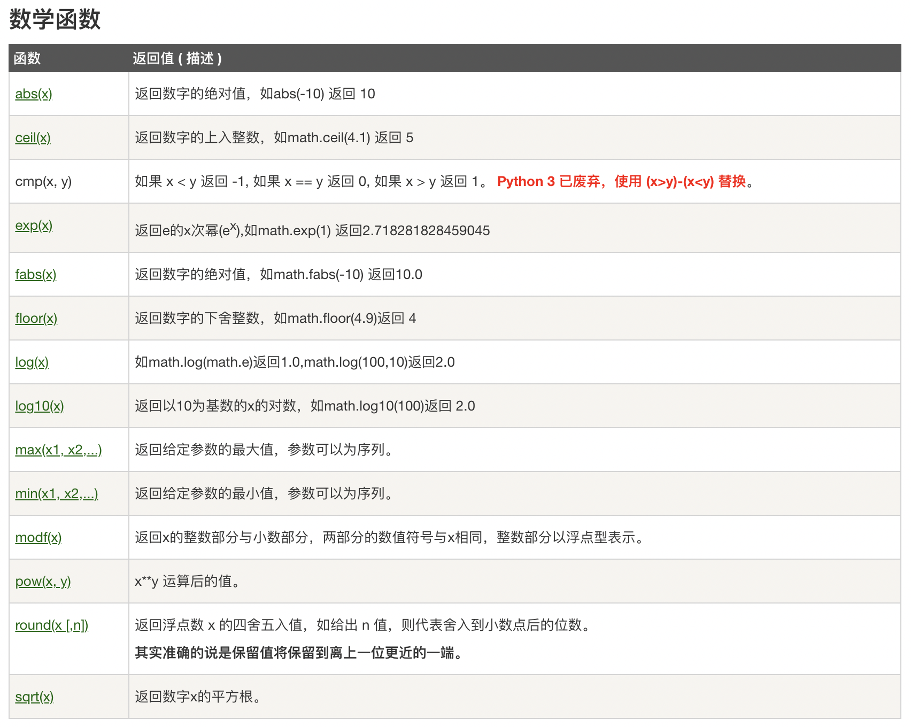

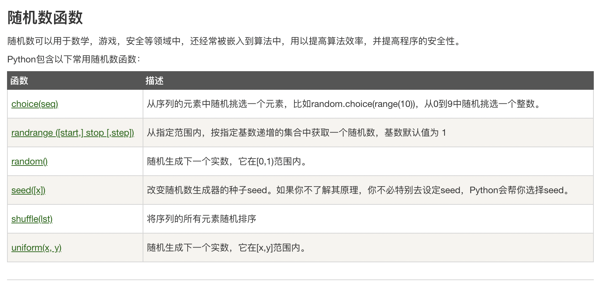


## 3.2 字符串

Python中的字符串用单引号 **'** 或双引号 **"** 括起来，同时使用反斜杠 **\** 转义特殊字符。

字符串的截取的语法格式如下：

```
变量[头下标:尾下标]
```

索引值以 0 为开始值，-1 为从末尾的开始位置。


加号 **+** 是字符串的连接符， 星号 ***** 表示复制当前字符串，与之结合的数字为复制的次数。实例如下：

实例

```

#!/usr/bin/python3

str = 'Runoob'

**print** (str)      # 输出字符串
**print** (str[0:-1])   # 输出第一个到倒数第二个的所有字符
**print** (str[0])    # 输出字符串第一个字符
**print** (str[2:5])   # 输出从第三个开始到第五个的字符
**print** (str[2:])    # 输出从第三个开始的后的所有字符
**print** (str * 2)    # 输出字符串两次，也可以写成 print (2 * str)
**print** (str + "TEST") # 连接字符串


```

执行以上程序会输出如下结果：

```
Runoob
Runoo
R
noo
noob
RunoobRunoob
RunoobTEST
```

Python 使用反斜杠 **\** 转义特殊字符，如果你不想让反斜杠发生转义，可以在字符串前面添加一个 **r**，表示原始字符串：

实例

```
>>> print('Ru\noob')
Ru
oob
>>> print(r'Ru\noob')
Ru\noob
>>>
```

另外，反斜杠(\\)可以作为续行符，表示下一行是上一行的延续。也可以使用 **"""..."""** 或者 **'''...'''** 跨越多行。

注意，Python 没有单独的字符类型，一个字符就是长度为1的字符串。

实例

```
>>> word = 'Python'
>>> print(word[0], word[5])
P n
>>> print(word[-1], word[-6])
n P
```

与 C 字符串不同的是，Python 字符串不能被改变。向一个索引位置赋值，比如word[0] = 'm'会导致错误。

**注意：**

- 1、反斜杠可以用来转义，使用r可以让反斜杠不发生转义。
- 2、字符串可以用+运算符连接在一起，用*运算符重复。
- 3、Python中的字符串有两种索引方式，从左往右以0开始，从右往左以-1开始。
- 4、Python中的字符串不能改变。


单引号和双引号都可以，单引号不能直接嵌套单引号，双引号不能直接嵌套双引号，可以通过\转译符 或者相互嵌套

```
>>> 'Hello Word'
'Hello Word'
>>> "Hello Word"
'Hello Word'
>>> 
```

### 3.2.1 字符串拼接

字符串拼接用+

```
>>> x = "hello"
>>> y = "Word"
>>> print(x+y)
helloWord
>>> 
```

### 3.2.3 字符串str和repx

```
>>> "Hello Word"
'Hello Word'
>>> print("Hello word")
Hello word
>>> 
# 换行符
>>> "Hello \nWord"
'Hello \nWord'
>>> print("Hello \nword")
Hello 
word
>>> 
```


```
>>> print(repr("Hello \nword"))
'Hello \nword'
>>> print(str("Hello \nword"))
Hello 
word
>>> 
```

你可通过使用函数str和repr1直接使用这两种机 制。使用str能以合理的方式将值转换为用户能够看懂的字符串。例如，尽可能将特殊字符编码 转换为相应的字符。然而，使用repr时，通常会获得值的合法Python表达式表示。

### 3.2.4 长字符串、原始字符串和字节

长字符串 '''

```
print('''
This is a very long string. It continues here. And it's not over yet. "Hello, world!"
Still here.
    
''')


$ python main.py

This is a very long string. It continues here. And it's not over yet. "Hello, world!"
Still here.


```

还可使用三个双引号，如"""like this"""。请注意，这让解释器能够识别表示字符串开始 和结束位置的引号，==因此字符串本身可包含单引号和双引号，无需使用反斜杠进行转义。==

原始字符串

不需要转译

```
# 原始字符串
print(r'C:\Program Files\fnord\foo\bar\baz\frozz\bozz')
```


### 3.2.5 Unicode、bytes和bytearray

==Python字符串使用Unicode编码来表示文本。==

1. 要获悉字符的Unicode码点和名称，可在网上使用有关该字符的描述进行搜索，也可参阅特 定的网站，如http://unicode-table.com。

```
>>> "\u00C6"
'Æ'
>>> "\U0001F60A"
'😊'
>>> 
>>> "This is a cat: \N{Cat}"
'This is a cat: 🐈'
>>> 
```


==不可变的bytes 和可变的bytearray。==

```
>>> b'Hello, world!'
b'Hello, world!'
```


```
>>> "Hello, world!".encode("ASCII")
b'Hello, world!'
>>> "Hello, world!".encode("UTF-8")
b'Hello, world!'
>>> "Hello, world!".encode("UTF-32")
b'\xff\xfe\x00\x00H\x00\x00\x00e\x00\x00\x00l\x00\x00\x00l\x00\x00\x00o\x00\x00\x00,\x00\x00\x00 \x00\x00\x00w\x00\x00\x00o\x00\x00\x00r\x00\x00\x00l\x00\x00\x00d\x00\x00\x00!\x00\x00\x00'
>>> 


>>> len("How long is this?".encode("UTF-8")) 17
>>> len("How long is this?".encode("UTF-32")) 72
```

==可不使用方法encode和decode，而直接创建bytes和str(即字符串)对象==，如下所示:

<font color=red size=5x>字符和字符串的转换</font>

```
>>> bytes("Hællå, wørld!", encoding="utf-8")
b'H\xc3\xa6ll\xc3\xa5, w\xc3\xb8rld!'
>>> str(b'H\xc3\xa6ll\xc3\xa5, w\xc3\xb8rld!', encoding="utf-8")
'Hællå, wørld!'
>>> 
```

==bytearray，它是bytes的可变版。==

```
>>> x = bytearray(b"Hello!")
>>> x[1] = ord(b"u")
>>> x
bytearray(b'Hullo!')
>>> 
```


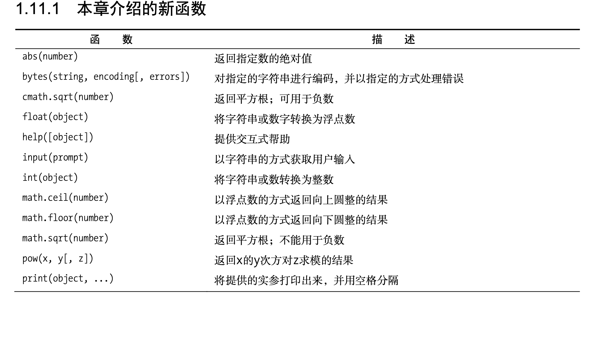

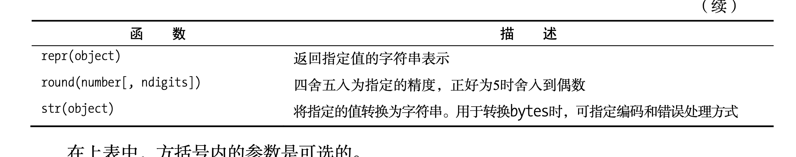

### 3.2.6 字符串运算符

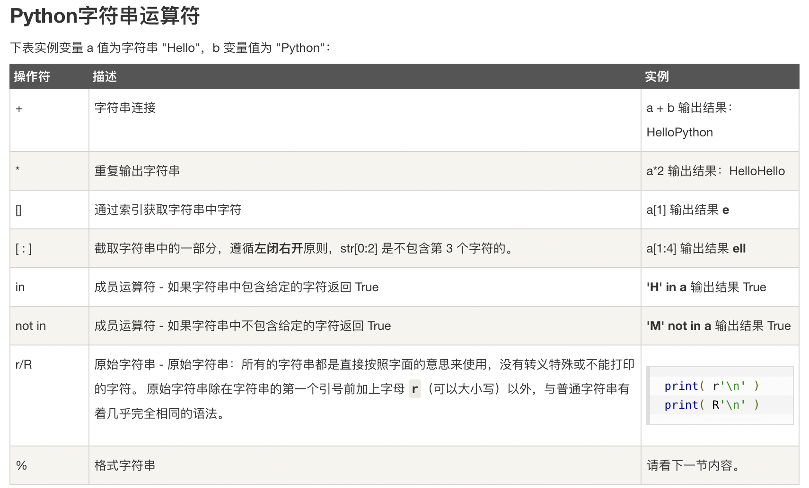


### 3.2.7 字符串格式化

```
#!/usr/bin/python3

print("age %d name %s" % (18,"zhangsan"))

age 18 name zhangsan
```

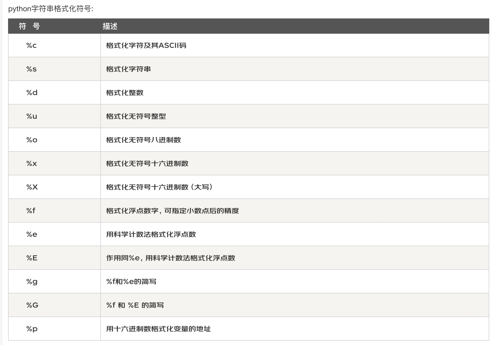

### 3.2. 8 f-string

**f-string** 格式化字符串以 **f** 开头，后面跟着字符串，字符串中的表达式用大括号 {} 包起来，它会将变量或表达式计算后的值替换进去，实例如下：

```
#!/usr/bin/python3

name = 'zhangSan'
print(f'hello {name}')


# 结果
hello zhangSan
```


## 3.3 列表

List（列表）

List（列表） 是 Python 中使用最频繁的数据类型。

列表可以完成大多数集合类的数据结构实现。列表中元素的类型可以不相同，它支持数字，字符串甚至可以包含列表（所谓嵌套）。

列表是写在方括号 **[]** 之间、用逗号分隔开的元素列表。

和字符串一样，列表同样可以被索引和截取，列表被截取后返回一个包含所需元素的新列表。

列表截取的语法格式如下：

```
变量[头下标:尾下标]
```

索引值以 **0** 为开始值，**-1** 为从末尾的开始位置。


加号 **+** 是列表连接运算符，星号 ***** 是重复操作。如下实例：

```
#!/usr/bin/python3

list = [ 'abcd', 786 , 2.23, 'runoob', 70.2 ]
tinylist = [123, 'runoob']

print (list)            # 输出完整列表
print (list[0])         # 输出列表第一个元素
print (list[1:3])       # 从第二个开始输出到第三个元素
print (list[2:])        # 输出从第三个元素开始的所有元素
print (tinylist * 2)    # 输出两次列表
print (list + tinylist) # 连接列表
```


```
['abcd', 768, 'runink', 70.2]
abcd
[768, 'runink']
['runink', 70.2]
[123, 'kk', 123, 'kk']
['abcd', 768, 'runink', 70.2, 123, 'kk']
(venv) 
```

与Python字符串不一样的是，列表中的元素是可以改变的：

```
>>> a = [1, 2, 3, 4, 5, 6]
>>> a[0] = 9
>>> a[2:5] = [13, 14, 15]
>>> a
[9, 2, 13, 14, 15, 6]
>>> a[2:5] = []   # 将对应的元素值设置为 []
>>> a
[9, 2, 6]
```


List 内置了有很多方法，例如 append()、pop() 等等，这在后面会讲到。

**注意：**

- 1、List写在方括号之间，元素用逗号隔开。
- 2、和字符串一样，list可以被索引和切片。
- 3、List可以使用+操作符进行拼接。
- 4、List中的元素是可以改变的。

Python 列表截取可以接收第三个参数，参数作用是截取的步长，以下实例在索引 1 到索引 4 的位置并设置为步长为 2（间隔一个位置）来截取字符串：


如果第三个参数为负数表示逆向读取，以下实例用于翻转字符串：


==更新列表==

可以使用 append() 方法来添加列表项

```python
#!/usr/bin/python3

list = ['Google', 'Runoob', 1997, 2000]

print("第三个元素： ", list[2])
list[2] = 10000
print("更新后的第三个元素 ： ", list[2])

list.append("baidu")

print("append后的list； ", list)

# 结果
第三个元素：  1997
更新后的第三个元素 ：  10000
append后的list；  ['Google', 'Runoob', 10000, 2000, 'baidu']

```


==删除元素==

```
#!/usr/bin/python3

list = ['Google', 'Runoob', 1997, 2000]

print("原始列表 : ",list)
del list[1]
list.remove("Google")
print("删除第二个元素后列表 : ",list)


# 结果
原始列表 :  ['Google', 'Runoob', 1997, 2000]
删除第二个元素后列表 :  [1997, 2000]
```


==Python列表脚本操作符==

列表对 + 和 * 的操作符与字符串相似。+ 号用于组合列表，* 号用于重复列表。

如下所示：

| Python 表达式                         | 结果                         | 描述                 |
| :------------------------------------ | :--------------------------- | :------------------- |
| len([1, 2, 3])                        | 3                            | 长度                 |
| [1, 2, 3] + [4, 5, 6]                 | [1, 2, 3, 4, 5, 6]           | 组合                 |
| ['Hi!'] * 4                           | ['Hi!', 'Hi!', 'Hi!', 'Hi!'] | 重复                 |
| 3 in [1, 2, 3]                        | True                         | 元素是否存在于列表中 |
| for x in [1, 2, 3]: print(x, end=" ") | 1 2 3                        | 迭代                 |


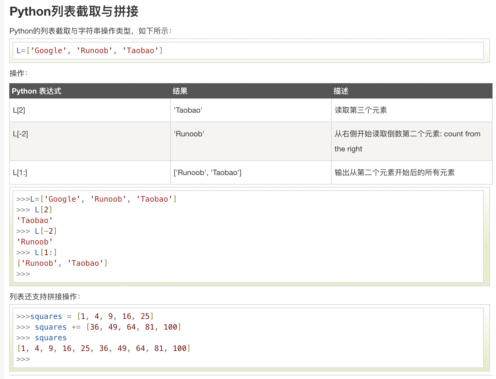


==嵌套列表==

```
#!/usr/bin/python3

list1 = [1, "2", "g", "kk"]

list2 = ["lk,2,", 34.56]

list = [list1, list2]
print("list : ", list)
print("list : ", list[0][1])

#结果
list :  [[1, '2', 'g', 'kk'], ['lk,2,', 34.56]]
list :  2
```

==列表比较==

列表比较需要引入 **operator** 模块的 **eq** 方法（详见：[Python operator 模块](https://www.runoob.com/python3/python-operator.html)）：

```
#!/usr/bin/python3
import operator

a = [1, 2]
b = [3, 4]
c = [3, 4]

print("operator.eq(a,b):", operator.eq(a, b))
print("operator.eq(b,c):", operator.eq(c, b))

# 结果
operator.eq(a,b): False
operator.eq(b,c): True
```

==Python列表函数&方法==

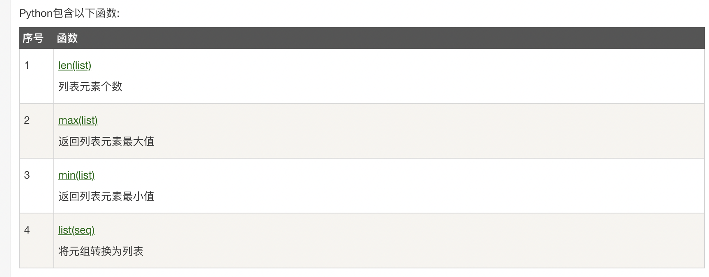

```
#!/usr/bin/python3
import operator

a = [1, 2, 34, 12, 23, 33]
b = ("j", 1, 8)

print("len", len(a))

print("max", max(a))

print("min", min(a))

print("list", list(b))


# 结果
len 6
max 34
min 1
list ['j', 1, 8]
```


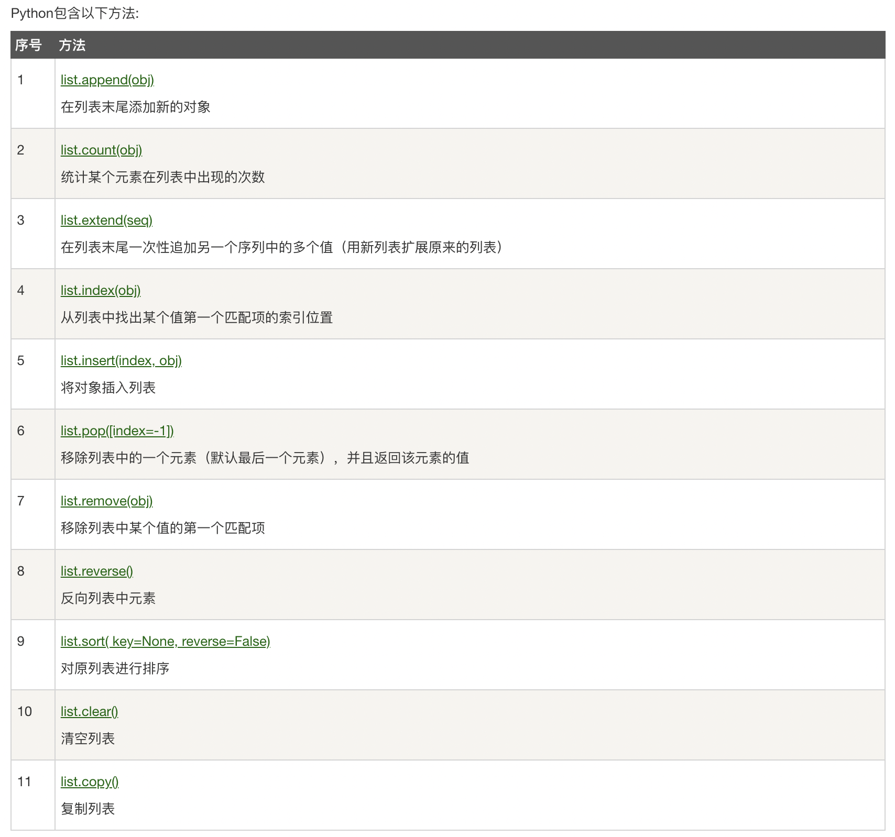

```python
#!/usr/bin/python3
import operator

a = [1, 2, 34, 12, 23, 33, 33]
b = (1, 8)

a.append(99)
print("末尾添加元素后", a)

print("列表中33出现次数", a.count(33))

a.extend(b)
print("在尾部一次性追加多个列表的之后", a)

print("列表中33第一次出现的索引位置", a.index(33))

a.insert(3, 999)
print("将对象插入列表并制定索引", a)

pop = a.pop(-1)
print("移除列表中的一个元素（默认最后一个元素），并且返回该元素的值", pop)

a.reverse()
print("反向后的值", a)

# reverse -- 排序规则，reverse = True 降序， reverse = False 升序（默认）。
# 必须类型相同才能排序
a.sort()
print("排序后的列表", a)

print("复制后的列表", a.copy())

a.clear()
print("清空后的列表", a)

```


```python
末尾添加元素后 [1, 2, 34, 12, 23, 33, 33, 99]
列表中33出现次数 2
在尾部一次性追加多个列表的之后 [1, 2, 34, 12, 23, 33, 33, 99, 1, 8]
列表中33第一次出现的索引位置 5
将对象插入列表并制定索引 [1, 2, 34, 999, 12, 23, 33, 33, 99, 1, 8]
移除列表中的一个元素（默认最后一个元素），并且返回该元素的值 8
反向后的值 [1, 99, 33, 33, 23, 12, 999, 34, 2, 1]
排序后的列表 [1, 1, 2, 12, 23, 33, 33, 34, 99, 999]
复制后的列表 [1, 1, 2, 12, 23, 33, 33, 34, 99, 999]
清空后的列表 []
```


## 3.4 Tuple（元组）

元组（tuple）与列表类似，不同之处在于元组的元素不能修改。元组写在小括号 **()** 里，元素之间用逗号隔开。

元组中的元素类型也可以不相同：

```
#!/usr/bin/python3

tuple = ( 'abcd', 786 , 2.23, 'runoob', 70.2  )
tinytuple = (123, 'runoob')

print (tuple)             # 输出完整元组
print (tuple[0])          # 输出元组的第一个元素
print (tuple[1:3])        # 输出从第二个元素开始到第三个元素
print (tuple[2:])         # 输出从第三个元素开始的所有元素
print (tinytuple * 2)     # 输出两次元组
print (tuple + tinytuple) # 连接元组
```

```
('abcd', 786, 2.23, 'runoob', 70.2)
abcd
(786, 2.23)
(2.23, 'runoob', 70.2)
(123, 'runoob', 123, 'runoob')
('abcd', 786, 2.23, 'runoob', 70.2, 123, 'runoob')
```

元组与字符串类似，可以被索引且下标索引从0开始，-1 为从末尾开始的位置。也可以进行截取（看上面，这里不再赘述）。

其实，可以把字符串看作一种特殊的元组。

```
>>> tup = (1, 2, 3, 4, 5, 6)
>>> print(tup[0])
1
>>> print(tup[1:5])
(2, 3, 4, 5)
>>> tup[0] = 11  # 修改元组元素的操作是非法的
Traceback (most recent call last):
  File "<stdin>", line 1, in <module>
TypeError: 'tuple' object does not support item assignment
>>>
```

虽然tuple的元素不可改变，但它可以包含可变的对象，比如list列表。

构造包含 0 个或 1 个元素的元组比较特殊，所以有一些额外的语法规则：

```
tup1 = ()    # 空元组
tup2 = (20,) # 一个元素，需要在元素后添加逗号
```

string、list 和 tuple 都属于 sequence（序列）。

**注意：**

- 1、与字符串一样，元组的元素不能修改。
- 2、元组也可以被索引和切片，方法一样。
- 3、注意构造包含 0 或 1 个元素的元组的特殊语法规则。
- 4、元组也可以使用+操作符进行拼接。

### 3.4.1 元组运算符

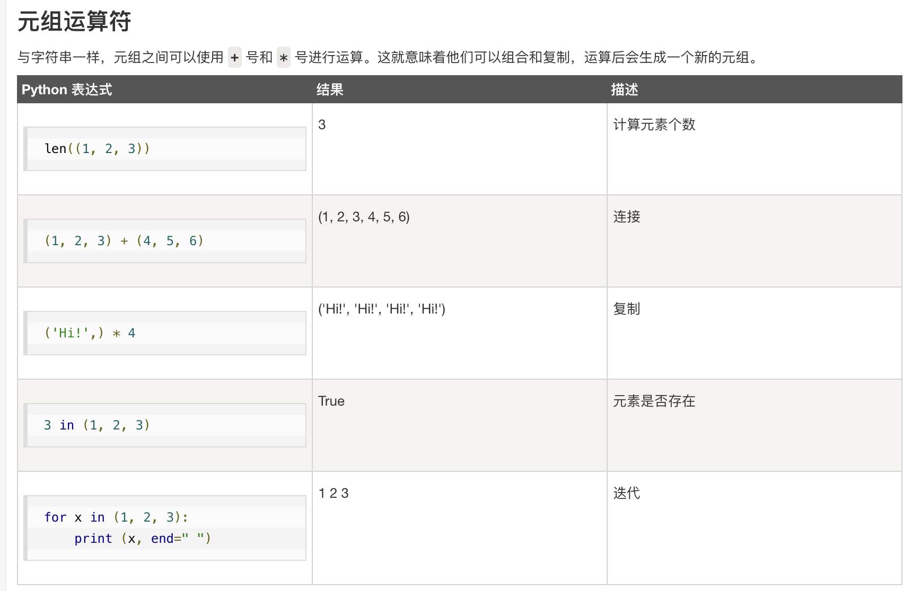


### 3.4.2 元组的截取

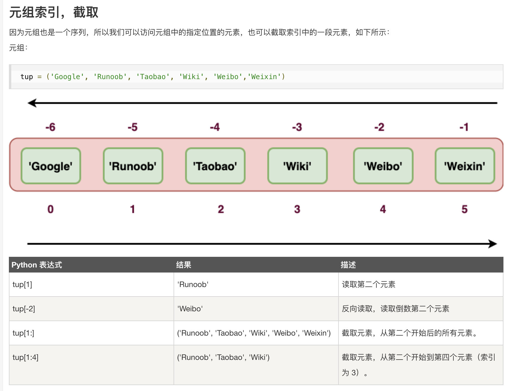


### 3.4.3 元组内置函数

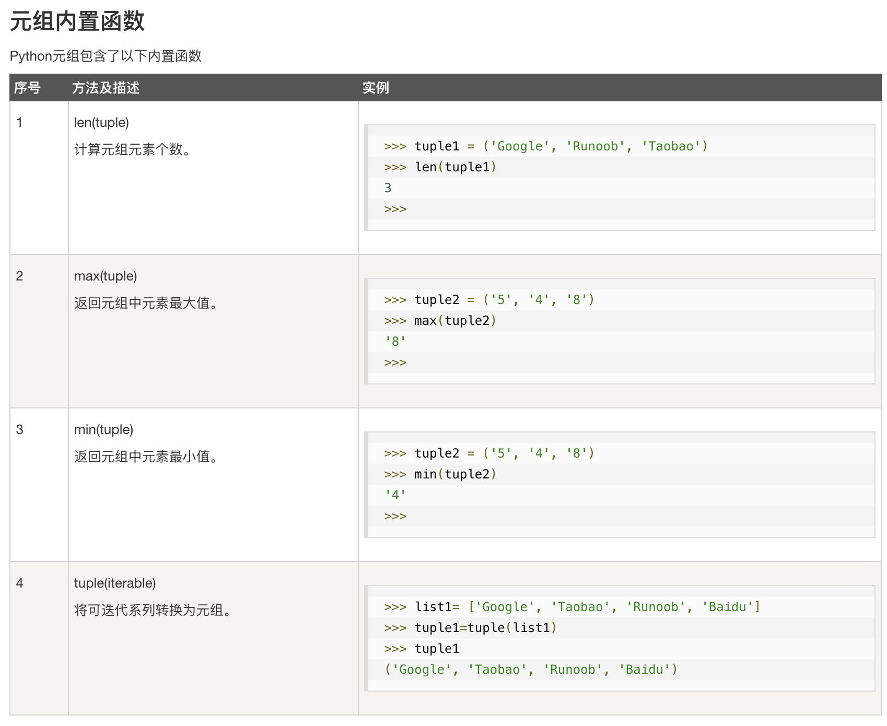


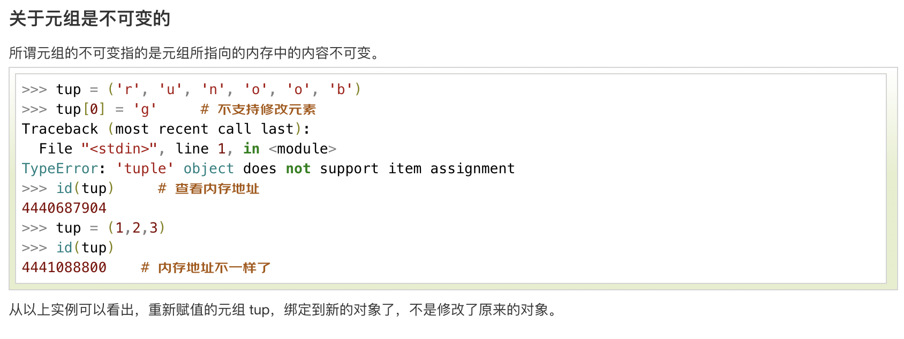


## 3.5 集合Set

Set（集合）

集合（set）是由一个或数个形态各异的大小整体组成的，构成集合的事物或对象称作元素或是成员。

基本功能是进行成员关系测试和删除重复元素。

==可以使用大括号 **{ }** 或者 **set()** 函数创建集合，注意：创建一个空集合必须用 **set()** 而不是 **{ }**，因为 **{ }** 是用来创建一个空字典。==

创建格式：

```
parame = {value01,value02,...}
或者
set(value)
```

```
#!/usr/bin/python3

sites = {'Google', 'Taobao', 'Runoob', 'Facebook', 'Zhihu', 'Baidu'}

print(sites)   # 输出集合，重复的元素被自动去掉

# 成员测试
if 'Runoob' in sites :
    print('Runoob 在集合中')
else :
    print('Runoob 不在集合中')


# set可以进行集合运算
a = set('abracadabra')
b = set('alacazam')

print(a)

print(a - b)     # a 和 b 的差集

print(a | b)     # a 和 b 的并集

print(a & b)     # a 和 b 的交集

print(a ^ b)     # a 和 b 中不同时存在的元素
```


```
{'Zhihu', 'Baidu', 'Taobao', 'Runoob', 'Google', 'Facebook'}
Runoob 在集合中
{'b', 'c', 'a', 'r', 'd'}
{'r', 'b', 'd'}
{'b', 'c', 'a', 'z', 'm', 'r', 'l', 'd'}
{'c', 'a'}
{'z', 'b', 'm', 'r', 'l', 'd'}
```

### 3.5.1 内置函数

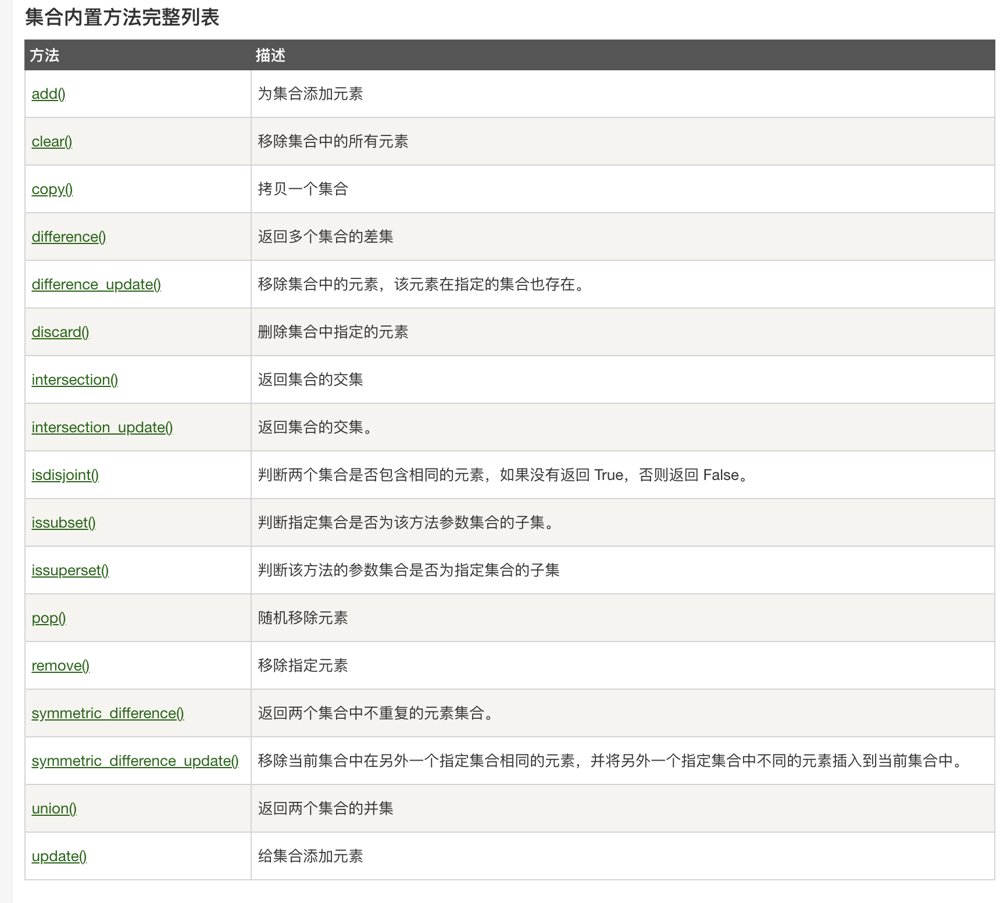


## 3.6 Dictionary（字典）

字典（dictionary）是Python中另一个非常有用的内置数据类型。

列表是有序的对象集合，字典是无序的对象集合。两者之间的区别在于：字典当中的元素是通过键来存取的，而不是通过偏移存取。

字典是一种映射类型，字典用 **{ }** 标识，它是一个无序的 **键(key) : 值(value)** 的集合。

键(key)必须使用不可变类型。

在同一个字典中，键(key)必须是唯一的。

```
#!/usr/bin/python3

dict = {}
dict['one'] = "1 - 菜鸟教程"
dict[2]     = "2 - 菜鸟工具"

tinydict = {'name': 'runoob','code':1, 'site': 'www.runoob.com'}


print (dict['one'])       # 输出键为 'one' 的值
print (dict[2])           # 输出键为 2 的值
print (tinydict)          # 输出完整的字典
print (tinydict.keys())   # 输出所有键
print (tinydict.values()) # 输出所有值
```


```
1 - 菜鸟教程
2 - 菜鸟工具
{'name': 'runoob', 'code': 1, 'site': 'www.runoob.com'}
dict_keys(['name', 'code', 'site'])
dict_values(['runoob', 1, 'www.runoob.com'])
```

构造函数 dict() 可以直接从键值对序列中构建字典如下：

```
>>> dict([('Runoob', 1), ('Google', 2), ('Taobao', 3)])
{'Runoob': 1, 'Google': 2, 'Taobao': 3}
>>> {x: x**2 for x in (2, 4, 6)}
{2: 4, 4: 16, 6: 36}
>>> dict(Runoob=1, Google=2, Taobao=3)
{'Runoob': 1, 'Google': 2, 'Taobao': 3}
```

**{x: x\**2 for x in (2, 4, 6)}** 该代码使用的是字典推导式，更多推导式内容可以参考：[Python 推导式](https://www.runoob.com/python3/python-comprehensions.html)。

另外，字典类型也有一些内置的函数，例如 clear()、keys()、values() 等。

**注意：**

- 1、字典是一种映射类型，它的元素是键值对。
- 2、字典的关键字必须为不可变类型，且不能重复。
- 3、创建空字典使用 **{ }**。


### 3.6.1 内置函数创建dict

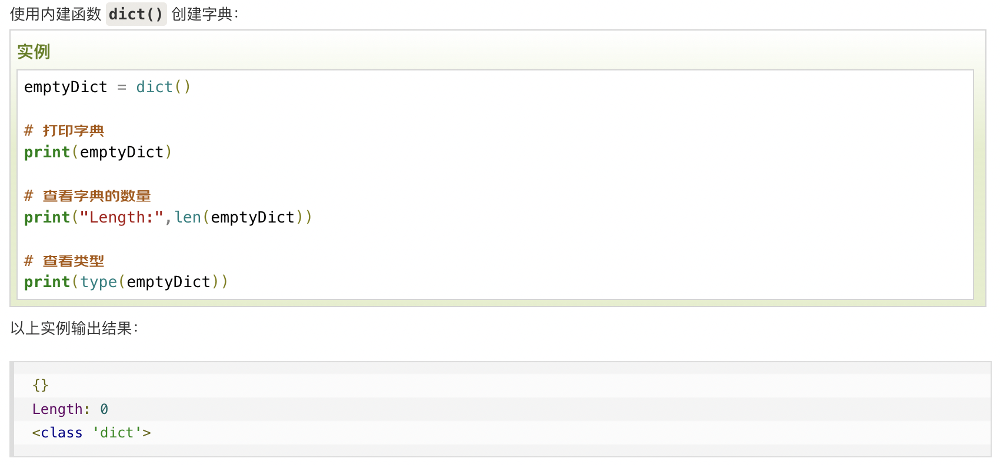


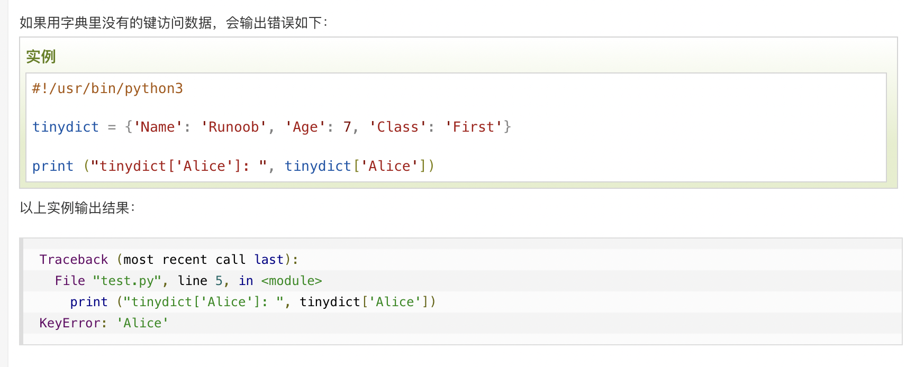

### 3.6.2 内置函数

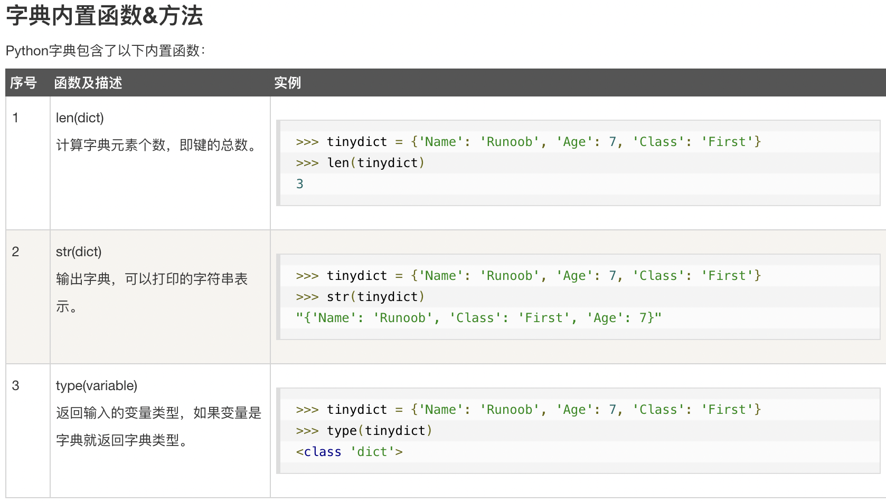


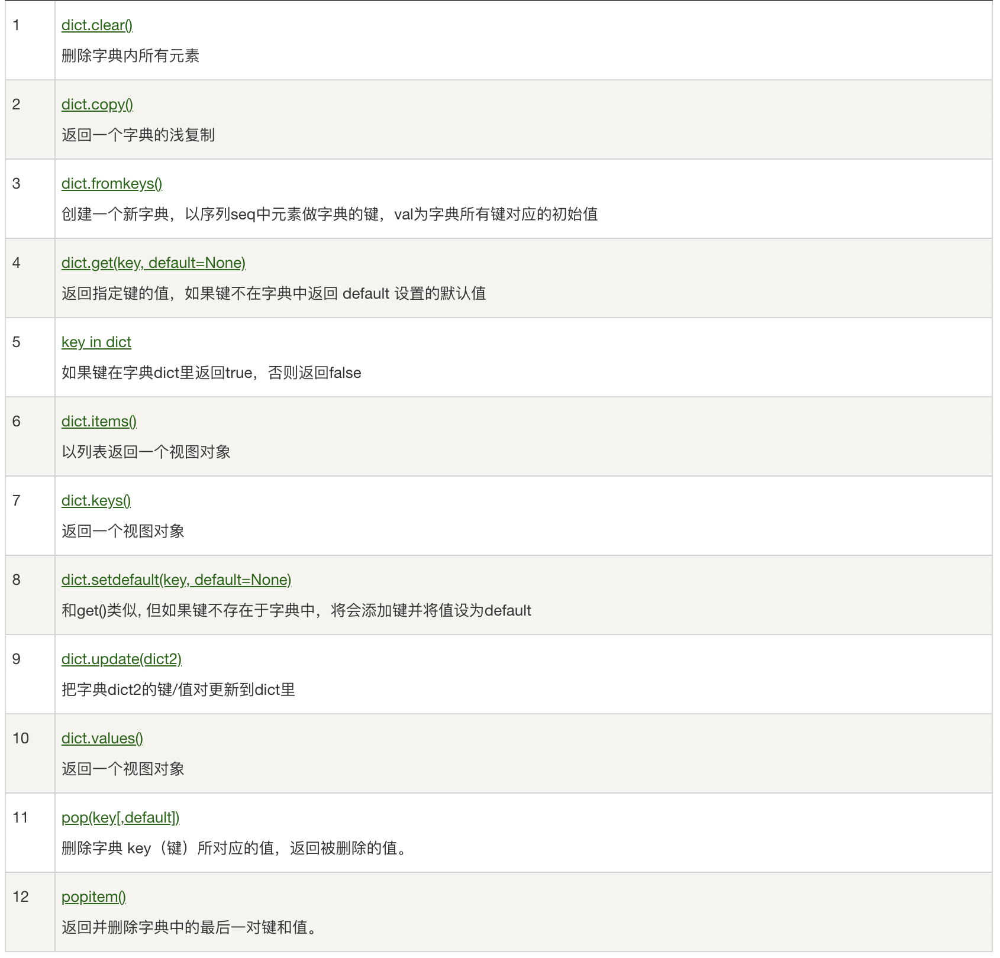

# 4 Python数据类型转换

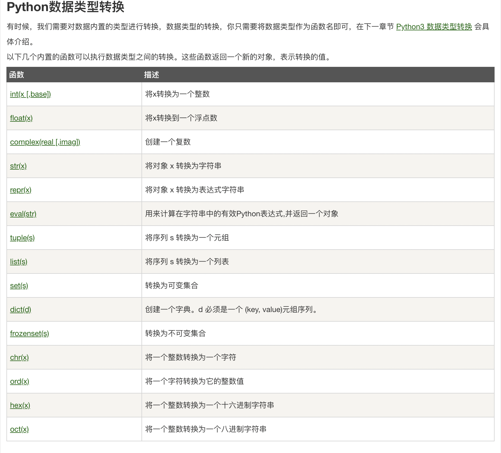


## 4.1 隐式转换

在隐式类型转换中，Python 会自动将一种数据类型转换为另一种数据类型，不需要我们去干预。

以下实例中，我们对两种不同类型的数据进行运算，较低数据类型（整数）就会转换为较高数据类型（浮点数）以避免数据丢失。

## 实例

num_int = 123
num_flo = 1.23

num_new = num_int + num_flo

**print**("datatype of num_int:",type(num_int))
**print**("datatype of num_flo:",type(num_flo))

**print**("Value of num_new:",num_new)
**print**("datatype of num_new:",type(num_new))

以上实例输出结果为：

```
num_int 数据类型为: <class 'int'>
num_flo 数据类型为: <class 'float'>
num_new: 值为: 124.23
num_new 数据类型为: <class 'float'>
```

代码解析：

- 实例中我们对两个不同数据类型的变量 `num_int` 和 `num_flo` 进行相加运算，并存储在变量 `num_new` 中。
- 然后查看三个变量的数据类型。
- 在输出结果中，我们看到 `num_int` 是 `整型（integer）` ， `num_flo` 是 `浮点型（float）`。
- 同样，新的变量 `num_new` 是 `浮点型（float）`，这是因为 Python 会将较小的数据类型转换为较大的数据类型，以避免数据丢失。

我们再看一个实例，整型数据与字符串类型的数据进行相加：

## 4.2 显式类型转换

在显式类型转换中，用户将对象的数据类型转换为所需的数据类型。 我们使用 int()、float()、str() 等预定义函数来执行显式类型转换。

**int()** 强制转换为整型：

实例

```
x = int(1)  # x 输出结果为 1
y = int(2.8) # y 输出结果为 2
z = int("3") # z 输出结果为 3
```

**float()** 强制转换为浮点型：

实例

```
x = float(1)   # x 输出结果为 1.0
y = float(2.8)  # y 输出结果为 2.8
z = float("3")  # z 输出结果为 3.0
w = float("4.2") # w 输出结果为 4.2
```

**str()** 强制转换为字符串类型：

实例

```
x = str("s1") # x 输出结果为 's1'
y = str(2)   # y 输出结果为 '2'
z = str(3.0) # z 输出结果为 '3.0'
```

整型和字符串类型进行运算，就可以用强制类型转换来完成：

实例

```
num_int = 123
num_str = "456"
```

**print**("num_int 数据类型为:",type(num_int))
**print**("类型转换前，num_str 数据类型为:",type(num_str))

num_str = int(num_str)   # 强制转换为整型
**print**("类型转换后，num_str 数据类型为:",type(num_str))

num_sum = num_int + num_str

**print**("num_int 与 num_str 相加结果为:",num_sum)
**print**("sum 数据类型为:",type(num_sum))

以上实例输出结果为：

```
num_int 数据类型为: <class 'int'>
类型转换前，num_str 数据类型为: <class 'str'>
类型转换后，num_str 数据类型为: <class 'int'>
num_int 与 num_str 相加结果为: 579
sum 数据类型为: <class 'int'>
```


# 5 推导式

Python 推导式是一种独特的数据处理方式，可以从一个数据序列构建另一个新的数据序列的结构体。

Python 支持各种数据结构的推导式：

- 列表(list)推导式
- 字典(dict)推导式
- 集合(set)推导式
- 元组(tuple)推导式

## 5.1 列表推导式

列表推导式格式为：

```
[表达式 for 变量 in 列表] 
[out_exp_res for out_exp in input_list]

或者 

[表达式 for 变量 in 列表 if 条件]
[out_exp_res for out_exp in input_list if condition]
```

- out_exp_res：列表生成元素表达式，可以是有返回值的函数。
- for out_exp in input_list：迭代 input_list 将 out_exp 传入到 out_exp_res 表达式中。
- if condition：条件语句，可以过滤列表中不符合条件的值。

过滤掉长度小于或等于3的字符串列表，并将剩下的转换成大写字母：

实例

```
>>> names = ['Bob','Tom','alice','Jerry','Wendy','Smith']
>>> new_names = [name.upper()for name in names if len(name)>3]
>>> print(new_names)
['ALICE', 'JERRY', 'WENDY', 'SMITH']
```


计算 30 以内可以被 3 整除的整数：

实例

```
num = [ i for i in range(30) if i %3 ==0]
print(num)

[0, 3, 6, 9, 12, 15, 18, 21, 24, 27]
```


## 5.2 字典推导式

字典推导基本格式：

```
{ key_expr: value_expr for value in collection }

或

{ key_expr: value_expr for value in collection if condition }
```


```
#!/usr/bin/python3

list1 = {"aa": 1, "bb": "g"}

num = {k: len(k) for k in list1 if k == "aa"}
num1 = {k: list1[k] for k in list1 if k == "aa"}
print(num)
print(num1)


{'aa': 2}
{'aa': 1}
```

提供三个数字，以三个数字为键，三个数字的平方为值来创建字典：

```
dic = {k : k**2 for k in {2,4,6}}

print(dic)
{2: 4, 4: 16, 6: 36}
```

## 5.3 集合推导式

集合推导式基本格式：

```
{ expression for item in Sequence }
或
{ expression for item in Sequence if conditional }
```

计算数字 1,2,3 的平方数：

实例

```
>>> setnew = {i**2 **for** i **in** (1,2,3)}
>>> setnew
{1, 4, 9}
```

判断不是 abc 的字母并输出：

实例

```
a = {x for x in 'abracadabra' if x not in 'abc'}
print(a)

{'d', 'r'}
>>> type(a)
<class 'set'>
```

## 5.4 元组推导式

元组推导式可以利用 range 区间、元组、列表、字典和集合等数据类型，快速生成一个满足指定需求的元组。

元组推导式基本格式：

```
(expression for item in Sequence )
或
(expression for item in Sequence if conditional )
```

元组推导式和列表推导式的用法也完全相同，只是元组推导式是用 **()** 圆括号将各部分括起来，而列表推导式用的是中括号 **[]**，另外元组推导式返回的结果是一个生成器对象。

例如，我们可以使用下面的代码生成一个包含数字 1~9 的元组：

```
>>> a = (x for x in range(1,10))
>>> a
<generator object <genexpr> at 0x7faf6ee20a50>  # 返回的是生成器对象

>>> tuple(a)       # 使用 tuple() 函数，可以直接将生成器对象转换成元组
(1, 2, 3, 4, 5, 6, 7, 8, 9)
```


# 6 Python3 注释

确保对模块, 函数, 方法和行内注释使用正确的风格。

Python 中的注释有单行注释和多行注释。

Python 中单行注释以 **#** 开头，例如：

```
# 这是一个注释 print("Hello, World!")
```

多行注释用三个单引号 **'''** 或者三个双引号 **"""** 将注释括起来，例如:

## 6.1 单引号（'''）

```
#!/usr/bin/python3 
'''
这是多行注释，用三个单引号
这是多行注释，用三个单引号 
这是多行注释，用三个单引号
'''
print("Hello, World!")
```


## 6.2 双引号（"""）

```
#!/usr/bin/python3 
"""
这是多行注释，用三个双引号
这是多行注释，用三个双引号 
这是多行注释，用三个双引号
"""
print("Hello, World!")
```

# 7 运算符

## 7.1 Python逻辑运算符

Python语言支持逻辑运算符，以下假设变量 a 为 10, b为 20:

| 运算符 | 逻辑表达式 | 描述                                                         | 实例                    |
| :----- | :--------- | :----------------------------------------------------------- | :---------------------- |
| and    | x and y    | 布尔"与" - 如果 x 为 False，x and y 返回 x 的值，否则返回 y 的计算值。 | (a and b) 返回 20。     |
| or     | x or y     | 布尔"或" - 如果 x 是 True，它返回 x 的值，否则它返回 y 的计算值。 | (a or b) 返回 10。      |
| not    | not x      | 布尔"非" - 如果 x 为 True，返回 False 。如果 x 为 False，它返回 True。 | not(a and b) 返回 False |

以上实例输出结果：

```
#!/usr/bin/python3
 
a = 10
b = 20
 
if ( a and b ):
   print ("1 - 变量 a 和 b 都为 true")
else:
   print ("1 - 变量 a 和 b 有一个不为 true")
 
if ( a or b ):
   print ("2 - 变量 a 和 b 都为 true，或其中一个变量为 true")
else:
   print ("2 - 变量 a 和 b 都不为 true")
 
# 修改变量 a 的值
a = 0
if ( a and b ):
   print ("3 - 变量 a 和 b 都为 true")
else:
   print ("3 - 变量 a 和 b 有一个不为 true")
 
if ( a or b ):
   print ("4 - 变量 a 和 b 都为 true，或其中一个变量为 true")
else:
   print ("4 - 变量 a 和 b 都不为 true")
 
if not( a and b ):
   print ("5 - 变量 a 和 b 都为 false，或其中一个变量为 false")
else:
   print ("5 - 变量 a 和 b 都为 true")
```


```
1 - 变量 a 和 b 都为 true
2 - 变量 a 和 b 都为 true，或其中一个变量为 true
3 - 变量 a 和 b 有一个不为 true
4 - 变量 a 和 b 都为 true，或其中一个变量为 true
5 - 变量 a 和 b 都为 false，或其中一个变量为 false
```


## 7.2 成员运算符

Python成员运算符

除了以上的一些运算符之外，Python还支持成员运算符，测试实例中包含了一系列的成员，包括字符串，列表或元组。

| 运算符 | 描述                                                    | 实例                                              |
| :----- | :------------------------------------------------------ | :------------------------------------------------ |
| in     | 如果在指定的序列中找到值返回 True，否则返回 False。     | x 在 y 序列中 , 如果 x 在 y 序列中返回 True。     |
| not in | 如果在指定的序列中没有找到值返回 True，否则返回 False。 | x 不在 y 序列中 , 如果 x 不在 y 序列中返回 True。 |

以下实例演示了Python所有成员运算符的操作：

```
#!/usr/bin/python3
 
a = 10
b = 20
list = [1, 2, 3, 4, 5 ]
 
if ( a in list ):
   print ("1 - 变量 a 在给定的列表中 list 中")
else:
   print ("1 - 变量 a 不在给定的列表中 list 中")
 
if ( b not in list ):
   print ("2 - 变量 b 不在给定的列表中 list 中")
else:
   print ("2 - 变量 b 在给定的列表中 list 中")
 
# 修改变量 a 的值
a = 2
if ( a in list ):
   print ("3 - 变量 a 在给定的列表中 list 中")
else:
   print ("3 - 变量 a 不在给定的列表中 list 中")
   
   
以上实例输出结果：

1 - 变量 a 不在给定的列表中 list 中
2 - 变量 b 不在给定的列表中 list 中
3 - 变量 a 在给定的列表中 list 中
```


## 7.3 身份运算符

Python身份运算符

身份运算符用于比较两个对象的存储单元

| 运算符 | 描述                                        | 实例                                                         |
| :----- | :------------------------------------------ | :----------------------------------------------------------- |
| is     | is 是判断两个标识符是不是引用自一个对象     | **x is y**, 类似 **id(x) == id(y)** , 如果引用的是同一个对象则返回 True，否则返回 False |
| is not | is not 是判断两个标识符是不是引用自不同对象 | **x is not y** ， 类似 **id(x) != id(y)**。如果引用的不是同一个对象则返回结果 True，否则返回 False。 |

==**注：** [id()](https://www.runoob.com/python/python-func-id.html) 函数用于获取对象内存地址。==

以下实例演示了Python所有身份运算符的操作：

```
#!/usr/bin/python3
 
a = 20
b = 20
 
if ( a is b ):
   print ("1 - a 和 b 有相同的标识")
else:
   print ("1 - a 和 b 没有相同的标识")
 
if ( id(a) == id(b) ):
   print ("2 - a 和 b 有相同的标识")
else:
   print ("2 - a 和 b 没有相同的标识")
 
# 修改变量 b 的值
b = 30
if ( a is b ):
   print ("3 - a 和 b 有相同的标识")
else:
   print ("3 - a 和 b 没有相同的标识")
 
if ( a is not b ):
   print ("4 - a 和 b 没有相同的标识")
else:
   print ("4 - a 和 b 有相同的标识")
   
以上实例输出结果：

1 - a 和 b 有相同的标识
2 - a 和 b 有相同的标识
3 - a 和 b 没有相同的标识
4 - a 和 b 没有相同的标识
```

is 与 == 区别：

==is 用于判断两个变量引用对象是否为同一个， == 用于判断引用变量的值是否相等。==

```
>>>a = [1, 2, 3]
>>> b = a
>>> b is a 
True
>>> b == a
True
>>> b = a[:]
>>> b is a
False
>>> b == a
True
```


==and 拥有更高优先级:==

实例

```
x = True
y = False
z = False
 
if x or y and z:
    print("yes")
else:
    print("no")
```


以上实例先计算 **y and z** 并返回 False ，然后 **x or False** 返回 True，输出结果：

```
yes
```


# 8 编程

## 8.1 end关键字

```
#!/usr/bin/python3

a, b = 0, 1

while b < 100:
    print(b, end=',')
    a, b = b, a + b


1,1,2,3,5,8,13,21,34,55,89,
```


## 8.2 条件控制

==Python 中用 **elif** 代替了 **else if**，所以if语句的关键字为：**if – elif – else**。==

```
#!/usr/bin/python3

a = 2

if a == 1:
    print("a==", a)
elif a == 2:
    print("a==", a)
else:
    print("a==", a)

a== 2
```


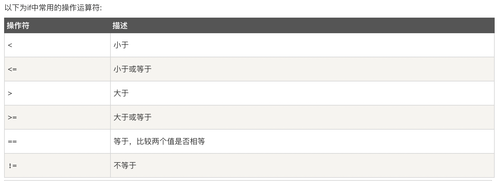


## 8.3 循环语句

**break** 语句可以跳出 for 和 while 的循环体。如果你从 for 或 while 循环中终止，任何对应的循环 else 块将不执行。

**continue** 语句被用来告诉 Python 跳过当前循环块中的剩余语句，然后继续进行下一轮循环。

```
while 循环
Python 中 while 语句的一般形式：

while 判断条件(condition)：
    执行语句(statements)……
```

## 8.4 pass

## pass 语句

Python pass是空语句，是为了保持程序结构的完整性。

pass 不做任何事情，一般用做占位语句，如下实例

```
#!/usr/bin/python3

for letter in 'Runoob':
    if letter == 'o':
        pass
        print('执行 pass 块')
    print('当前字母 :', letter)

print("Good bye!")

# 结果
当前字母 : R
当前字母 : u
当前字母 : n
执行 pass 块
当前字母 : o
执行 pass 块
当前字母 : o
当前字母 : b
Good bye!
```

# 9 Python3 迭代器与生成器

```
#!/usr/bin/python3

list = [1,2,3,4]
it = iter(list)
print(next(it))
print(next(it))
print(next(it))
print(next(it))
print(next(it))

1
2
3
4
Traceback (most recent call last):
  File "/Users/xxx/xxx/python/main.py", line 9, in <module>
    print(next(it))
超长报错
```


For 自动结尾

```
#!/usr/bin/python3

list = [1,2,3,4]
it = iter(list)

for i in it:
    print(i)
    
1
2
3
4

```


While 

```
#!/usr/bin/python3
import sys

list = [1,2,3,4]
it = iter(list)

while True:
    try:
        print(next(it))
    except StopIteration:
        sys.exit()
        
#结果
1
2
3
4

```

# 10 创建迭代器

```
class MyNumbers:
    def __iter__(self):
        self.a = 1
        return self

    def __next__(self):
        s = self.a
        self.a += 1
        return s

myclass = MyNumbers()
myiter = iter(myclass)

print(next(myiter))
print(next(myiter))
print(next(myiter))
print(next(myiter))
print(next(myiter))


$ python3 main.py
1
2
3
4
5

```

__iter__() 方法返回一个特殊的迭代器对象， 这个迭代器对象实现了 __next__() 方法并通过 StopIteration 异常标识迭代的完成。

__next__() 方法（Python 2 里是 next()）会返回下一个迭代器对象。

创建一个返回数字的迭代器，初始值为 1，逐步递增 1：

```
class MyNumbers:
    def __iter__(self):
        self.a = 1
        return self

    def __next__(self):
        if self.a < 20:
            x = self.a
            self.a += 1
            return x
        else:
            raise StopIteration

myclass = MyNumbers()
myiter = iter(myclass)

for i in myiter:
    print(i)
    
1
2
3
4
5
6
7
8
9
10
11
12
13
14
15
16
17
18
19
```


## 10.2 生成器

在 Python 中，使用了 yield 的函数被称为生成器（generator）。

跟普通函数不同的是，生成器是一个返回迭代器的函数，只能用于迭代操作，更简单点理解生成器就是一个迭代器。

在调用生成器运行的过程中，每次遇到 yield 时函数会暂停并保存当前所有的运行信息，返回 yield 的值, 并在下一次执行 next() 方法时从当前位置继续运行。

```python
#!/usr/bin/python3
import sys


def fibonacci(n):
    a,b,count = 0,1,0
    while True:
        if count > n:
            return
        yield a
        a, b = b,a+b
        count +=1


f = fibonacci(10)

while True:
    try:
        print(next(f),end=" ")
    except StopIteration:
        sys.exit()
```


```
0 1 1 2 3 5 8 13 21 34 55
```

# 11 定义一个函数

你可以定义一个由自己想要功能的函数，以下是简单的规则：

- 函数代码块以 **def** 关键词开头，后接函数标识符名称和圆括号 **()**。
- 任何传入参数和自变量必须放在圆括号中间，圆括号之间可以用于定义参数。
- 函数的第一行语句可以选择性地使用文档字符串—用于存放函数说明。
- 函数内容以冒号 **:** 起始，并且缩进。
- **return [表达式]** 结束函数，选择性地返回一个值给调用方，不带表达式的 return 相当于返回 None。


```python
#!/usr/bin/python3
def hello():
    print("hello")


print(hello())


def max(a, b):
    if a > b:
        print("a", a)
    else:
        print("b", b)


max(4, 7)


# 计算面积
def area(width, height):
    return width * height


def print_welcome(name):
    print("welcome", name)


print(print_welcome("zhanSan"))
print("area", area(5, 4))

```


```
hello
None
b 7
welcome zhanSan
None
area 20
(venv) 
```

## 11.1 参数传递

在 python 中，类型属于对象，对象有不同类型的区分，变量是没有类型的：

```
a=[1,2,3]

a="Runoob"
```

以上代码中，**[1,2,3]** 是 List 类型，**"Runoob"** 是 String 类型，而变量 a 是没有类型，她仅仅是一个对象的引用（一个指针），可以是指向 List 类型对象，也可以是指向 String 类型对象。

## 11.2 可更改(mutable)与不可更改(immutable)对象

在 python 中，strings, tuples, 和 numbers 是不可更改的对象，而 list,dict 等则是可以修改的对象。

- **不可变类型：**变量赋值 **a=5** 后再赋值 **a=10**，这里实际是新生成一个 int 值对象 10，再让 a 指向它，而 5 被丢弃，不是改变 a 的值，相当于新生成了 a。
- **可变类型：**变量赋值 **la=[1,2,3,4]** 后再赋值 **la[2]=5** 则是将 list la 的第三个元素值更改，本身la没有动，只是其内部的一部分值被修改了。

python 函数的参数传递：

- **不可变类型：**类似 C++ 的值传递，如整数、字符串、元组。如 fun(a)，传递的只是 a 的值，没有影响 a 对象本身。如果在 fun(a) 内部修改 a 的值，则是新生成一个 a 的对象。
- **可变类型：**类似 C++ 的引用传递，如 列表，字典。如 fun(la)，则是将 la 真正的传过去，修改后 fun 外部的 la 也会受影响

python 中一切都是对象，严格意义我们不能说值传递还是引用传递，我们应该说传不可变对象和传可变对象。

## 11.3 python 传不可变对象实例

通过 **id()** 函数来查看内存地址变化：

实例(Python 3.0+)

def change(a):    print(id(a))   # 指向的是同一个对象    a=10    print(id(a))   # 一个新对象  a=1 print(id(a)) change(a)

以上实例输出结果为：

```
4379369136
4379369136
4379369424
```

可以看见在调用函数前后，形参和实参指向的是同一个对象（对象 id 相同），在函数内部修改形参后，形参指向的是不同的 id。

## 11.4 传可变对象实例

可变对象在函数里修改了参数，那么在调用这个函数的函数里，原始的参数也被改变了。例如：

实例(Python 3.0+)

\#!/usr/bin/python3  # 可写函数说明 def changeme( mylist ):   "修改传入的列表"   mylist.append([1,2,3,4])   print ("函数内取值: ", mylist)   return  # 调用changeme函数 mylist = [10,20,30] changeme( mylist ) print ("函数外取值: ", mylist)

传入函数的和在末尾添加新内容的对象用的是同一个引用。故输出结果如下：

```
函数内取值:  [10, 20, 30, [1, 2, 3, 4]]
函数外取值:  [10, 20, 30, [1, 2, 3, 4]]
```


## 11.5 不定长参数

==*一个星号是以元组的方式倒入==

```
#!/usr/bin/python3

def func_name(arg1 ,*tuple):
    print(arg1)
    print(tuple)


func_name(70,60,"uu")
func_name(71)


70
(60, 'uu')

71
()

```


如果在函数调用时没有指定参数，它就是一个空元组。我们也可以不向函数传递未命名的变量。如下实例：


==加了两个星号 ***\*** 的参数会以字典的形式导入。==

```
#!/usr/bin/python3

def func_name(arg1 ,**dict):
    print(arg1)
    print(dict)


func_name(70,a=60,b="uu")
func_name(71)

# 结果
70
{'a': 60, 'b': 'uu'}
71
{}
(venv) 


```


==声明函数时，参数中星号 ***** 可以单独出现，例如:==

==如果单独出现星号 *****，则星号 ***** 后的参数必须用关键字传入：==

```
>>> def f(a,b,*,c):
...     return a+b+c
... 
>>> f(1,2,3)   # 报错
Traceback (most recent call last):
  File "<stdin>", line 1, in <module>
TypeError: f() takes 2 positional arguments but 3 were given
>>> f(1,2,c=3) # 正常
6
```


## 11.6 匿名函数

Python 使用 **lambda** 来创建匿名函数。

所谓匿名，意即不再使用 **def** 语句这样标准的形式定义一个函数。

- **lambda** 只是一个表达式，函数体比 **def** 简单很多。
- lambda 的主体是一个表达式，而不是一个代码块。仅仅能在 lambda 表达式中封装有限的逻辑进去。
- lambda 函数拥有自己的命名空间，且不能访问自己参数列表之外或全局命名空间里的参数。
- 虽然 lambda 函数看起来只能写一行，却不等同于 C 或 C++ 的内联函数，后者的目的是调用小函数时不占用栈内存从而增加运行效率。

语法

lambda 函数的语法只包含一个语句，如下：

```
lambda [arg1 [,arg2,.....argn]]:expression
```

设置参数 a 加上 10:

实例

x = lambda a : a + 10 print(x(5))

以上实例输出结果：

```
15
```


多个参数接收

```
#!/usr/bin/python3

f = lambda a, b: a + b

print(f(5, 6))
print(f(5, 6))


11
11
```


我们可以将匿名函数封装在一个函数内，这样可以使用同样的代码来创建多个匿名函数。

以下实例将匿名函数封装在 myfunc 函数中，通过传入不同的参数来创建不同的匿名函数：

实例

```
def myfunc(n):
  return lambda a : a * n
 
mydoubler = myfunc(2)
mytripler = myfunc(3)
 
print(mydoubler(11))
print(mytripler(11))
```


以上实例输出结果：

```
22
33
```

## 11.7 强制位置参数

Python3.8 新增了一个函数形参语法 / 用来指明函数形参必须使用指定位置参数，不能使用关键字参数的形式。

在以下的例子中，形参 a 和 b 必须使用指定位置参数，c 或 d 可以是位置形参或关键字形参，而 e 和 f 要求为关键字形参:

```
def f(a, b, /, c, d, *, e, f):
    print(a, b, c, d, e, f)
```

以下使用方法是正确的:

```
f(10, 20, 30, d=40, e=50, f=60)
```

以下使用方法会发生错误:

```
f(10, b=20, c=30, d=40, e=50, f=60)   # b 不能使用关键字参数的形式
f(10, 20, 30, 40, 50, f=60)           # e 必须使用关键字参数的形式
```

# 12 Python3 数据结构


## 12.1 列表推导式

```
#!/usr/bin/python3

vec = [2, 4, 6]
vec1 = [3 * x for x in vec]

print(vec1)

[6, 12, 18]
```


```
#!/usr/bin/python3

vec = [2, 4, 6]
vec1 = [[x, x**2] for x in vec]

print(vec1)

[[2, 4], [4, 16], [6, 36]]

```


```
#!/usr/bin/python3

freshfruit = ['  banana', '  loganberry ', 'passion fruit  ']

"""
去除空格
"""
f1 = [weapon.strip() for weapon in freshfruit]
print(f1)

['banana', 'loganberry', 'passion fruit']

```


if 

```
#!/usr/bin/python3

freshfruit = ['  banana', '  loganberry ', 'passion fruit  ']

"""
去除空格
"""
f1 = [weapon.strip() for weapon in freshfruit if len(weapon.strip()) > 7]
print(f1)

['loganberry', 'passion fruit']
```


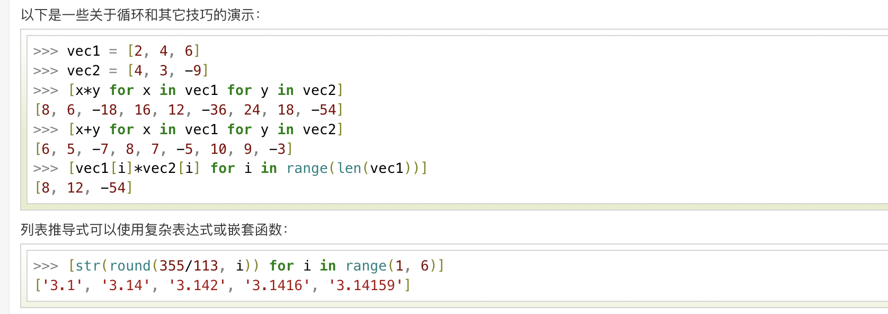


```
#!/usr/bin/python3

matrix = [
    [1, 2, 3, 4],
     [5, 6, 7, 8],
    [9, 10, 11, 12],
 ]


r1 = [row for row in matrix]
p = [[row[i] for row in matrix] for i in range(4)]

print(r1)
print(p)
[[1, 2, 3, 4], [5, 6, 7, 8], [9, 10, 11, 12]]
[[1, 5, 9], [2, 6, 10], [3, 7, 11], [4, 8, 12]]
```


## 12.2 元组和序列

元组由若干逗号分隔的值组成，例如：

```
#!/usr/bin/python3

t = 12345,54321,"hello"
print(t[0])
print(t)

u = t,(123,567,"lkj")
print(u)


12345
(12345, 54321, 'hello')
((12345, 54321, 'hello'), (123, 567, 'lkj'))

```


## 12.3 集合

集合是一个==无序不重复元素的集==。基本功能包括关系测试和消除重复元素。

可以用大括号({})创建集合。注意：如果要创建一个空集合，你必须用 set() 而不是 {} ；后者创建一个空的字典，下一节我们会介绍这个数据结构。

以下是一个简单的演示：

```
#!/usr/bin/python3

basket = {"apple","orange",'apple','pear','orange',"banana"}
print(basket)

if 'origin' in basket :
    print("is in")
else:
    print("is not in")


a = set('abajsjkdkdk')
b = set("lddd")

print(a-b)
print(a|b)
print(a&b)
print(a^b)
a = {x for x in 'abracadabra' if x not in 'abc'}
print(a)

{'orange', 'banana', 'pear', 'apple'}
is not in
{'s', 'b', 'a', 'j', 'k'}
{'d', 's', 'a', 'j', 'b', 'l', 'k'}
{'d'}
{'s', 'b', 'a', 'j', 'l', 'k'}
{'d', 'r'}
(venv) 

```

## 12.4 字典

另一个非常有用的 Python 内建数据类型是字典。

序列是以连续的整数为索引，与此不同的是，字典以关键字为索引，关键字可以是任意不可变类型，通常用字符串或数值。

理解字典的最佳方式是把它看做无序的键=>值对集合。在同一个字典之内，关键字必须是互不相同。

一对大括号创建一个空的字典：{}。

这是一个字典运用的简单例子：

```
#!/usr/bin/python3


tel = {"Jack": 4098, "ggg": 12,"lll":14}
print(tel)

del tel["Jack"]
print(tel)

l = list(tel.keys())
print(l)

h = sorted(tel.keys())
print(h)

if "ggg" in tel:
    print("in")

{'Jack': 4098, 'ggg': 12, 'lll': 14}
{'ggg': 12, 'lll': 14}
['ggg', 'lll']
['ggg', 'lll']
in


```


初始化数据

```
#!/usr/bin/python3
dict1 = dict([('spac',4139),('kljh',1234)])
dict2 = dict(sape=4139, guido=4127, jack=4098)
dict3 = {x: x**2 for x in (2, 4, 6)}
print(dict1)
print(dict2)
print(dict3)


{'spac': 4139, 'kljh': 1234}
{'sape': 4139, 'guido': 4127, 'jack': 4098}
{2: 4, 4: 16, 6: 36}
```

遍历技巧

在字典中遍历时，关键字和对应的值可以使用 items() 方法同时解读出来：

```
#!/usr/bin/python3

for k ,v  in enumerate(["aa",'bb']):
    print(k,v)

0 aa
1 bb
```


同时便利多个

```
#!/usr/bin/python3

questions = ['name', 'quest', 'favorite color']
answers = ['lancelot', 'the holy grail', 'blue']

for q,a in zip(questions,answers):
    print('What is your {0}?  It is {1}.'.format(q, a))
    

What is your name?  It is lancelot.
What is your quest?  It is the holy grail.
What is your favorite color?  It is blue.

```

要按顺序遍历一个序列，使用 sorted() 函数返回一个已排序的序列，并不修改原值：

```
>>> basket = ['apple', 'orange', 'apple', 'pear', 'orange', 'banana']
>>> for f in sorted(set(basket)):
...     print(f)
...
apple
banana
orange
pear
```

# 13 模块

一个模块只会被导入一次，不管你执行了多少次import。这样可以防止导入模块被一遍又一遍地执行。

搜索路径是由一系列目录名组成的，Python解释器就依次从这些目录中去寻找所引入的模块。

目录结构

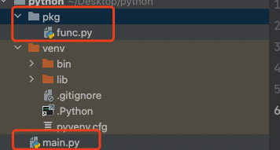


```
#!/usr/bin/python3

from pkg import func
from pkg.func import print_func

print_func("aaa")

aaa
```

 from 语句让你从模块中导入一个指定的部分到当前命名空间中，语法如下：

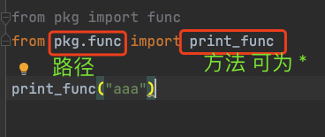


## 13.1 __name__属性

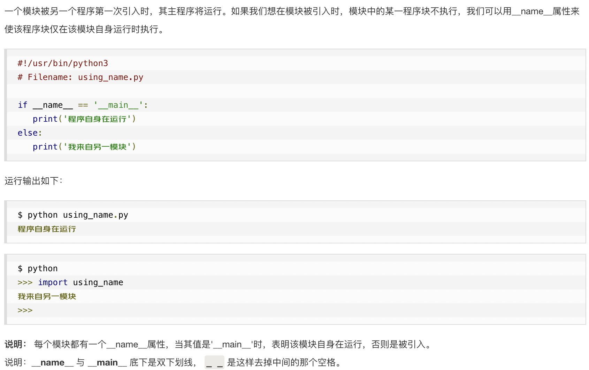


## 13.2 dir() 函数

内置的函数 dir() 可以找到模块内定义的所有名称。以一个字符串列表的形式返回:

```
#!/usr/bin/python3

from pkg import func
from pkg.func import print_func

print_func("aaa")
print_func(dir(func))

['__builtins__', '__cached__', '__doc__', '__file__', '__loader__', '__name__', '__package__', '__spec__', 'print_func']
```


## 13.3 包

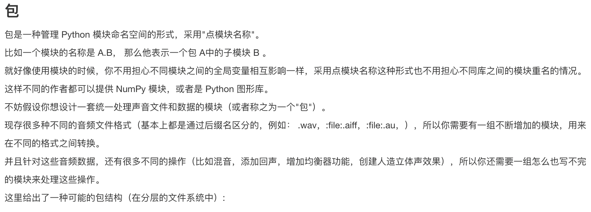


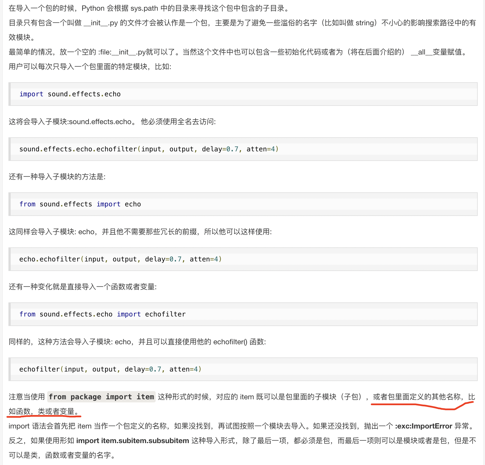


## 13.4 从一个包中导入*

__all__

目录结构

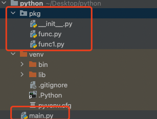


Init

```
#!/usr/bin/python3
# __all__ = ["func", "func1"]
__all__ = ["func"]

from pkg.func import *

if __name__ == '__main__':
    print("自身在运行1")
else:
    print("引入在运行1")
```


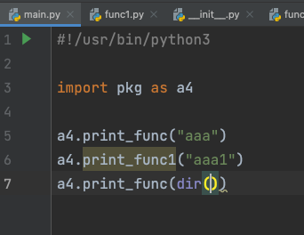


```
引入在运行
引入在运行1
aaa
Traceback (most recent call last):
  File "/Users/zhangqiuli24/Desktop/python/main.py", line 6, in <module>
    a4.print_func1("aaa1")
AttributeError: module 'pkg' has no attribute 'print_func1'
```


必须引入的是

```
import pkg as a4 这种形式 __all__ 才会生效
```


# 14 输入和输出

```
#!/usr/bin/python3

s = 'Hello, Runoob'

print(str(s))
print(repr(s))
print(str(1/7))

x = 10 * 3.25
y = 200 * 200
s = 'x 的值为： ' + repr(x) + ',  y 的值为：' + repr(y) + '...'
print(s)

hello = 'hello, runoob\n'
hellos = repr(hello)
print(hellos)


s = repr((x, y, ('Google', 'Runoob')))
print(s)
```


```
Hello, Runoob
'Hello, Runoob'
0.14285714285714285
x 的值为： 32.5,  y 的值为：40000...
'hello, runoob\n'
(32.5, 40000, ('Google', 'Runoob'))
```


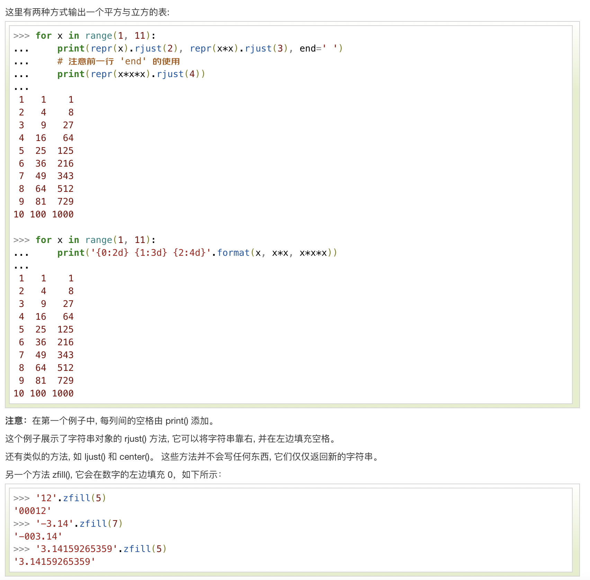


## 14.1 str.format() 的基本使用如下:

```
#!/usr/bin/python3

print("hello {}".format("zhangSan"))

hello zhangSan
```


有编号的

```
#!/usr/bin/python3


print("{0}-{1}".format("is 0","is 1"))
print("{1}-{0}".format("is 0","is 1"))

is 0-is 1
is 1-is 0
```


制定变量名字

```
#!/usr/bin/python3


print('{name}网址： {site}'.format(name='菜鸟教程', site='www.runoob.com'))

菜鸟教程网址： www.runoob.com
```


结合

```
#!/usr/bin/python3


print('站点列表 {0}, {1}, 和 {other}。'.format('Google', 'Runoob', other='Taobao'))

站点列表 Google, Runoob, 和 Taobao。
```


填充长度

在 **:** 后传入一个整数, 可以保证该域至少有这么多的宽度。 用于美化表格时很有用。

```
#!/usr/bin/python3


table = {'Google': 1, 'Runoob': 2, 'Taobao': 3}
for name, number in table.items():
    print('{0:10} ==> {1:10d}'.format(name, number))
```


```
Google     ==>          1
Runoob     ==>          2
Taobao     ==>          3
```


如果你有一个很长的格式化字符串, 而你不想将它们分开, 那么在格式化时通过变量名而非位置会是很好的事情。

最简单的就是传入一个字典, 然后使用方括号 **[]** 来访问键值 :

```
#!/usr/bin/python3


table = {'Google': 1, 'Runoob': 2, 'Taobao': 3}
print('Runoob: {0[Runoob]:d}; Google: {0[Google]:d}; Taobao: {0[Taobao]:d}'.format(table))


#!/usr/bin/python3
table = {'Google': 1, 'Runoob': 2, 'Taobao': 3}
print('Runoob: {0[Runoob]:10d}; Google: {0[Google]:d}; Taobao: {0[Taobao]:d}'.format(table))
```


```
Runoob: 2; Google: 1; Taobao: 3

Runoob:          2; Google: 1; Taobao: 3

```

也可以通过在 table 变量前使用 ***\*** 来实现相同的功能：

```
#!/usr/bin/python3


table = {'Google': 1, 'Runoob': 2, 'Taobao': 3}
print('Runoob: {Runoob:d}; Google: {Google:d}; Taobao: {Taobao:d}'.format(**table))

Runoob: 2; Google: 1; Taobao: 3
```


# 14.2 旧式字符串格式化

**%** 操作符也可以实现字符串格式化。 它将左边的参数作为类似 **sprintf()** 式的格式化字符串, 而将右边的代入, 然后返回格式化后的字符串. 例如:

```
#!/usr/bin/python3


print("你好 %s" % "san")

你好 san
```


## 14.3 读取键盘输入

```
#!/usr/bin/python3


str = input("请输入")

print("键盘输入{}".format(str))


请输入kk
键盘输入kk

```


## 14.4 读写文件

open() 将会返回一个 file 对象，基本语法格式如下:

```
open(filename, mode)
```

- filename：包含了你要访问的文件名称的字符串值。
- mode：决定了打开文件的模式：只读，写入，追加等。所有可取值见如下的完全列表。这个参数是非强制的，默认文件访问模式为只读(r)。

不同模式打开文件的完全列表：

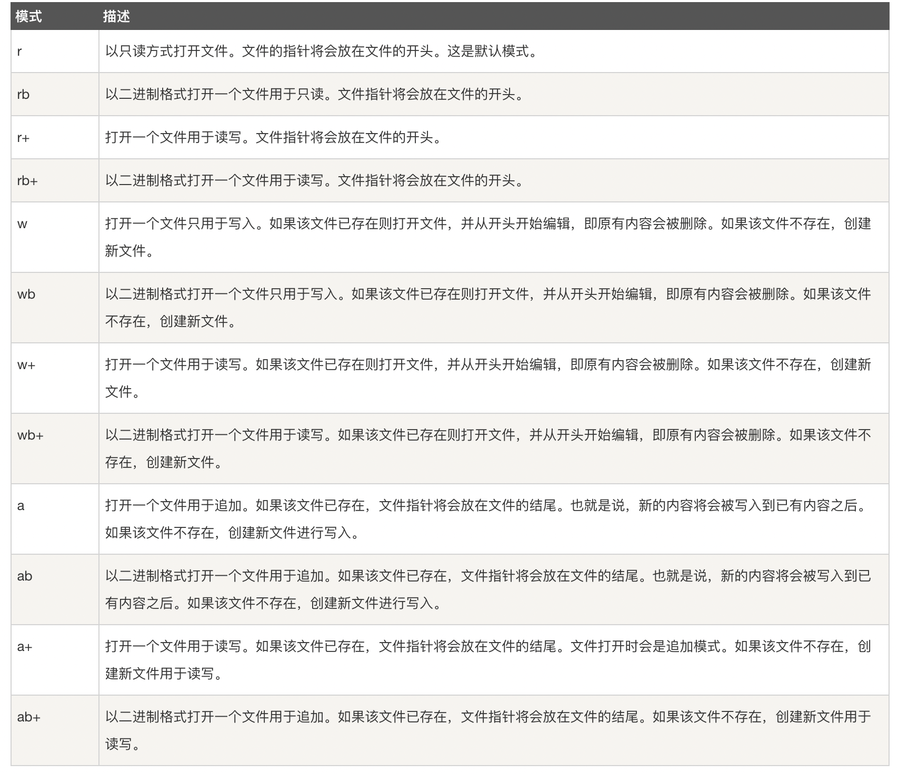


```
#!/usr/bin/python3


f = open("./open.log","w")
f.write("python is write file")

f.close()
```


## 14.5 文件对象的方法

读取文件

为了读取一个文件的内容，调用 f.read(size), 这将读取一定数目的数据, 然后作为字符串或字节对象返回。

size 是一个可选的数字类型的参数。 当 size 被忽略了或者为负, 那么该文件的所有内容都将被读取并且返回。

以下实例假定文件 foo.txt 已存在（上面实例中已创建）：

```
#!/usr/bin/python3


f = open("./open.log","r")
str = f.read(3)
print(str)

f.close()

pyt
```


### f.readline()

f.readline() 会从文件中读取单独的一行。换行符为 '\n'。f.readline() 如果返回一个空字符串, 说明已经已经读取到最后一行。

```
#!/usr/bin/python3

# 打开一个文件
f = open("/tmp/foo.txt", "r")

str = f.readline()
print(str)

# 关闭打开的文件
f.close()
执行以上程序，输出结果为：


```


```
Python 是一个非常好的语言。
```


### f.readlines()

f.readlines() 将返回该文件中包含的所有行。

如果设置可选参数 sizehint, 则读取指定长度的字节, 并且将这些字节按行分割。

```

# 打开一个文件
f = open("/tmp/foo.txt", "r")

str = f.readlines()
print(str)

# 关闭打开的文件
f.close()
执行以上程序，输出结果为：


```


```
['Python 是一个非常好的语言。\n', '是的，的确非常好!!\n']
```


另一种方式是迭代一个文件对象然后读取每行:

```
#!/usr/bin/python3

# 打开一个文件
f = open("/tmp/foo.txt", "r")

for line in f:
    print(line, end='')

# 关闭打开的文件
f.close()
```


```
Python 是一个非常好的语言。
是的，的确非常好!!
```


### f.write()

f.write(string) 将 string 写入到文件中, 然后返回写入的字符数。

```
#!/usr/bin/python3

# 打开一个文件
f = open("/tmp/foo.txt", "w")

num = f.write( "Python 是一个非常好的语言。\n是的，的确非常好!!\n" )
print(num)
# 关闭打开的文件
f.close()
```

```
29
```


==如果要写入一些不是字符串的东西, 那么将需要先进行转换:==

```
#!/usr/bin/python3

# 打开一个文件
f = open("/tmp/foo1.txt", "w")

value = ('www.runoob.com', 14)
s = str(value)
f.write(s)

# 关闭打开的文件
f.close()
```


```
$ cat /tmp/foo1.txt 
('www.runoob.com', 14)
```

### f.tell()

f.tell() 返回文件对象当前所处的位置, 它是从文件开头开始算起的字节数。


### f.seek()

如果要改变文件指针当前的位置, 可以使用 f.seek(offset, from_what) 函数。

from_what 的值, 如果是 0 表示开头, 如果是 1 表示当前位置, 2 表示文件的结尾，例如：


- seek(x,0) ： 从起始位置即文件首行首字符开始移动 x 个字符
- seek(x,1) ： 表示从当前位置往后移动x个字符
- seek(-x,2)：表示从文件的结尾往前移动x个字符

from_what 值为默认为0，即文件开头。下面给出一个完整的例子：

```
#!/usr/bin/python3

# python is write file%
f = open("./open.log","r")
f.seek(2)
str = f.read(3)
print(str)

f.close()
```


```
tho
```

### f.close()

在文本文件中 (那些打开文件的模式下没有 b 的), 只会相对于文件起始位置进行定位。

当你处理完一个文件后, 调用 f.close() 来关闭文件并释放系统的资源，如果尝试再调用该文件，则会抛出异常。

### ==with==

```
#!/usr/bin/python3

# python is write file%
with open('./open.log', 'r') as f:
    read_data = f.read()
    print(read_data)
    f.close()
```


```
python is write file

```

## pickle 模块

python的pickle模块实现了基本的数据序列和反序列化。

通过pickle模块的序列化操作我们能够将程序中运行的对象信息保存到文件中去，永久存储。

通过pickle模块的反序列化操作，我们能够从文件中创建上一次程序保存的对象。

基本接口：

```
#!/usr/bin/python3
import pickle

# 使用pickle模块将数据对象保存到文件
data1 = {'a': [1, 2.0, 3, 4+6j],
         'b': ('string', u'Unicode string'),
         'c': None}

selfref_list = [1, 2, 3]
selfref_list.append(selfref_list)

output = open('data.pkl', 'wb')

# Pickle dictionary using protocol 0.
pickle.dump(data1, output)

# Pickle the list using the highest protocol available.
pickle.dump(selfref_list, output, -1)

output.close()

```


```
```


# 15 Python3 File(文件) 方法

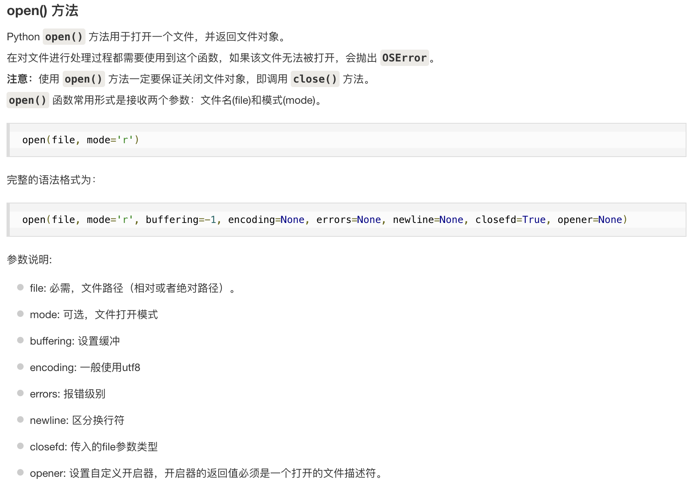


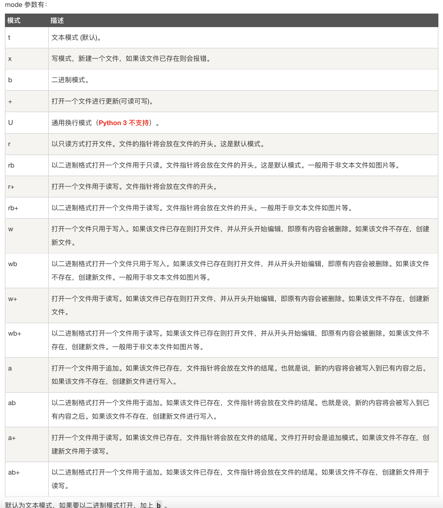


## 15.1

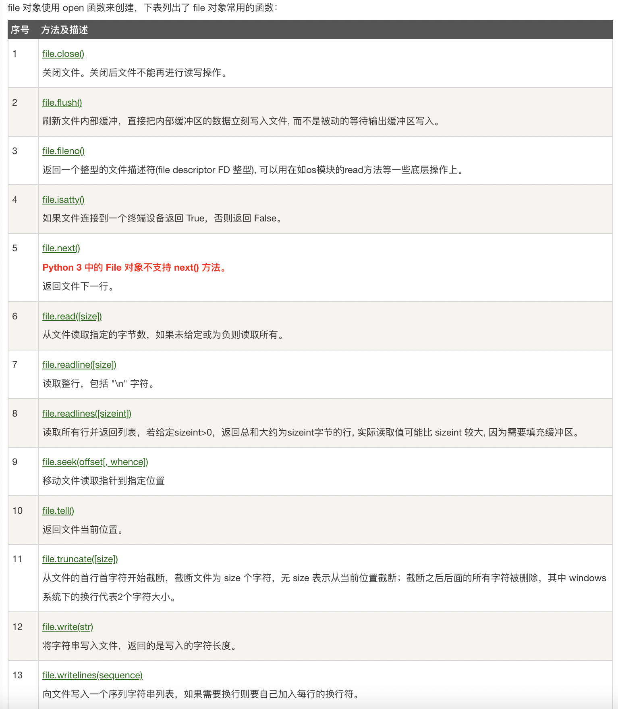

# 16 Python3 OS 文件/目录方法

[-](https://www.runoob.com/python3/python3-os-file-methods.html)


# 17 Python3 错误和异常

## 17.1 异常

即便 Python 程序的语法是正确的，在运行它的时候，也有可能发生错误。运行期检测到的错误被称为异常。

大多数的异常都不会被程序处理，都以错误信息的形式展现在这里:

异常处理

`try/except`

异常捕捉可以使用 **try/except** 语句。

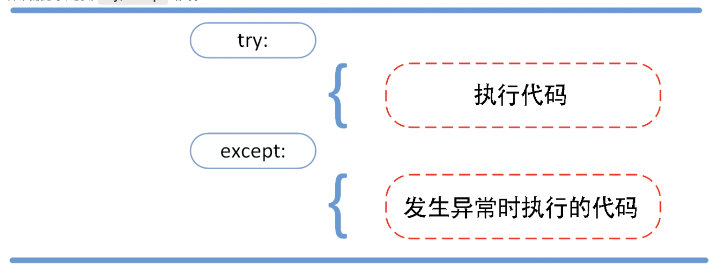


```
#!/usr/bin/python3

while True:
    try:
        x = int(input("请输入一个数字"))
        break
    except ValueError:
        print("您输入的不是数字，请再次尝试输入！")
```

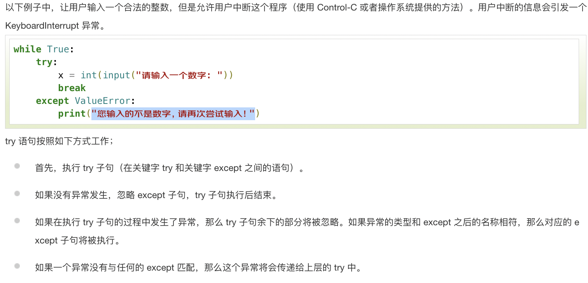


一个 try 语句可能包含多个except子句，分别来处理不同的特定的异常。最多只有一个分支会被执行。

处理程序将只针对对应的 try 子句中的异常进行处理，而不是其他的 try 的处理程序中的异常。

一个except子句可以同时处理多个异常，这些异常将被放在一个括号里成为一个元组，例如:

==pass表示跳过==

```
except (RuntimeError, TypeError, NameError):
    pass
```

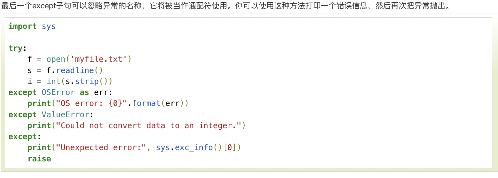


## 17.2 try/except...else

**try/except** 语句还有一个可选的 **else** 子句，如果使用这个子句，那么必须放在所有的 except 子句之后。

==else 子句将在 try 子句没有发生任何异常的时候执行。==

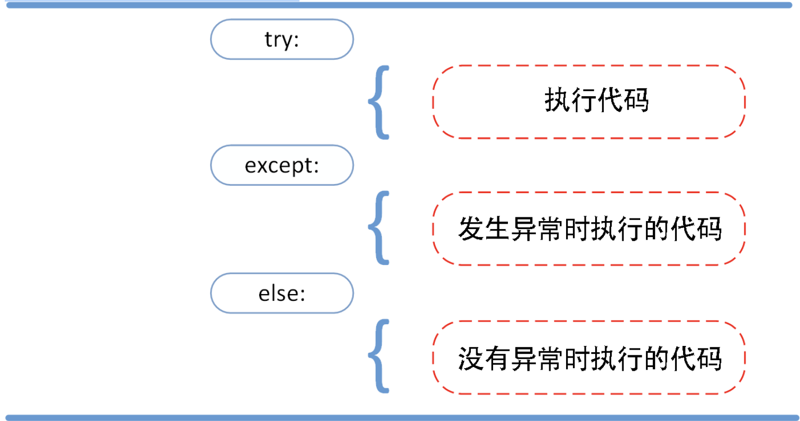


```
#!/usr/bin/python3

import sys

for arg in sys.argv[1:]:
    try:
        f = open(arg, 'r')
    except IOError:
        print('cannot open', arg)
    else:
        print(arg, 'has', len(f.readlines()), 'lines')
        f.close()
```


```
open.log has 1 lines
```


## 17.3 try-finally 语句

==try-finally 语句无论是否发生异常都将执行最后的代码。==

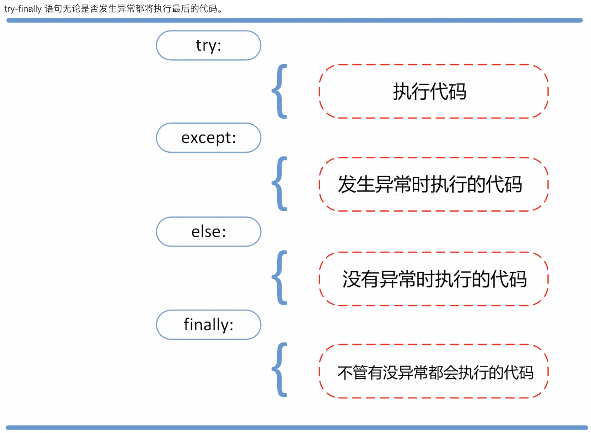


```
try:
    runoob()
except AssertionError as error:
    print(error)
else:
    try:
        with open('open.log') as file:
            read_data = file.read()
    except FileNotFoundError as fnf_error:
        print(fnf_error)
finally:
    print('这句话，无论异常是否发生都会执行。')
```


```
这句话，无论异常是否发生都会执行。
Traceback (most recent call last):
  File "/Users/xxxx/Desktop/python/main.py", line 7, in <module>
    int("kk")
ValueError: invalid literal for int() with base 10: 'kk'
(venv) 
```


## 17.4 抛出异常

Python 使用 raise 语句抛出一个指定的异常。

raise语法格式如下：

```
raise [Exception [, args [, traceback]]]
```

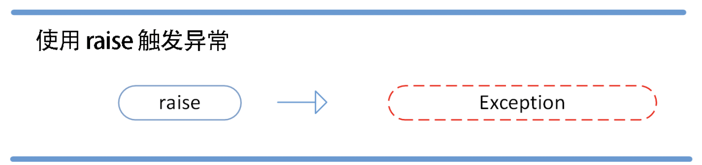


```
#!/usr/bin/python3
# def runoob():
#     return


x = 10
if x > 5:
    raise Exception('x 不能大于 5。x 的值为: {}'.format(x))
```


```
Traceback (most recent call last):
  File "/Users/xxxx/Desktop/python/main.py", line 8, in <module>
    raise Exception('x 不能大于 5。x 的值为: {}'.format(x))
Exception: x 不能大于 5。x 的值为: 10
(venv) 

```

==raise 唯一的一个参数指定了要被抛出的异常。它必须是一个异常的实例或者是异常的类（也就是 Exception 的子类）。==

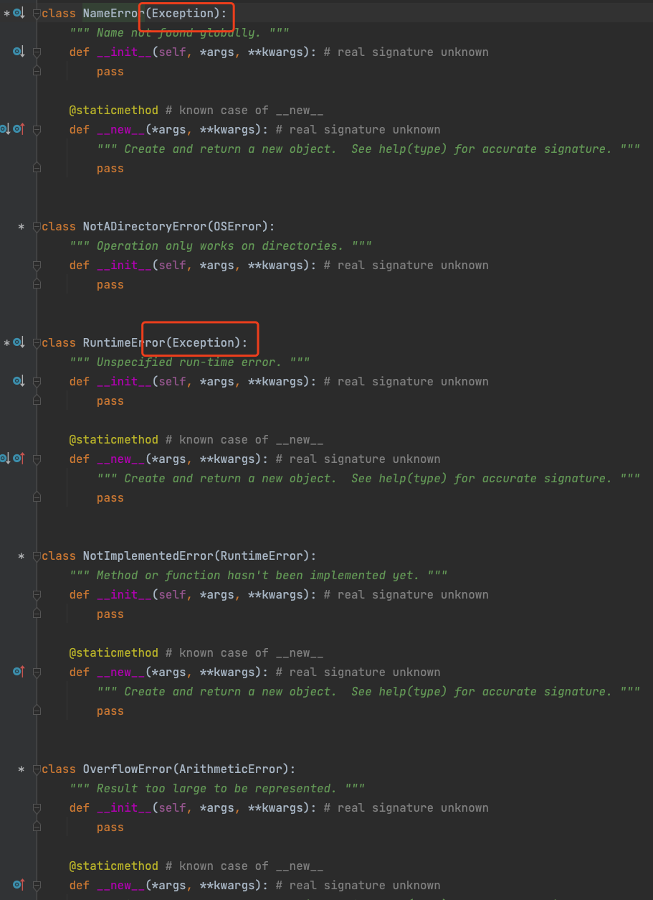

如果你只想知道这是否抛出了一个异常，并不想去处理它，那么一个简单的 raise 语句就可以再次把它抛出。

```
try:
    raise NameError('HiThere')
except NameError:
    print('An exception flew by!')
    raise
```


```
An exception flew by!
Traceback (most recent call last):
  File "/Users/xxx/Desktop/python/main.py", line 7, in <module>
    raise NameError('HiThere')
NameError: HiThere
(venv) 
```


## 17.5 用户自定义异常

你可以通过创建一个新的异常类来拥有自己的异常。==异常类继承自 Exception 类==，可以直接继承，或者间接继承，例如:

```
#!/usr/bin/python3
# def runoob():
#     return


class MyError(Exception):
    def __init__(self, value):
        self.value = value

    def __str__(self):
        return repr(self.value)


try:
    raise MyError(2*2)
except MyError as e:
    print('My exception occurred, value:', e.value)

```

在这个例子中，类 Exception 默认的 __init__() 被覆盖。

当创建一个模块有可能抛出多种不同的异常时，一种通常的做法是为这个包建立一个基础异常类，然后基于这个基础类为不同的错误情况创建不同的子类:

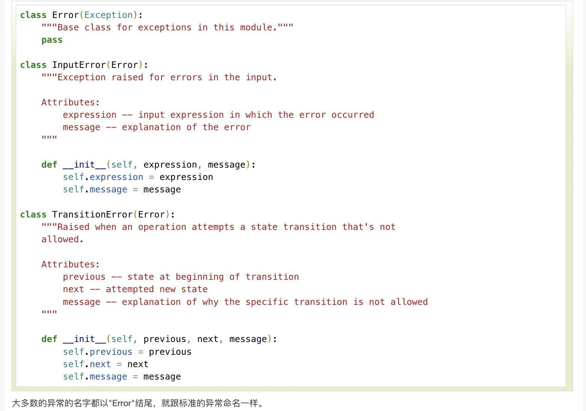


## 17.6 定义清理行为

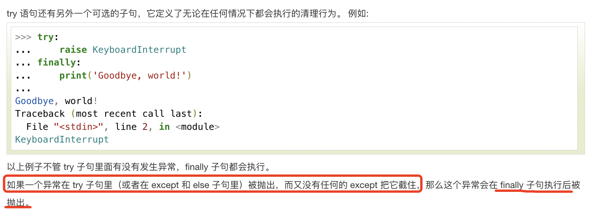


```
#!/usr/bin/python3

def divide(x, y):
    try:
        result = x / y
    except ZeroDivisionError:
        print("division by zero!")
    else:
        print("result is", result)
    finally:
        print("executing finally clause")

divide(2, 1)
divide(2, 0)
```


```
result is 2.0
executing finally clause
division by zero!
executing finally clause
```


## 17.7 预定义的清理行为

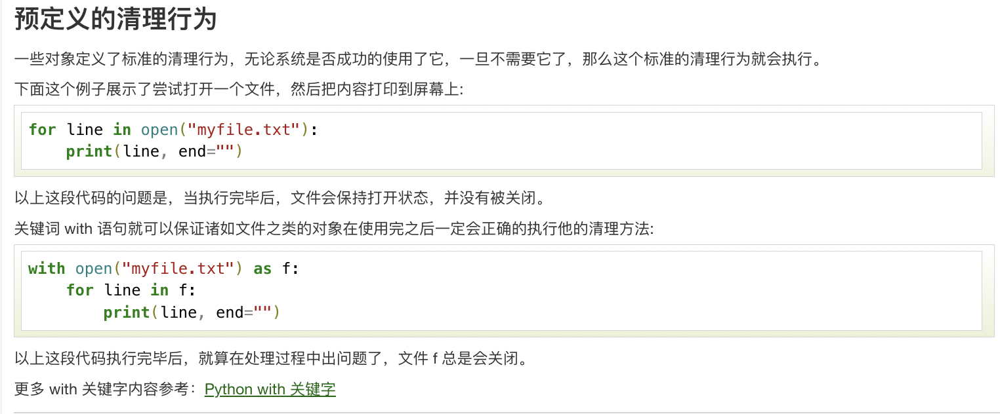


## 17.8 with关键字

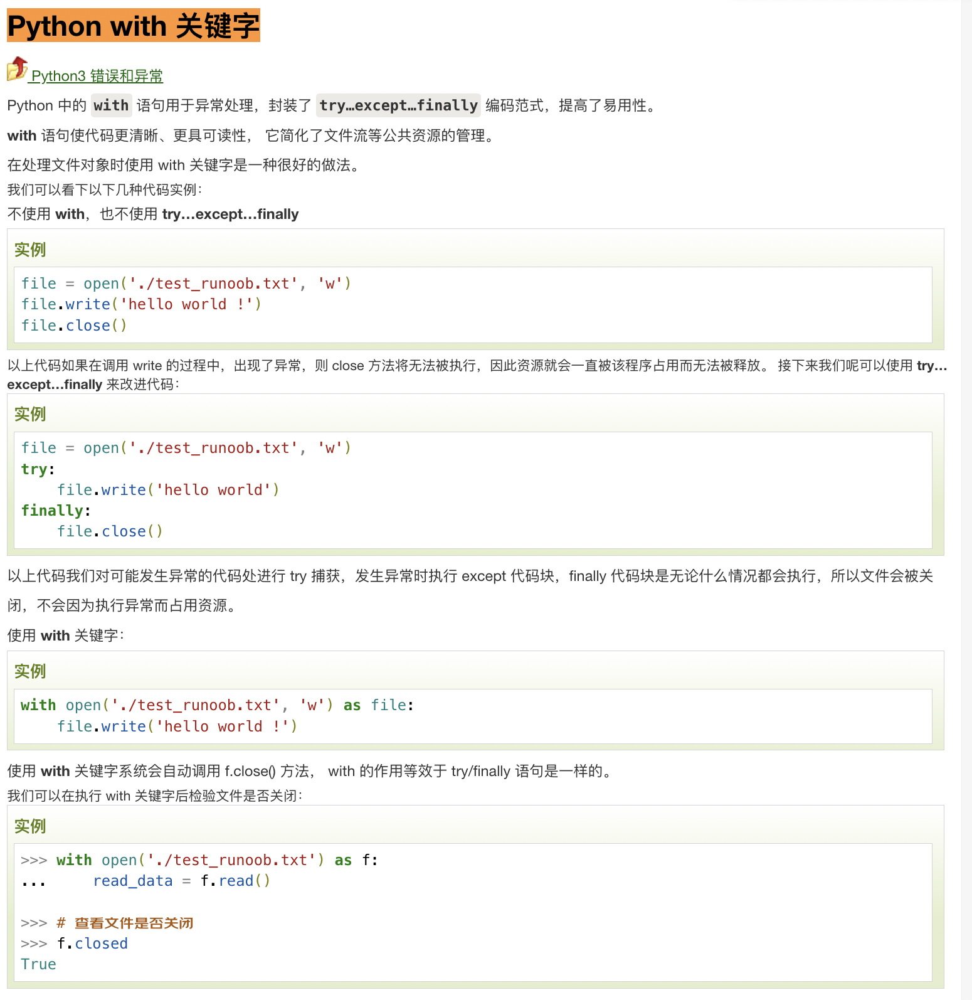

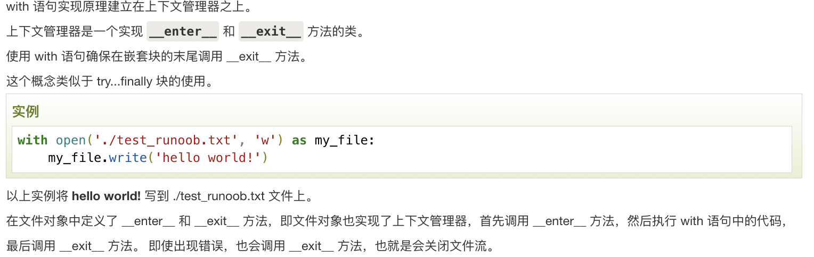

## 17.9 Python3 assert（断言）

[ Python3 错误和异常](https://www.runoob.com/python3/python3-errors-execptions.html)

Python assert（断言）用于判断一个表达式，在表达式条件为 false 的时候触发异常。

断言可以在条件不满足程序运行的情况下直接返回错误，而不必等待程序运行后出现崩溃的情况，例如我们的代码只能在 Linux 系统下运行，可以先判断当前系统是否符合条件。

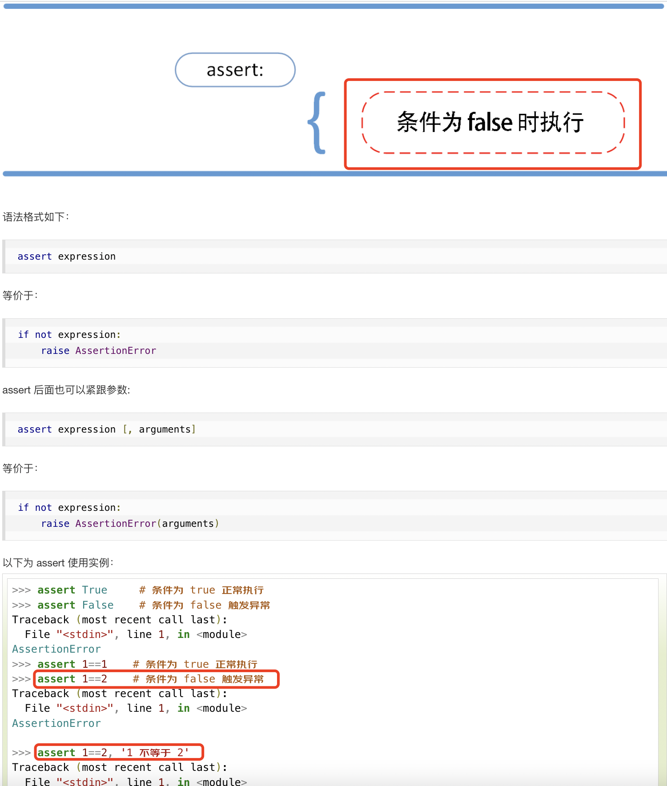


以下实例判断当前系统是否为 Linux，如果不满足条件则直接触发异常，不必执行接下来的代码：


```
import sys
assert ('linux' in sys.platform), "该代码只能在 Linux 下执行"

# 接下来要执行的代码
```


# 18. class

[-](https://www.runoob.com/python3/python3-class.html)

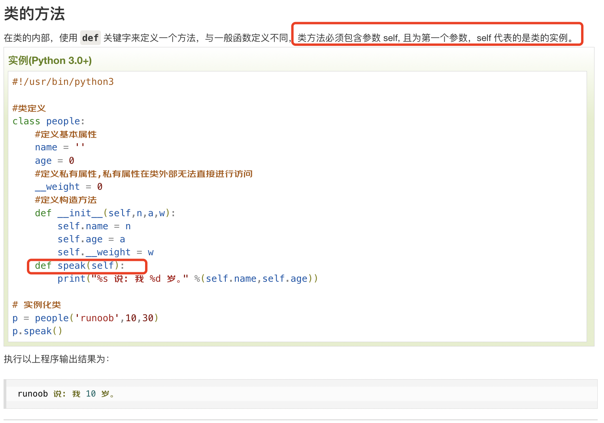


## 18.1 继承

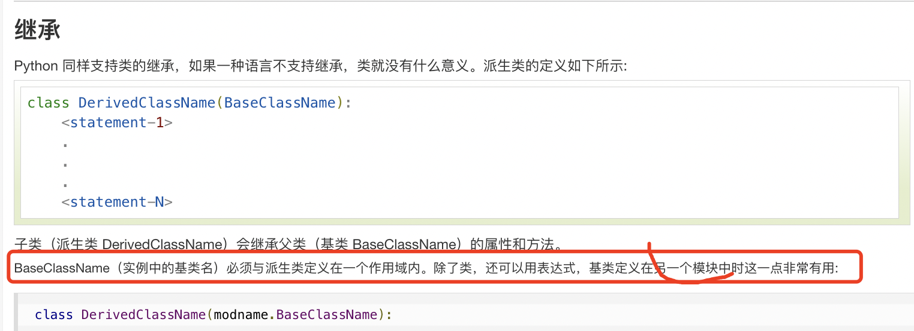

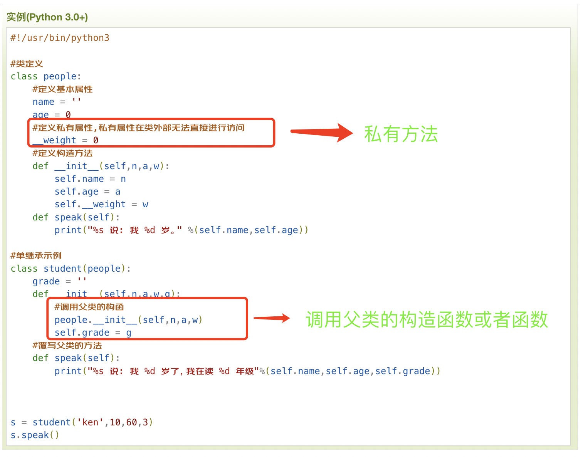


```
#!/usr/bin/python3

class people:
    # 定义属性
    name = ''
    age = 0

    # 定义构造函数
    def __init__(self, name, age, weight):
        self.age = age
        self.name = name
        self.__weight = weight

    def speak(self):
        print("%s 说： 我 %d 岁" % (self.name, self.age))


class student(people):
    grade = ''

    def __init__(self, n, a, w, g):
        people.__init__(self, n, a, w)
        self.grade = g

    # 覆盖父类方法
    def speak(self):
        print(people.age) # 下边的继承覆盖了父类的属性
        print(people.name)
        print("{0} 说： 我 {1} 岁了，我在读{2}年纪".format(self.name, self.age, self.grade))


s = student("ken", 10, 60, 3)
s.speak()

```


```
0

ken 说： 我 10 岁了，我在读3年纪
```


## 18.2 多继承


```
我叫 Tim，我是一个演说家，我演讲的主题是 Python
```

## 18.3 方法重写


## 18.4 super关键字


[-](https://www.runoob.com/python/python-func-super.html)


## 18.5 类属性与方法


## 18.6 类的专有方法


## 18.7 运算符重载


```
#!/usr/bin/python3

class Vector:
    def __init__(self, a, b):
        self.a = a
        self.b = b

    def __str__(self):
        return 'Vector (%s, %s)' % (self.a, self.b)

    def __add__(self, other):
        return Vector(self.a + other.a, self.b + other.b)


# v1 = Vector(2, 10)
# v2 = Vector(5, -2)
v1 = Vector("a", "b")
v2 = Vector("c", "d")
print(v1 )
print(v2)
```


```
Vector (a, b)
Vector (c, d)
```


# 19 命名空间

## 19.1 全局变量和局部变量


## 19.2 global 和 nonlocal关键字


# 20 Python3 标准库概览

## 20.1 通配符

## 文件通配符

glob模块提供了一个函数用于从目录通配符搜索中生成文件列表:

```
>>> import glob
>>> glob.glob('*.py')
['primes.py', 'random.py', 'quote.py']
```


## 命令行参数

通用工具脚本经常调用命令行参数。这些命令行参数以链表形式存储于 sys 模块的 argv 变量。例如在命令行中执行 "python demo.py one two three" 后可以得到以下输出结果:

```
>>> import sys
>>> print(sys.argv)
['demo.py', 'one', 'two', 'three']
```

------


## 测试模块


## 21 mysql

安装驱动

```
python -m pip install mysql-connector
```


