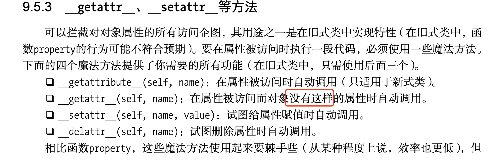
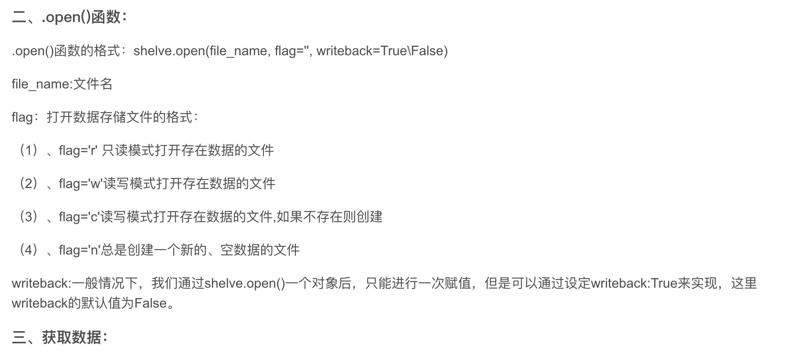
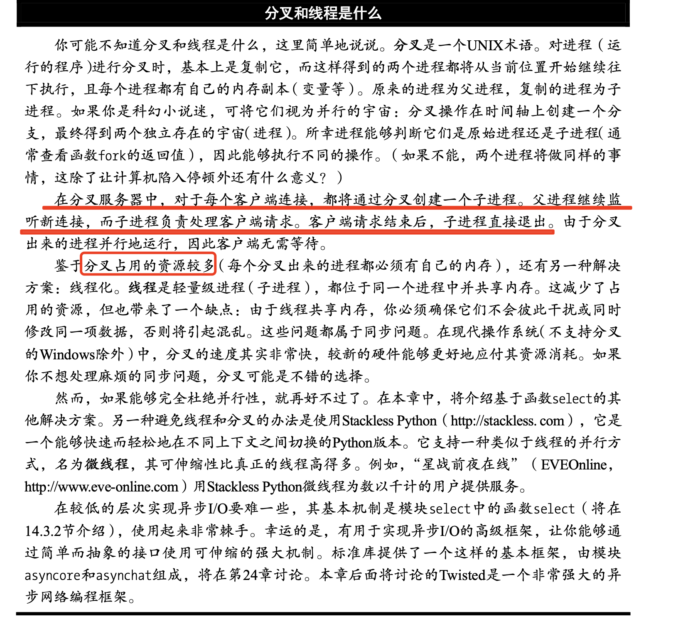

# 1 程序运行方式

## 1.1 

```
#!/usr/bin/env python
```


不管Python库位于什么地方，这都将让你能够像运行普通程序一样运行脚本。如果你安装了 多个版本的Python，可用更具体的可执行文件名(如python3)替换python。


## 1.2 普通脚本运行

```
chmod a+x hello.py

./hello.py
```


## 1.3 python3 main.py


# 2 注释 #

\可以衔接下一行的东西

```
>>> print('hello,\
... word')
hello,word
>>> 

```

# 3 字符串

单引号，双引号都是一样的

拼接用+

## 3.1 str转译\r、\n等

`str`是一个类

```
print(str("Hello,\nword"))

Hello,
word
```


## 3.2 repr显示原始字符串

```
print(repr("Hello,\nword"))
Hello,\nword
```


## 3.3 r显示原始字符

```
print(r"hello,\nword")
Hello,\nword
```

但是最后一位不能`\`否则报错，pythn不知道到哪里是结束标志

```
print(r"This is illegal\")
SyntaxError: EOL while scanning string literal
```


## 3.4 长字符串使用 ''' 或者"""表示

```
print('''你好啊''')

>>> print('''你好啊''')
你好啊
```


## 3.5 Unicode、bytes和bytearray

Python字符串使用Unicode编码来表示文本。

```
>>> '\u00C6'
'Æ'
>>> '\U0001F60A'
'😊'
>>> 'This is a cat: \N{Dog}'
'This is a cat: 🐕'
>>> 

```


## 3.6 可变字节和不可变字节array

不可变的bytes 和可变的bytearray。如果需要，可直接创建bytes对象(而不是字符串)，方法是使用前缀b:

```
>>> b'Hello,word'
b'Hello,word'
```


## 3.7 ASCII、 UTF-8和UTF-32编码将字符串转换为bytes

```
>>> 'hello,word'.encode("ASCII")
b'hello,word'
>>> 'hello,word'.encode("UTF-8")
b'hello,word'
>>> 'hello,word'.encode("UTF-32")
b'\xff\xfe\x00\x00h\x00\x00\x00e\x00\x00\x00l\x00\x00\x00l\x00\x00\x00o\x00\x00\x00,\x00\x00\x00w\x00\x00\x00o\x00\x00\x00r\x00\x00\x00d\x00\x00\x00'
>>> 

```


# 4 列表

有几种操作适用于所有序列，包括索引、切片、相加、相乘和成员资格检查。另外，Python 还提供了一些内置函数，可用于确定序列的长度以及找出序列中最大和最小的元素。

```
list1 = ['Google', 'Runoob', 1997, 2000]
list2 = [1, 2, 3, 4, 5 ]
list3 = ["a", "b", "c", "d"]
list4 = ['red', 'green', 'blue', 'yellow', 'white', 'black']
list5 = [[1, 2, 3, 4, 5 ],[1, 2, 3, 4, 5 ],[1, 2, 3, 4, 5 ]]
```


## 4.1 访问列表元素

通过索引 ，也就是下表访问

也可以通过尾部访问

也可以使用方括号 **[]** 的形式截取字符 前闭后开，包括前边，不包括后边


```
#!/usr/bin/python3

list1 = ['red', 'green', 'blue', 'yellow', 'white', 'black']
print(list1[0])
print(list1[1])
print(list1[2])

red
green
blue

print( list[-1] )
print( list[-2] )
print( list[-3] )

black
white
yellow

//范围
nums = [10, 20, 30, 40, 50, 60, 70, 80, 90]
print(nums[0:4])
[10, 20, 30, 40]


# 从第二位开始（包含）截取到倒数第二位（不包含）
print ("list[1:-2]: ", list[1:-2])
list[1:-2]:  ['green', 'blue', 'yellow']
```


## 4.2 append更新列表

### 可以添加一个元素，也可以在添加一个列表

```
#!/usr/bin/python3

list1 = ['red', 'green', 'blue', 'yellow', 'white', 'black', "llk"]
# print(list1[0])
# print(list1[1])

print(list1)
list1.append(["llk","oop"])
print(list1)

['red', 'green', 'blue', 'yellow', 'white', 'black', 'llk']
['red', 'green', 'blue', 'yellow', 'white', 'black', 'llk', ['llk', 'oop']]

```


### **两个列表聚合 +**

```
#!/usr/bin/python3

list1 = ['red', 'green', 'blue', 'yellow', 'white', 'black', "llk"]
# print(list1[0])
# print(list1[1])

print(list1)
list3 = list1 + ["llk","oop"]
print(list3)

['red', 'green', 'blue', 'yellow', 'white', 'black', 'llk']
['red', 'green', 'blue', 'yellow', 'white', 'black', 'llk', 'llk', 'oop']
```


### **列表扩容 \***

```
#!/usr/bin/python3

list1 = ["99"]

print(list1*4)

['99', '99', '99', '99']

```


### **元素检查是否存在 in**

```
#!/usr/bin/python3

list1 = ["99"]

print(list1*4)

if "99" in list1:
    print("in")
else:
    print("not in")


['99', '99', '99', '99']
in
```


### **列表迭代 for. x in **

```
#!/usr/bin/python3

list1 = ["99","88"]

print(list1*4)


for x in list1:
    print(x,end="-")
    
99-88-% 
```


### 删除元素

```
#!/usr/bin/python3

list1 = ["99","88"]

del list1[1]
print(list1*4)

['99', '99', '99', '99']
```


### 切片赋值

```
#!/usr/bin/python3

name = list('perl')
print(name)

name[2:]=list("ar")
print(name)

['p', 'e', 'r', 'l']
['p', 'e', 'a', 'r']
```


插入空元素 间接删除元素

```
#!/usr/bin/python3

numbers = [1, 2, 3, 4, 5]
numbers[1:4] = []

print(numbers)

[1, 5]
```


## 4.3 clear清空列表

```
#!/usr/bin/python3

numbers = [1, 2, 3, 4, 5]
numbers.clear()

print(numbers)

[]
```


## 4.4 copy 复制

```
#!/usr/bin/python3

a = [1, 2, 3]

b = a
b[1]=4
print(a)
print(b)

# 此时a也变了
# 让a和b关联到不同副本
c = a.copy()
c[1] = 5
print(c)
print(a)


[1, 4, 3]
[1, 4, 3]
[1, 5, 3]
[1, 4, 3]
```


## 4.5 count 统计个数

```
#!/usr/bin/python3

a = ['to', 'be', 'or', 'not', 'to', 'be'].count('to')

print(a)

x = [[1, 2], 1, 1, [2, 1, [1, 2]]]
print(x.count(1))

print(x.count([1,2]))

2
2
1
(venv
```

只统计第一层的


## 4.6 extend 聚合多个列表 和+类似

```
#!/usr/bin/python3

a = ['to', 'be', 'or', 'not', 'to', 'be']
b = ["kj","lk"]

print(a+b)

a.extend(b)
print(a)

['to', 'be', 'or', 'not', 'to', 'be', 'kj', 'lk']
['to', 'be', 'or', 'not', 'to', 'be', 'kj', 'lk']
```


## 4.7 index 元素出现的下标

不存在报错

```
#!/usr/bin/python3

knights = ['We', 'are', 'the', 'knights', 'who', 'say', 'ni']

print(knights.index('who'))
print(knights.index('whoa'))

4
Traceback (most recent call last):
  File "/Users/xxxxx/Desktop/pythonProject/main.py", line 6, in <module>
    print(knights.index('whoa'))
ValueError: 'whoa' is not in list

```

## 4.8 insert 插入对象

```
#!/usr/bin/python3

numbers = [1, 2, 3, 5, 6, 7]
numbers.insert(3,"four")
print(numbers)

[1, 2, 3, 'four', 5, 6, 7]


# 这样也可以
numbers = [1, 2, 3, 5, 6, 7]
numbers[3:3] = ['four']
print(numbers)
[1, 2, 3, 'four', 5, 6, 7]

```

## 4.9 pop删除元素并返回

```
#!/usr/bin/python3

numbers = [1, 2, 3, 5, 6, 7]

pops = numbers.pop()
print(pops)
print(numbers)

pops = numbers.pop(1)
print(pops)
print(numbers)

7
[1, 2, 3, 5, 6]
2
[1, 3, 5, 6]
```

push和pop是大家普遍接受的两种栈操作(加入和取走)的名称。Python没有提供push，但可 使用append来替代。方法pop和append的效果相反，因此将刚弹出的值压入(或附加)后，得到的 栈将与原来相同。


## 4.10 remove 闪促第一个指定的值

```
#!/usr/bin/python3

x = ['to', 'be', 'or', 'not', 'to', 'be']


x.remove("be")
print(x)

['to', 'or', 'not', 'to', 'be']

```


## 4.11 reverse 倒叙排列

注意到reverse修改列表，但不返回任何值(与remove和sort等方法一样)。

```
#!/usr/bin/python3

x = [1, 2, 3]
x.reverse()
print(x)

[3, 2, 1]

```


## 4.12 sort 排序

sort修改x且不返回任何值

```
#!/usr/bin/python3

x = [4, 6, 2, 1, 7, 9]
x.sort()

print(x)

x1 = ['a','s','k','b']
x1.sort()
print(x1)

[1, 2, 4, 6, 7, 9]
['a', 'b', 'k', 's']
```


## 4.13 高级排序

方法sort接受两个可选参数:key和reverse。

```
#!/usr/bin/python3

x = ['aardvark', 'abalone', 'acme', 'add', 'aerate']
x.sort(key=len)

print(x)

# 另一个关键字参数reverse 以指出是否要按相反的顺序对列表进行排序。

x = [4, 6, 2, 1, 7, 9]
x.sort(reverse=True)
print(x)

['add', 'acme', 'aerate', 'abalone', 'aardvark']
[9, 7, 6, 4, 2, 1]

```


# 5 元组

与列表一样，元组也是序列，唯一的差别在于元组是不能修改的(你可能注意到了，字符串 也不能修改)。元组语法很简单，只要将一些值用逗号分隔，就能自动创建一个元组


## 5.1 元组的定义

```
#!/usr/bin/python3

p = 1, 2, 3
print(p)

p1 = (1, 2, 3, 4)
print(p1)

# 空元组
p2 = ()
print("p2 = ", p2)

p3 = 42,
print("p3 = ", p3)


(1, 2, 3)
(1, 2, 3, 4)
p2 =  ()
p3 =  (42,)
(venv) 
```


## 5.2 元组的扩容

```
p4 = 3 * (40+2,)
print("p4",p4)

p4 (42, 42, 42)
```


## 5.3 元组的访问

```
p5 = 1, 2, 3, 4

print("p5-1", p5[1])
print("p5-1", p5[1:3])


p5-1 (2, 3)# 前闭后开


```


## 5.4 将序列转换为元组

```
#!/usr/bin/python3

list1 = ["a","b","c",8]

t  = tuple(list1)
print(t)


('a', 'b', 'c', 8)
```


## 5.5 修改元组

元组中的元素值是不允许修改的，但我们可以对元组进行连接组合，如下实例:

```
#!/usr/bin/python3

tup1 = (12, 34.56)
tup2 = ('abc', 'xyz')

# 以下修改元组元素操作是非法的。
# tup1[0] = 100

# 创建一个新的元组
tup3 = tup1 + tup2
print(tup3)


(12, 34.56, 'abc', 'xyz')
```


## 5.6 删除元组

元组中的元素值是不允许删除的，但我们可以使用del语句来删除整个元组，如下实例:

```
#!/usr/bin/python3
 
tup = ('Google', 'Runoob', 1997, 2000)
 
print (tup)
del tup
print ("删除后的元组 tup : ")
print (tup)


('Google', 'Runoob', 1997, 2000)
删除后的元组 tup : 
Traceback (most recent call last):
  File "/Users/zhangqiuli24/Desktop/pythonProject/main.py", line 8, in <module>
    print(tup)
NameError: name 'tup' is not defined
(venv) 
```


## 5.7 检查元素是否存在元组中 in

```
#!/usr/bin/python3

tup = ('Google', 'Runoob', 1997, 2000)

if "2000" in tup:
    print("in")
else:
    print("not in")
    

not in
```


## 5.8 元组遍历

```
#!/usr/bin/python3

tup = ('Google', 'Runoob', 1997, 2000)

for x in tup:
    print(x,end="-")
    
Google-Runoob-1997-2000-%                                                                                                                                                      (venv)     
    
```


## 本章函数

```
#!/usr/bin/python3

list1 = ["a","b","c",8]
list2 = [3,5,1,2,7]

t  = tuple(list1)
print(t)

print(len(list1))
print(max(list2))
print(min(list2))
print(reversed(list1))
print(sorted(list2))


('a', 'b', 'c', 8)
4
7
1
<list_reverseiterator object at 0x10b0085e0>
[1, 2, 3, 5, 7]
(venv) 

```


## 关于元组是不可变的

所谓元组的不可变指的是元组所指向的内存中的内容不可变。

```
>>> tup = ('r', 'u', 'n', 'o', 'o', 'b')
>>> tup[0] = 'g'     # 不支持修改元素
Traceback (most recent call last):
  File "<stdin>", line 1, in <module>
TypeError: 'tuple' object does not support item assignment
>>> id(tup)     # 查看内存地址
4440687904
>>> tup = (1,2,3)
>>> id(tup)
4441088800    # 内存地址不一样了
```

从以上实例可以看出，重新赋值的元组 tup，绑定到新的对象了，不是修改了原来的对象。


# 6 字符串

前一章说过，所有标准序列操作(索引、切片、乘法、成员资格检查、长度、最小值和最 大值)都适用于字符串，但别忘了字符串是不可变的，因此所有的元素赋值和切片赋值都是非 法的。


## 6.1 修改字符串-占位符 %s

```
#!/usr/bin/python3

format = "Hello, %s. %s enough for ya?"

values = ('world', 'Hot')
print(format % values)

Hello, world. Hot enough for ya?
```


```
>>> from string import Template
>>> tmpl = Template("Hello, $who! $what enough for ya?") 
>>> tmpl.substitute(who="Mars", what="Dusty")
'Hello, Mars! Dusty enough for ya?'
```


## 6.2 索引占位

```
#!/usr/bin/python3

print("{}, {} and {}".format("first", "second", "third"))

print("{0}, {1} and {2}".format("first", "second", "third"))

print("{3} {0} {2} {1} {3} {0}".format("be", "not", "or", "to"))

first, second and third
first, second and third
to be or not to be
```


命名字段的工作原理与你预期的完全相同

```
>>> from math import pi
>>> "{name} is approximately {value:.2f}.".format(value=pi, name="π") 'π is approximately 3.14.'
```

关键字参数的排列顺序无关紧要。在这里，我还指定了格式说明符.2f，并使用冒号 将其与字段名隔开。它意味着要使用包含2位小数的浮点数格式。如果没有指定.2f，结果将如下:

```
>>> "{name} is approximately {value}.".format(value=pi, name="π") 'π is approximately 3.141592653589793.'
```


在Python 3.6中，如果变量与替换字段同名，还可使用一种简写。在这种情况下，可 使用f字符串——在字符串前面加上f。

```
>>> from math import e
>>> f"Euler's constant is roughly {e}."
"Euler's constant is roughly 2.718281828459045."

等价
>>> "Euler's constant is roughly {e}.".format(e=e) "Euler's constant is roughly 2.718281828459045."

```


## 6.3 替换字段名

```
print("{foo} {} {bar} {}".format(1,2,bar=4,foo=3))
3 1 4 2

# 索引来指定
print("{foo} {1} {bar} {0}".format(1,2,bar=4,foo=3))
3 2 4 1
```


```
>>> fullname = ["Alfred", "Smoketoomuch"] >>> "Mr {name[1]}".format(name=fullname) 'Mr Smoketoomuch'
>>> import math
>>> tmpl = "The {mod.__name__} module defines the value {mod.pi} for π" >>> tmpl.format(mod=math)
'The math module defines the value 3.141592653589793 for π'
```


## 6.4 基本转换

```
print("{pi!s} {pi!r} {pi!a}".format(pi="π"))

```

π 'π' '\u03c0'

(s、r和a)指定分别使用str、repr和ascii进行转换


```
>>> "The number is {num}".format(num=42) 'The number is 42'
>>> "The number is {num:f}".format(num=42) 'The number is 42.000000'
  你也可以将其作为二进制数进行处理。
>>> "The number is {num:b}".format(num=42) 'The number is 101010'
```

使用字符f(表示定 点数)。

二进制数进行处理.


## 6.5 宽度、精度和千位分隔符

```
#!/usr/bin/python3


print("{num:10}".format(num=3))
print("{name:10}".format(name="Bob"))

         3
Bob       
```

数和字符串的对齐方式不同。


**精度**

```
print("Pi day is {pi:.2f}".format(pi=2))
print("Pi day is {pi:.9f}".format(pi=2))

Pi day is 2.00
Pi day is 2.000000000
```


**同时指定宽度和精度**

```
print("{pi:10.2f}".format(pi=2))

      2.00

```


可使用逗号来指出你要添加千位分隔符

```
print('One googol is {:,}'.format(10**100))


One googol is 10,000,000,000,000,000,000,000,000,000,000,000,000,000,000,000,000,000,000,000,000,000,000,000,000,000,000,000,000,000,000,000,000,000
```


## 6.6 符号、对齐和0填充

其中零表示使用 0来填充数字。

```
#!/usr/bin/python3


print('{:010.2f}'.format(5))
print('{:04}'.format(5))

0000005.00
0005
```


**要指定左对齐、右对齐和居中，可分别使用<、>和^。**

```
print('{0:<10.2f}\n{0:^10.2f}\n{0:>10.2f}'.format(3))

3.00
   3.00   
      3.00
(venv) 
```


**可以使用填充字符来扩充对齐说明符**

```
"{:$^15}".format(" WIN BIG ")

$$$ WIN BIG $$$
```


**更具体的说明符=，它指定将填充字符放在符号和数字之间**

```
print('{0:10.2f}\n{1:10.2f}'.format(pi, -pi))

      3.00
     -3.00
# 说明符=，它指定将填充字符放在符号和数字之间。
print('{0:10.2f}\n{1:=10.2f}'.format(pi, -pi))
      4.00
-     4.00
```


如果要给正数加上符号，可使用说明符+(将其放在对齐说明符后面)，而不是默认的-。

```
print('{0:-.2}\n{1:-.2}'.format(pi, -pi)) #默认设置 3.1
-3.1

print('{0:+.2}\n{1:+.2}'.format(pi, -pi))
+3.1
-3.1

print('{0: .2}\n{1: .2}'.format(pi, -pi))
3.1 -3.1
```


**(#)选项，你可将其放在符号说明符和宽度之间**

```
>>> "{:b}".format(42) '101010'
>>> "{:#b}".format(42) '0b101010'
```


对于各种十进制数，它要求必须包含小数点(对于类型g，它保留小数点后面的零)

```
>>> "{:g}".format(42) '42'
>>> "{:#g}".format(42) '42.0000'
```


## 案例

```
#!/usr/bin/python3


width = int(input('Please enter width: '))

price_width = 10
item_width = width - price_width

header_fmt = '{{:{}}}{{:>{}}}'.format(item_width, price_width)
fmt = '{{:{}}}{{:>{}.2f}}'.format(item_width, price_width)


print('=' * width)

print(header_fmt.format('Item', 'Price'))

print('-' * width)

print(fmt.format('Apples', 0.4))
print(fmt.format('Pears', 0.5))
print(fmt.format('Cantaloupes', 1.92))
print(fmt.format('Dried Apricots (16 oz.)', 8))
print(fmt.format('Prunes (4 lbs.)', 12))

print('=' * width)
```


```
Please enter width: 35
===================================
Item                          Price
-----------------------------------
Apples                         0.40
Pears                          0.50
Cantaloupes                    1.92
Dried Apricots (16 oz.)        8.00
Prunes (4 lbs.)               12.00
===================================
```


## 6.7 字符串方法 center

方法center通过在两边添加填充字符(默认为空格)让字符串居中。

```
>>> "The Middle by Jimmy Eat World".center(39)
'     The Middle by Jimmy Eat World     '
```


### 6.8 find

方法find在字符串中查找子串。如果找到，就返回子串的第一个字符的索引，否则返回-1。

```
>>> 'With a moo-moo here, and a moo-moo there'.find('moo') 7
>>> title = "Monty Python's Flying Circus"
>>> title.find('Monty')
0
>>> title.find('Python')
6
>>> title.find('Flying') 
15
>>> title.find('Zirquss') 
-1
```

你还可指定搜索的起点和终点(它们都是可选的)。

```
>>> subject = '$$$ Get rich now!!! $$$' 
>>> subject.find('$$$')
0
>>> subject.find('$$$', 1) # 只指定了起点 20
>>> subject.find('!!!')
16 8 
>>> subject.find('!!!', 0, 16) # 同时指定了起点和终点
-1
```

请注意，起点和终点值(第二个和第三个参数)指定的搜索范围包含起点，但不包含终点。 这是Python惯常的做法。


## 6.9 join

```
#!/usr/bin/python3


seq = [1,2,3,4,5] # 合并数字的会报错
seq = ["a","k","f","k","l"]
sep = '+'
strs = sep.join(seq)
print(strs)

a+k+f+k+l
```


## 6.10 lower

方法lower返回字符串的小写版本。 

```
>>> >>> 'Trondheim Hammer Dance'.lower()

'trondheim hammer dance'
```


1. 一个与lower相关的方法是title(参见附录B)。它将字符串转换为词首大写，即所有单 词的首字母都大写，其他字母都小写。然而，它确定单词边界的方式可能导致结果不合理。

   \>>> "that's all folks".title() "That'S All, Folks"

1. 另一种方法是使用模块string中的函数capwords。

   \>>> import string
    \>>> string.capwords("that's all, folks") That's All, Folks"


## 6.11 replace 

方法replace将指定子串都替换为另一个字符串，并返回替换后的结果。

```
>>> 'This is a test'.replace('is', 'eez') 
'Theez eez a test'
```


## 6.12 split

split是一个非常重要的字符串方法，其作用与join相反，用于将字符串拆分为序列。

```
>>> '1+2+3+4+5'.split('+') 
['1', '2', '3', '4', '5']
>>> '/usr/bin/env'.split('/') 
['', 'usr', 'bin', 'env']
>>> 'Using the default'.split() 
['Using', 'the', 'default']
```


## 6.13 strip 去除空白

```
>>> ' internal whitespace is kept '.strip() 
'internal whitespace is kept'
```

还可在一个字符串参数中指定要删除哪些字符。

```
>>> '*** SPAM * for * everyone!!! ***'.strip(' *!') 
'SPAM * for * everyone'
```

这个方法只删除开头或末尾的指定字符，因此中间的星号未被删除。


## 6.14 translate

方法translate与replace一样替换字符串的特定部分，但不同的是它只能进行==单字符==替换。

这个方法的优势在于能够同时替换多个字符，因此效率比replace高。

```
>>> table = str.maketrans('cs', 'kz', ' ')
>>> 'this is an incredible test'.translate(table) 
'thizizaninkredibletezt'
```


## 6.15 判断字符串是否满足特定的条件

很多字符串方法都以is打头，如isspace、isdigit和isupper，它们判断字符串是否具有特定 的性质(如包含的字符全为空白、数字或大写)。如果字符串具备特定的性质，这些方法就返回 True，否则返回False。

附录B:isalnum、isalpha、isdecimal、isdigit、isidentifier、islower、isnumeric、 isprintable、isspace、istitle、isupper。


# 7 字典

## 7.1 创建和使用字典

```
dicts ={"a":1,3:"gg"}
print(dicts)
```


## 7.2 函数dict

```
#!/usr/bin/python3


item = [("name","gumby"),("age",42)]
d = dict(item)
print(d)
print(d["name"])

{'name': 'gumby', 'age': 42}
gumby
```


关键字实参

```
#!/usr/bin/python3


d = dict(name="gumby",age=45)
print(d)

{'name': 'gumby', 'age': 45}
```


## 7.3 基本的字典操作

字典的基本行为在很多方面都类似于序列。

- len(d)返回字典d包含的项(键值对)数。
- d[k]返回与键k相关联的值。
- d[k] = v将值v关联到键k。
- del d[k]删除键为k的项。
- k in d检查字典d是否包含键为k的项。 

- 键的类型:字典中的键可以是整数，但并非必须是整数。字典中的键可以是任何不可变 的类型，如浮点数(实数)、字符串或元组。
-  自动添加:即便是字典中原本没有的键，也可以给它赋值，这将在字典中创建一个新项。 然而，如果不使用append或其他类似的方法，就不能给列表中没有的元素赋值。
- 成员资格:表达式k in d(其中d是一个字典)查找的是键而不是值，而表达式v in l(其 中l是一个列表)查找的是值而不是索引。这看似不太一致，但你习惯后就会觉得相当自 然。毕竟如果字典包含指定的键，检查相应的值就很容易。


## 7.4 将字符串格式设置功能用于字典

```
#!/usr/bin/python3


phonebook = {'Beth': '9102', 'Alice': '2341', 'Cecil': '3258'}

print("Cecil's phone number is {Cecil}.".format_map(phonebook))

Cecil's phone number is 3258.
```

指定任意数量的转换说明符,所有的字段名都是包含在字典中 的键。

```
#!/usr/bin/python3

data = {'title': 'My Home Page', 'text': 'Welcome to my home page!'}

phonebook = template = '''<html> 14 ... <head><title>{title}</title></head>
... <body>
... <h1>{title}</h1>
... <p>{text}</p>
...</body>
'''

print(phonebook.format_map(data))
```


## 7.5 字典方法

**clear**

方法clear删除所有的字典项，这种操作是就地执行的(就像list.sort一样)，因此什么都不 返回(或者说返回None)。

```
#!/usr/bin/python3

d = {}
d['name'] = 'Gumby'
d['age'] = 42
print(d)

returns = d.clear()
print(returns)

{'name': 'Gumby', 'age': 42}
None
```


## 7.6 copy

方法copy返回一个新字典，其包含的键值对与原来的字典相同(这个方法执行的是==浅复制， 因为值本身是原件，而非副本==)。

```
#!/usr/bin/python3

x = {'username': 'admin', 'machines': ['foo', 'bar', 'baz']}

y = x.copy()

print("x",x)
print("y",y)
print()

y["username"] = "nlh"

print("x",x)
print("y",y)
print()
y['machines'].remove('bar')

print("x",x)
print("y",y)
print()

x {'username': 'admin', 'machines': ['foo', 'bar', 'baz']}
y {'username': 'admin', 'machines': ['foo', 'bar', 'baz']}

x {'username': 'admin', 'machines': ['foo', 'bar', 'baz']}
y {'username': 'nlh', 'machines': ['foo', 'bar', 'baz']}

x {'username': 'admin', 'machines': ['foo', 'baz']}
y {'username': 'nlh', 'machines': ['foo', 'baz']}
```


当替换副本中的值时，原件不受影响。然而，如果修改副本中的值(就地修改而 不是替换)，原件也将发生变化，因为原件指向的也是被修改的值(如这个示例中的'machines' 列表所示)。

为避免这种问题，一种办法是执行深复制，即同时复制值及其包含的所有值，等等。为此， 可使用模块copy中的函数deepcopy。


```
#!/usr/bin/python3

from copy import deepcopy
d = {}
d['names'] = ['Alfred', 'Bertrand']
c = d.copy()
dc = deepcopy(d)

d['names'].append('Clive')

print(d)
print(dc)

{'names': ['Alfred', 'Bertrand', 'Clive']}
{'names': ['Alfred', 'Bertrand']}

```

==潜复制，替换值对原址没影响，修改会影响原来的值==


## 7.7 fromkeys 创建包含制定key的dict

```
#!/usr/bin/python3

print({}.fromkeys(['name', 'age']))

{'name': None, 'age': None}
```

如果你不想使用默认值None，可提供特定的值。

```
#!/usr/bin/python3

print({}.fromkeys(['name', 'age']))

print(dict.fromkeys(["name","age"],"unknow"))

{'name': 'unknow', 'age': 'unknow'}
```


## 7.8 get 防止获取不存在的key报错

```
#!/usr/bin/python3

d = {"name":"zhangsan","age":34}

print(d["sex"])

# 当key 不存在报错
Traceback (most recent call last):
  File "/Users/sssss/Desktop/pythonProject/main.py", line 5, in <module>
    print(d["sex"])
KeyError: 'sex'
(venv) 


#!/usr/bin/python3

d = {"name":"zhangsan","age":34}

print(d.get("sex"))

None
```

可以指定默认值

```
#!/usr/bin/python3

d = {"name":"zhangsan","age":34}

print(d.get("sex","nil"))

nil
```


## 7.9 将key-value转换为列表

```
#!/usr/bin/python3

d = {'title': 'Python Web Site', 'url': 'http://www.python.org', 'spam': 0}
it= d.items()
print(it)

if ('spam', 0) in it:
    print("in")

d['spam'] = 1

if ('spam', 0) in it:
    print("in")
else:
    print("not in")
    

dict_items([('title', 'Python Web Site'), ('url', 'http://www.python.org'), ('spam', 0)])
in
not in
(venv) 

```


视图的一个优点是不复制，它们始终是底层字典的反映，即便你修改了底层字典亦如此。


## 7.10 返回所有key

```
#!/usr/bin/python3

d = {'title': 'Python Web Site', 'url': 'http://www.python.org', 'spam': 0}
print(d.keys())

dict_keys(['title', 'url', 'spam'])
```


## 7.11 pop 获取指定key的值

```
#!/usr/bin/python3

d = {'x': 1, 'y': 2}

print(d.pop("x"))
print(d)


1
{'y': 2}
```


## 7.12 popitem 弹出最后元素

```
#!/usr/bin/python3

d = {'url': 'http://www.python.org', 'spam': 0, 'title': 'Python Web Site'}

it = d.popitem()
print(it)
print(d)

('title', 'Python Web Site')
{'url': 'http://www.python.org', 'spam': 0}
```


## 7.13 setdefault不存在的key则添加

```
#!/usr/bin/python3

d = {}
d.setdefault('name', 'N/A')
print(d)
d['name'] = 'Gumby'
d.setdefault('name', 'N/A')
print(d)

{'name': 'N/A'}
{'name': 'Gumby'}
(venv) 
```

setdefault返回指定的值并相应地更新字典。如果指定的键 存在，就返回其值，并保持字典不变。与get一样，值是可选的;如果没有指定，默认为None。

```
>>> d = {}
>>> print(d.setdefault('name')) None
>>> d
{'name': None}
```


## 7.14 update使用一个字典中的项来更新另一个字典

```
#!/usr/bin/python3

d = {
'title': 'Python Web Site',
'url': 'http://www.python.org', 'changed': 'Mar 14 22:09:15 MET 2016'
}

x = {'title': 'Python Language Website'}

d.update(x)
print(d)

{'title': 'Python Language Website', 'url': 'http://www.python.org', 'changed': 'Mar 14 22:09:15 MET 2016'}
```


## 7.15 values 返回所有values

```
#!/usr/bin/python3

d = {
'title': 'Python Web Site',
'url': 'http://www.python.org', 'changed': 'Mar 14 22:09:15 MET 2016'
}

print(d.values())

dict_values(['Python Web Site', 'http://www.python.org', 'Mar 14 22:09:15 MET 2016'])
```


# 8 条件、循环语句

## 8.1 print 连接符

```
#!/usr/bin/python3

print("a","b","c","d","e",sep="-")

a-b-c-d-e
```


**自定义结束字符串. 默认是\n

```
#!/usr/bin/python3

a = ['a',"b","c"]
b = ['a1',"b1","c1"]

if "a" in a:
    print("a","n",end="_")

elif "a" in b:
    print(b)

a n_% 
```


## 8.2 导入时重命名


## 8.3 序列解包

可使用星号运算符(*)来收集多余的值，这样无需确保值和变量的个数相同

==赋值语句的右边可以是任何类型的序列，但带星号的变量最终包含的总是一个列表。在变量 和值的个数相同时亦如此。==

```
#!/usr/bin/python3

a, b, *rest = [1, 2, 3, 4]

print(a)
print(b)
print(rest)

name = "Albus Percival Wulfric Brian Dumbledore"
first, *middle, last = name.split()
print(middle)

a, *b, c = "abc"
print(b)

1
2
[3, 4]
['Percival', 'Wulfric', 'Brian']
['b']
(venv) 
```


## 8.4 链式赋值


## 8.5 增强赋值


```
```


# 9 bool

假的情况

False None 0 "" () [] {}

换而言之，标准值False和None、各种类型(包括浮点数、复数等)的数值0、空序列(如空 字符串、空元组和空列表)以及空映射(如空字典)都被视为假，而其他各种值都被视为真1， 包括特殊值True2。

# 10 比较运算符


## 10.1 range 

不包含后边

```
#!/usr/bin/python3

print(list(range(1,10)))
print(tuple(range(1,10)))

for num in range(1,10):
    print(num)
    
    
[1, 2, 3, 4, 5, 6, 7, 8, 9]
(1, 2, 3, 4, 5, 6, 7, 8, 9)
1
2
3
4
5
6
7
8
9
(venv) 

```


## 10.2 迭代字典

```
#!/usr/bin/python3

d = {'x': 1, 'y': 2, 'z': 3}
for key in d:
    print(key, 'corresponds to', d[key])

print()
for key, value in d.items():
    print(key, 'corresponds to', value)
```


## 10.3 并行迭代 zip

并行迭代工具是内置函数zip，它将两个 序列“缝合”起来，并==返回一个由元组组成的序列。返回值是一个适合迭代的对象，要查看其内 容，可使用list将其转换为列表。==

```
#!/usr/bin/python3

names = ['anne', 'beth', 'george', 'damon']
ages = [12, 45, 32, 102]


for i in range(len(names)):
    print(names[i], 'is', ages[i], 'years old')

print()
for name,age in zip(names,ages):
    print(name,"is",age,"years old")
    
print(zip(names,ages))
print(list(zip(names,ages)))
    
anne is 12 years old
beth is 45 years old
george is 32 years old
damon is 102 years old

anne is 12 years old
beth is 45 years old
george is 32 years old
damon is 102 years old


<zip object at 0x108a0b480>
[('anne', 12), ('beth', 45), ('george', 32), ('damon', 102)]
```


函数zip可用于“缝合”任意数量的序列。需要指出的是，当序列的长度不同时，函数zip将 在最短的序列用完后停止“缝合”。

```
>>> list(zip(range(5), range(100000000))) 
[(0, 0), (1, 1), (2, 2), (3, 3), (4, 4)]
```


## 10.4 迭代时获取索引 enumerate

```
#!/usr/bin/python3

names = ['anne', 'beth', 'george', 'damon']
ages = [12, 45, 32, 102]

for name in names:
    print("index is ", names.index(name),"value is ",name)

print()
# 更佳方案
index = 0
for name in names:
    print("index is ",index,"value is ",name)
    index +=1


print()

# 内置函数
for index ,name in enumerate(names):
    print("index is ",index,"value is ",name)

index is  0 value is  anne
index is  1 value is  beth
index is  2 value is  george
index is  3 value is  damon

index is  0 value is  anne
index is  1 value is  beth
index is  2 value is  george
index is  3 value is  damon

index is  0 value is  anne
index is  1 value is  beth
index is  2 value is  george
index is  3 value is  damon
```


## 10.5 反向迭代和排序后再迭代

来看另外两个很有用的函数:reversed和sorted。它们类似于列表方法reverse和sort(sorted

接受的参数也与sort类似)，但可用于任何序列或可迭代的对象，且不就地修改对象，而是返回 反转和排序后的版本。

```
>>> sorted([4, 3, 6, 8, 3])
[3, 3, 4, 6, 8]
>>> sorted('Hello, world!')
[' ', '!', ',', 'H', 'd', 'e', 'l', 'l', 'l', 'o', 'o', 'r', 'w'] 
>>> list(reversed('Hello, world!'))
['!', 'd', 'l', 'r', 'o', 'w', ' ', ',', 'o', 'l', 'l', 'e', 'H'] 
>>> ''.join(reversed('Hello, world!'))
'!dlrow ,olleH'
```

sorted返回一个列表，而reversed像zip那样返回一个更神秘的可迭代对象。你无需 关心这到底意味着什么，只管在for循环或join等方法中使用它，不会有任何问题。只是你不能 对它执行索引或切片操作，也不能直接对它调用列表的方法。要执行这些操作，可先使用list对 返回的对象进行转换。

==要按字母表排序，可先转换为小写。为此，可将sort或sorted的key参数设置为str.lower。 例如，sorted("aBc", key=str.lower)返回['a', 'B', 'c']。==

## 10.6 跳出循环

break 跳出整个

continue 跳出当前


## 10.7 循环的else 子句

```
#!/usr/bin/python3

from math import sqrt
for n in range(99, 81, -1):
    root = sqrt(n)
    if root == int(root):
        print(n)
        break
else:
    print("Didn't find it!")
    
Didn't find it!


# 不满足条件的时候执行else
#!/usr/bin/python3

from math import sqrt
for n in range(1,10):
    print(n)
    # root = sqrt(n)
    # if root == int(root):
    #     print(n)
    #     break
else:
    print("Didn't find it!")

1
2
3
4
5
6
7
8
9
Didn't find it!


```


## 10.8 简单推导

```
#!/usr/bin/python3

print([x * x for x in range(10)])

print([x * x * x for x in range(10) if x % 3 == 0])

print([(x * x, y * y) for x in range(3) if x % 3 == 0 for y in range(4) if y % 2 == 0])

[0, 1, 4, 9, 16, 25, 36, 49, 64, 81]
[0, 27, 216, 729]
[(0, 0), (0, 4)]
```


使用圆括号代替方括号并不能实现元组推导，而是将创建生成器，详细信息请参阅第9章的 旁注“简单生成器”。然而，可使用花括号来执行==字典推导==。

```
squares = {i:"{} squared is {}".format(i, i**2) for i in range(10)}
print(squares)

{0: '0 squared is 0', 1: '1 squared is 1', 2: '2 squared is 4', 3: '3 squared is 9', 4: '4 squared is 16', 5: '5 squared is 25', 6: '6 squared is 36', 7: '7 squared is 49', 8: '8 squared is 64', 9: '9 squared is 81'}
```


## 10.9 三人行

### 什么都不做 pass


### del 删除


### 使用exec和eval执行字符串及计算其结果

相当于执行shell的语句

```
exec("print('Hello, world!')")
Hello, world!

```


命名空间 放置污染


## 总结


# 11 抽象

Def 定义函数

## 11.1 文档字符串

放在函数开头的字符串称为 文档字符串(docstring)，将作为函数的一部分存储起来。

```
#!/usr/bin/python3

def square(x):
    'Calculates the square of the number x.'
    return x * x


print(square.__doc__)

Calculates the square of the number x.
```

\__doc\__是函数的一个属性。属性将在第7章详细介绍。属性名中的双下划线表示这是一 个特殊的属性。特殊(“魔法”)属性


## 11.2 获取函数文档字符串 help

```
#!/usr/bin/python3

def square(x):
    'Calculates the square of the number x.'
    return x * x


print(square.__doc__)

help(square)


## 
Help on function square in module __main__:

square(x)
    Calculates the square of the number x.
```


## 11.3 参数名称传参，不关系参数

```
#!/usr/bin/python3


def hello_1(greeting, name):
    print('{}, {}!'.format(greeting, name))


def hello_2(name, greeting):
    print('{}, {}!'.format(name, greeting))


hello_1('hello', 'word')
hello_2('hello', 'word')

print()
# 参数名称传参，不关系顺序

hello_2(greeting="word", name="hello")


hello, word!
hello, word!

hello, word!
(venv) 
```


## 11.4 函数指定默认值

```
def hello_3(greeting="hello", word="word"):
    print('{}, {}'.format(greeting, word))


hello_3()

hello, word
```


没有指定默认值的 必须传递参数


## 11.5 不定数参数传递*

不定长的参数会转化为元组，和并行赋值是一样的

a,b,*c = ["a","b","c","d"]

```
#!/usr/bin/python3


def hello_1(greeting, *names):
    print("names ",names)
    for name in names:
        greeting[name] = name
    else:
        print("end")

    print(greeting)


hello_1({}, "zhangsan", "lisi", "wangwu")

names  ('zhangsan', 'lisi', 'wangwu')
end
{'zhangsan': 'zhangsan', 'lisi': 'lisi', 'wangwu': 'wangwu'}
(venv) 
```


## 11.6 收集关键字参数

\**收集关键字参数，转化为dict

```
#!/usr/bin/python3


def print_params_2(title, *params):
    print(title)
    print(params)


print_params_2("params:", 1, 2, 3)


# 带星号的也可以放在其他位置，但是界限要分明
def in_the_middle(x, *y, z):
    print(x, y, z)


in_the_middle(1, 2, 3, 4, 56, z=8)

print()


# 星号不会收集关键字参数，要收集关键字，需要两个**
def print_params3(**params):
    print(params)


print_params3(x=1,y=2,c=3)

params:
(1, 2, 3)
1 (2, 3, 4, 56) 8

{'x': 1, 'y': 2, 'c': 3}

```


```
def print_params_4(x, y, z=3, *pospar, **keypar):
    print(x, y, z)
    print(pospar)
    print(keypar)


print_params_4(1, 2, 3, 5, 6, 7, foo=1, bar=2)

1 2 3
(5, 6, 7)
{'foo': 1, 'bar': 2}
(venv) 
```

## 11.7 分配参数

*分配元组参数

\**分配字典参数

```
#!/usr/bin/python3


def add(x, y):
    print(x + y)


params = (1, 2)

add(*params)

print("** 分配dict参数")


def hello_3(greeting="hello", name="word"):
    print('{}, {}'.format(greeting, name))


params = {'name': 'Sir Robin', 'greeting': 'Well met'}

hello_3(**params)

3
** 分配dict参数
Well met, Sir Robin


```


## 练习

```
#!/usr/bin/python3


def story(**kwd):
    return 'Once upon a time,there was a' \
           '{job} called {name}.'.format_map(kwd)


def power(x, y, *others):
    if others:
        print("Recevied redundant parameters:", others)
    return pow(x, y)


def interval(start, stop=None, step=1):
    """Imitates range() for step > 0"""
    if stop is None:
        start, stop = 0, start
    result = []

    i = start
    while i < stop:
        result.append(i)
        i += step
    return result


# 命名参数
print(story(job='king', name='gumby'))

print()
print("** 解析dict参数")
print(story(**{'job': "queue", "name": "lbl"}))

print()
print("** 聚合dict")
params = {'job': 'language', 'name': 'Python'}
print(story(**params))

print()
print("删除变量")
del params["job"]
print(params)

print()
print(story(job='stroke', **params))

print()
power(2, 3)

print("绑定参数")
print(power(y=3, x=2))

params = (5,) * 2
print(power(*params))

print()
print("* 解析元组参数")
power(3, 2, "hello word")

print("获取参数字符串")
print(interval.__doc__)


Once upon a time,there was aking called gumby.

** 解析dict参数
Once upon a time,there was aqueue called lbl.

** 聚合dict
Once upon a time,there was alanguage called Python.

删除变量
{'name': 'Python'}

Once upon a time,there was astroke called Python.

绑定参数
8
3125

* 解析元组参数
Recevied redundant parameters: ('hello word',)
获取参数字符串
Imitates range() for step > 0
(venv) 
```

## 11.8 访问全局变量 globals()

```
#!/usr/bin/python3


params = "globals vars"


def combine(param):
    print(param + globals()["params"])


combine("not global vars ")

not global vars globals vars
```


## 11.9 关联全局变量 global

重新关联全局变量(使其指向新值)是另一码事。在函数内部给变量赋值时，该变量默认为 局部变量，除非你明确地告诉Python它是全局变量。那么如何将这一点告知Python呢?

```
#!/usr/bin/python3


x = 1


def change_global():
    global x
    x += 1


change_global()
print(x)


2
```


## 11.10 作用域嵌套 

函数内在定义函数


```
#!/usr/bin/python3

def one(x):
    def two(x):
        return x * 2
    return two(x)

print(one(3))

/////返回的是函数，可以调用
#!/usr/bin/python3

def one(x):
    def two(x):
        return x * 2

    return two


func = one(3)

print(func(5))
print(one(5)(7))

10
14

```


## 总结


# 12 类

## 12.1 检测是否是元组isinstance

isinstance来检查object是否是元组

```
#!/usr/bin/python3

param = (1,2,3,4,5)
p1 = {"n":1}

print(isinstance(param,tuple))
print(isinstance(p1,dict))
```


```
#!/usr/bin/python3


class Person:
    # def __init__(self):
    #     self.name = name
    name = ""

    def set_name(self, name):
        self.name = name

    def get_name(self):
        return self.name

    def greet(self):
        print("Hello ,word! i'm {}".format(self.name))


p = Person()
p.set_name("zhangsan")
print(p.get_name())
p.greet()

zhangsan
Hello ,word! i'm zhangsan
```

## 12.2 属性、函数、方法


## 12.3 方法私有化\__

要让方法或属性成为私有的(不能从外部访问)，只需让其名称以两个下划线打头即可。

from module import *不会导入以一个下划线


## 12.4 指定超类

相同的会覆盖父类的方法

```
#!/usr/bin/python3


class Filter:
    def init(self):
        self.blocked = []

    def filter(self, sequence):
        return [x for x in sequence if x not in self.blocked]


class SPAMFilter(Filter):  # SPAMFilter是Filter的子类
    def init(self):  # 重写超类Filter的方法init
        self.blocked = ['SPAM']


f = Filter()
f.init()
print(f.filter([1,2,3]))


s = SPAMFilter()
s.init()
print(s.filter(['SPAM', 'SPAM', 'SPAM', 'SPAM', 'eggs', 'bacon', 'SPAM']))

[1, 2, 3]
['eggs', 'bacon']
```


## 12.5 继承 issubclass及基类查看

```
print(issubclass(SPAMFilter,Filter))

print(SPAMFilter.__base__)
print(SPAMFilter.__bases__)

True
<class '__main__.Filter'>
(<class '__main__.Filter'>,)
```


## 12.6 多个超类

```
#!/usr/bin/python3


class Calculator:
    def calculate(self, expression):
        self.value = eval(expression)


class Talker:
    def talk(self):
        print('Hi, my value is', self.value)


class TalkingCalculator(Calculator, Talker):
    pass


t = TalkingCalculator()
t.calculate('1 + 2 * 3')
t.talk()

Hi, my value is 7


//一样的效果
#!/usr/bin/python3


class Calculator:
    def calculate(self, expression):
        self.value = eval(expression)


class Talker(Calculator):
    def talk(self):
        print('Hi, my value is', self.value)


class TalkingCalculator(Talker):
    pass


t = TalkingCalculator()
t.calculate('1 + 2 * 3')
t.talk()

```


## 12.7 检测是否包含属性

```
#!/usr/bin/python3


class Calculator:
    def calculate(self, expression):
        self.value = eval(expression)


class Talker(Calculator):
    def talk(self):
        print('Hi, my value is', self.value)


class TalkingCalculator(Talker):
    pass


t = TalkingCalculator()
print(hasattr(t,"talk"))
print(callable(getattr(t,"talks","nil")))
print(getattr(t,"talks","nil"))

setattr(t,"name","name value")
print(t.name)


//hasattr 是否包含
//getattr 获取属性，给定默认值
//setattr 设置属性

True
False
nil
name value
```


## 12.8 查看对象存储的值 \__dict__

```
print(t.__dict__)

{'name': 'name value'}
```


## 12.9 抽象基类

==抽象类(即包含抽象方法的类)最重要的特征是不能实例化。==

==继承类必须实现基类的抽象方法==

```
#!/usr/bin/python3


from abc import ABC, abstractmethod


# @this的东西被称为装饰器 @abstractmethod来将方法标记为抽象的——在子类中必须实现的方法。

class Talker(ABC):
    @abstractmethod
    def talk(self):
        pass


class Knigget(Talker):
    pass

    # 必须是想基类的抽象方法
    def talk(self):
        print("Ni!")


k = Knigget()
k.talk()
```


## 总结


# 13 异常

## 13.1 raise 引发异常，panic

要引发异常，可使用raise语句，并将一个类(必须是Exception的子类)或实例作为参数。

异常触发不执行 下边的操作

```
#!/usr/bin/python3


class Exceptions:
    def raises(self):
        # 普通异常
        raise Exception

    def raise_two(self):
        # 自定义异常
        raise Exception("test exception")


e = Exceptions()
# e.raises()
e.raise_two()


```


## 13.2 内置异常类


## 13.3 自定义异常类

```
class SomeCustomException(Exception): pass
```


```
#!/usr/bin/python3
class SomeCustomException(Exception): pass


class Exceptions:
    def raises(self):
        # 普通异常
        raise Exception

    def raise_two(self):
        # 自定义异常
        raise SomeCustomException("test exception")


e = Exceptions()
# e.raises()
e.raise_two()


Traceback (most recent call last):
  File "/Users/xxxxx/Desktop/pythonProject/main.py", line 17, in <module>
    e.raise_two()
  File "/Users/xxxxxx/Desktop/pythonProject/main.py", line 12, in raise_two
    raise SomeCustomException("test exception")
__main__.SomeCustomException: test exception
(venv) 

```


## 13.4 捕获异常try/except

```
#!/usr/bin/python3

try:
    x = int(input('Enter the first number: '))
    y = int(input('Enter the second number: '))
    print(x / y)
except ZeroDivisionError:
    print("The second number can't be zero!")
    
Enter the first number: 9
Enter the second number: 0
The second number can't be zero!
(venv) 
```


##  13.5 raise 补货异常继续向上传播

```
#!/usr/bin/python3

class MuffledCalculator:
    muffled = False

    def calc(self, expr):
        try:
            return eval(expr)
        except ZeroDivisionError:
            if self.muffled:
                print('Division by zero is illegal')
            else:
                raise


calculator = MuffledCalculator()
calculator.calc('10 / 2')
# calculator.calc('10 / 0')# 关闭了抑制功能

# 开启抑制功能
calculator.muffled = True
calculator.calc('10 / 0')


Traceback (most recent call last):
  File "/Users/zhangqiuli24/Desktop/pythonProject/main.py", line 18, in <module>
    calculator.calc('10 / 0')# 关闭了抑制功能
  File "/Users/xxxxx/Desktop/pythonProject/main.py", line 8, in calc
    return eval(expr)
  File "<string>", line 1, in <module>
ZeroDivisionError: division by zero

```


## 13.6 raise ... from 

```
#!/usr/bin/python3

try:
    1/0
except ZeroDivisionError:
    raise ValueError from None


```


## 13.7 多个except 及别名错误显示及兜底策略

```
#!/usr/bin/python3

try:
    x = int(input('Enter the first number: '))
    y = int(input('Enter the second number: '))
    print(x / y)
except (ZeroDivisionError, TypeError, NameError) as e:
    print('Your numbers were bogus ...')
    # 打印错误
    print(e)
except:  # 兜底策略
    print("else error")

Enter the first number: 9
Enter the second number: 0
Your numbers were bogus ...
division by zero
```


## 13.8 try-except-else（没有错误执行）

```
#!/usr/bin/python3

try:
    x = int(input('Enter the first number: '))
    y = int(input('Enter the second number: '))
    print(x / y)
except (ZeroDivisionError, TypeError, NameError) as e:
    print('Your numbers were bogus ...')
    # 打印错误
    print(e)
else:  # 兜底策略
    print("没有错误时候执行")

Enter the first number: 9
Enter the second number: 3
3.0
没有错误时候执行
```


## 13.9 finally 最后的兜底

不管try子句中发生什么异常，都将执行finally子句

没有错误也会走这个方法

```
#!/usr/bin/python3

try:
    x = int(input('Enter the first number: '))
    y = int(input('Enter the second number: '))
    print(x / y)
except (ZeroDivisionError, TypeError, NameError) as e:
    print('Your numbers were bogus ...')
    # 打印错误
    print(e)
else:  # 兜底策略
    print("没有错误时候执行")
finally:
    print("finally end")

Enter the first number: l
finally end
Traceback (most recent call last):
  File "/Users/xxxx/Desktop/pythonProject/main.py", line 4, in <module>
    x = int(input('Enter the first number: '))
ValueError: invalid literal for int() with base 10: 'l'
(venv) 

```


## 13.10 warning

```
#!/usr/bin/python3

from warnings import warn

warn("I've got a bad feeling about this.")
print(111)

/Users/xxxxx/Desktop/pythonProject/main.py
/Users/xxxxx/Desktop/pythonProject/main.py:5: UserWarning: I've got a bad feeling about this.
  warn("I've got a bad feeling about this.")
111
(venv) 

```

# 14 魔术方法

## 14.1 构造函数\__int__

初始化操作

参数是可选的

```
#!/usr/bin/python3

class FooBar:
    def __init__(self,name=40):
        self.name = name

    def get_name(self):
        print(self.name)

f = FooBar()
f.get_name()

f1 = FooBar(56)
f1.get_name()

40
56
```


## 14.2 析构函数\__del__

Python提供了魔法方法__del__，也称作析构函数(destructor)。这个方法在对象被销毁 (作为垃圾被收集)前被调用，但鉴于你无法知道准确的调用时间，建议尽可能不要使用__del__。


## 14.3 super继承和调用父类方法

```
#!/usr/bin/python3

class Bird:
    def __init__(self):
        self.hungry = True

    def eat(self):
        if self.hungry:
            print('Aaaah ...')
            self.hungry = False
        else:
            print('No, thanks!')


b = Bird()
b.eat()
b.eat()


class SongBird(Bird):
    def __init__(self):
        # 调用未关联的超类构造函数
        # 下便也是可以的
        # Bird.__init__()
        super().__init__()
        self.sound = 'Squawk!'

    def sing(self):
        print(self.sound)


sb = SongBird()
sb.sing()
sb.eat()

Aaaah ...
No, thanks!

Squawk!
Aaaah ...
(venv) 

```


## 14.4 从list、dict和str派生

继承内置类型

```
#!/usr/bin/python3

class CounterList(list):
    def __init__(self, *args):
        super().__init__(*args)
        self.counter = 0

    def __getitem__(self, index):
        self.counter += 1
        return super(CounterList, self).__getitem__(index)


cl = CounterList(range(10))
print(cl)
print(cl[1])
print(cl[2])
print(cl.counter)


1
2
2
```

==CounterList的行为在大多数方面都类似于列表，但它有一个counter属性(其初 始值为0)。每当你访问列表元素时，这个属性的值都加1。执行加法运算cl[4] + cl[2]后，counter 的值递增两次，变成了2。==


## 14.5 函数property

将属性灌进存取方法的元组

```
#!/usr/bin/python3

class Rectangle:
    def __init__(self):
        self.width = 0
        self.height = 0

    def set_size(self, size):
        self.width, self.height = size

    def get_size(self):
        return self.width, self.height

    # 将存取方法转换为元组
    size = property(get_size, set_size)


r = Rectangle()
r.height = 10
r.width = 5
print(r.size)

r.size = 150, 100
print(r.width)

(5, 10)
150

```


## 14.6 静态方法和类方法

==静态方法的 定义中没有参数self==，可直接通过类来调用。类方法的定义中包含类似于self的参数，通常被命 名为cls。

```
#!/usr/bin/python3

class MyClass:
    def smeth():
        pass
        print("This is a static method")

    smeth = staticmethod(smeth)

    def cmeth(cls):
        print('This is a class method of', cls)

    cmeth = classmethod(cmeth)
    
    
```


==装饰器模式==

```
#!/usr/bin/python3

class MyClass:
    @staticmethod
    def smeth():
        pass
        print("This is a static method")

    @staticmethod
    def cmeth(cls):
        print('This is a class method of', cls)


MyClass.cmeth("cls")
MyClass.smeth()

This is a class method of cls
This is a static method
(venv) 
```


## 14.7 \__getattr__、等



## 14.8 迭代器

方法__iter__返回一个迭代器，它是包含方法__next__的对象，而调用这个方法时可不提供 任何参数。当你调用方法__next__时，迭代器应返回其下一个值。如果迭代器没有可供返回的值， 应引发StopIteration异常。你还可使用内置的便利函数next，在这种情况下，next(it)与 it.__next__()等效。

```
#!/usr/bin/python3

class Fibs:
    def __init__(self):
        self.a = 0
        self.b = 1

    def __next__(self):
        self.a, self.b = self.b, self.a + self.b
        print(self.a)
        print(self.b)
        return self.a

    def __iter__(self):
        return self


fibs = Fibs()

for f in fibs:
    if f > 1000:
        print(f)
        break

1
1
1
2
2
3
3
5
5
8
8
13
13
21
21
34
34
55
55
89
89
144
144
233
233
377
377
610
610
987
987
1597
1597
2584
1597
(venv) 


```


==内置迭代函数 iter、next==

```
it = iter([1,2,3,4,5,6])

print(it.__next__())
print(it.__next__())
print(next(it))
print(next(it))

1
2
3
4

```


## 14.9 迭代器创建序列

```
#!/usr/bin/python3

class TestIterator:
    value = 0

    def __next__(self):
        self.value += 1
        if self.value > 10:
            raise StopIteration
        return self.value

    def __iter__(self):
        return self


it = TestIterator()
print(list(it))

[1, 2, 3, 4, 5, 6, 7, 8, 9, 10]
```


## 14.10 生成器

包含yield语句的函数都被称为生成器


## 14.12 总结


# 15 模块

文件hello.py中，这个文件的名称(不包括扩展名.py)将成为模块的名称。


## 15.1 有条件的执行\__name__


hello.py


```
这是测试hello的__name__
```


如果在main.py中引入


```
hello
```

是不会执行的


## 15.2 将模块放在正确的位置

查看模块可以放置的位置

```
 '/Library/Developer/CommandLineTools/Library/Frameworks/Python3.framework/Versions/3.8/lib/python38.zip',
 '/Library/Developer/CommandLineTools/Library/Frameworks/Python3.framework/Versions/3.8/lib/python3.8',
 '/Library/Developer/CommandLineTools/Library/Frameworks/Python3.framework/Versions/3.8/lib/python3.8/lib-dynload',
 '/Users/zhangqiuli24/Library/Python/3.8/lib/python/site-packages',
 '/Library/Developer/CommandLineTools/Library/Frameworks/Python3.framework/Versions/3.8/lib/python3.8/site-packages']

```


==只要模块位于类似于site-packages这样的地方，所有的程序就都能够导入它。==


## 15.3 告诉解释器到哪里去查找


## 15.4 包


## 15.5 dir

```
import copy
print(dir(copy))

['Error', '__all__', '__builtins__', '__cached__', '__doc__', '__file__', '__loader__', '__name__', '__package__', '__spec__', '_copy_dispatch', '_copy_immutable', '_deepcopy_atomic', '_deepcopy_dict', '_deepcopy_dispatch', '_deepcopy_list', '_deepcopy_method', '_deepcopy_tuple', '_keep_alive', '_reconstruct', 'copy', 'deepcopy', 'dispatch_table', 'error']

```


## 15.6 \__all__

```
["Error", "copy", "deepcopy"]

#!/usr/bin/python3

import copy

print(copy.__all__)
print(range.__doc__)


```

## 15.7 sys


```
#!/usr/bin/python3

import sys
args = sys.argv[1:]
args.reverse()
print(' '.join(args))

$ /Users/xxxxx/Desktop/pythonProject/main.py 123 456 789
789 456 123
(venv) 

```


## 15.8 os


```
#!/usr/bin/python3

import os

print(os.sep)
print(repr(os.pathsep))
print(repr(os.linesep))
print(os.urandom(4))

/
':'
'\n'
b'6+\xe7f'
(venv) 
```


## 15.9 webbrowser

召唤浏览器打开指定网址

```
#!/usr/bin/python3

import webbrowser

print(webbrowser.open("http://www.baidu.com"))
```


## 15.10 fileinput

第11章将深入介绍如何读写文件，这里先来预演一下。模块fileinput让你能够轻松地迭代 一系列文本文件中的所有行。如果你这样调用脚本(假设是在UNIX命令行中):

```
#!/usr/bin/python3

import fileinput


# 读取多个文件
with fileinput.input(files=('a.log','b.log')) as file:
    for line in file:
            print(f'{fileinput.filename()}第{fileinput.lineno()}行:{line}',end='')


a.log第1行:aaa
b.log第2行:bbbbb
```


==添加行号==

```
#!/usr/bin/python3

import fileinput

for line in fileinput.input(inplace=True):
    line = line.rstrip()
    num = fileinput.lineno()
    print('{:<50} # {:2d}'.format(line, num))

aaaa
aaaa                                               #  1
aaa
aaa                                                #  2
ddd
ddd                                                #  3
fff
fff                                                #  4
ggg
ggg                                                #  5
```


## 15.11 集合、堆和双端队列

==不能 仅使用花括号来创建空集合，因为这将创建一个空字典。==

==集合中元素的排列顺序是不确定的==

```
>>> type({}) 
<class 'dict'>
```


```
#!/usr/bin/python3

print(set(range(10)))

s = {"aa",1}
print(s)

{0, 1, 2, 3, 4, 5, 6, 7, 8, 9}
{1, 'aa'}
```


## 15.12 集合操作

```
#!/usr/bin/python3


print("集合的并集")
a = {1,2,3}
b = {2,3,4,5}
print(a.union(b))

print(a & b)

集合的并集
{1, 2, 3, 4, 5}
{2, 3}
(venv)
```

## 15.13 堆

```
#!/usr/bin/python3


from heapq import *
from random import shuffle

data = list(range(10))
shuffle(data)

print("data",data)

heap= []

for n in data:
    heappush(heap,n)

print(heap)
print()

heappush(heap,0.5)
print(heap)

print("弹出元素")
print(heappop(heap))
print(heappop(heap))
print()

print("heapreplace弹出最小的元素，再压入一个新元素")
print(heap)
heapreplace(heap,0.5)
print(heap)

heapreplace(heap,10)
print(heap)

# nlargest(n, iter)和nsmallest(n, iter)，:
# 分 别用于找出可迭代对象iter中最大和最小的n个元素。
# 这种任务也可通过先排序(如使用函数 sorted)再切片来完成，
# 但堆算法的速度更快，使用的内存更少(而且使用起来也更容易)。

gest = nlargest(1,heap)
print(gest)

last = nsmallest(1,heap)
print(last)


data [7, 9, 2, 6, 3, 5, 0, 1, 8, 4]
[0, 1, 2, 3, 4, 7, 5, 9, 8, 6]

[0, 0.5, 2, 3, 1, 7, 5, 9, 8, 6, 4]
弹出元素
0
0.5

heapreplace弹出最小的元素，再压入一个新元素
[1, 3, 2, 6, 4, 7, 5, 9, 8]
[0.5, 3, 2, 6, 4, 7, 5, 9, 8]
[2, 3, 5, 6, 4, 7, 10, 9, 8]
[10]
[2]
(venv) 
```


## 15.14 双端队列

```
#!/usr/bin/python3


from collections import deque
q = deque(range(5))
q.append(5)
q.appendleft(6)
print(q)

print(q.pop())
print(q.popleft())

q.rotate(3)
print(q)
q.rotate(-1)
print(q)

deque([6, 0, 1, 2, 3, 4, 5])
5
6
deque([2, 3, 4, 0, 1])
deque([3, 4, 0, 1, 2])
(venv) 
```

## 15.15 time


```
#!/usr/bin/python3


import time,datetime

print(time.time())
print(time.time_ns())

print(time.asctime())
print(time.localtime(1665470598))

curr = datetime.datetime.now()
print(curr)

print(curr.strftime("%Y-%m-%d %H:%M:%S"))

1665470858.229759
1665470858230342000
Tue Oct 11 14:47:38 2022
time.struct_time(tm_year=2022, tm_mon=10, tm_mday=11, tm_hour=14, tm_min=43, tm_sec=18, tm_wday=1, tm_yday=284, tm_isdst=0)
2022-10-11 14:47:38.230378
2022-10-11 14:47:38
(venv) 
```


## 15.16 random生成随机数

```
#!/usr/bin/python3


from random import *
from time import *

date1 = (2016, 1, 1, 0, 0, 0, -1, -1, -1)
time1 = mktime(date1)
date2 = (2017, 1, 1, 0, 0, 0, -1, -1, -1)
time2 = mktime(date2)

random_time = uniform(time1, time2)

print(asctime(localtime(random_time)))

print("随机数")
print(random())# 返回一个0~1(含)的随机实数
print("以长整数方式返回n个随机的二进制位")
print(getrandbits(2)) # 以长整数方式返回n个随机的二进制位
print("返回一个a~b(含)的随机实数")
print(uniform(1, 3))
print("从range(start, stop, step)中随机地选择一个数")
print(randrange(1, 5, 2))

print("从序列seq中随机地选择一个元素")
print(choice([1, 4, 3, 2, 6]))
print("就地打乱序列seq")
print(shuffle([1, 2, 3, 4, 5, 6]))
print("从序列seq中随机地选择n个值不同的元素")
print(sample([1, 5, 3, 2], 3))

Sun Jun 26 04:25:02 2016
随机数
0.032787462638583564
以长整数方式返回n个随机的二进制位
3
返回一个a~b(含)的随机实数
2.8209631427914434
从range(start, stop, step)中随机地选择一个数
1
从序列seq中随机地选择一个元素
3
就地打乱序列seq
None
从序列seq中随机地选择n个值不同的元素
[1, 2, 3]
(venv) 
```


## 15.17 shelve 和json

shelve是Python当中数据储存的方案，类似key-value数据库，便于保存Python对象，shelve只有一个open（）函数，用来打开指定的文件（字典），会返回一个对象shelf，shelf也是类似字典的对象




```
#!/usr/bin/python3


import shelve


def store_person(db):
    """
    让用户输入数据并存储到shelf对象中
    """

    pid = input("Enter unique Id number: ")
    person = {
        'name': input("Enter name"),
        'age': input("Enter age"),
        'phone': input("Enter phone number")
    }
    db[pid] = person


def lookup_person(db):
    """
    让用户输入ID和所需的字段，并从shelf对象中获取相应的数据
    """
    pid = input("Enter ID number:")
    field = input("'What would you like to know? (name, age, phone) '")
    field = field.strip().lower()
    print(field.capitalize() + ':', db[pid][field])


def print_help():
    print('The available commands are:')
    print('store : Stores information about a person')
    print('lookup : Looks up a person from ID number')
    print('quit : Save changes and exit')
    print('? : Prints this message')


def enter_command():
    cmd = input("Enter command (? for help): ")
    cmd = cmd.strip().lower()
    return cmd


def main():
    database = shelve.open("./database.dat")
    try:
        while True:
            cmd = enter_command()
            if cmd == "store":
                store_person(database)
            elif cmd == "lookup":
                lookup_person(database)
            elif cmd == "?":
                print_help()
            elif cmd == 'quit':
                return

    finally:
        database.close()


if __name__ == '__main__': main()


Enter command (? for help): ?
The available commands are:
store : Stores information about a person
lookup : Looks up a person from ID number
quit : Save changes and exit
? : Prints this message
Enter command (? for help): store
Enter unique Id number: 001
Enter namemr.gumby
Enter age43
Enter phone number555-1234
Enter command (? for help): lookup
Enter ID number:001
'What would you like to know? (name, age, phone) 'phone
Phone: 555-1234
Enter command (? for h
```


## 15.18 正则表达式re


# 16 文件

## 16.1 open


==读取和写入==

```
#!/usr/bin/python3


import os

with open("./a.log","r+") as f:
    # print(f.read(1))
    print(f.readline(10))
    f.writelines("test")
    
aaa
ddd

fff
ccc
vvv`
test%           
```


```
#!/usr/bin/python3


f = open(r'a.txt', 'w+')

write_int = f.write("01234567890123456789")
print(write_int)

# 将指针移动到指定位置
seek_int = f.seek(5)
print(seek_int)

f.write("Hello Word")
f.close()

f = open(r'a.txt', 'r+')

print(f.read())

print("当前指针位置")
print(f.tell())

20
5
01234Hello Word56789
当前指针位置
20
```


## 16.2 读取行和写入行

readline(5)

writeline


## 16.3 with 关闭文件

==忘了调用方法close将文件关闭==

```
# 在这里打开文件 
try:
# 将数据写入到文件中 
finally:
         file.close()
         
```

with语句让你能够打开文件并将其赋给一个变量(这里是somefile)。在语句体中，你将数据

写入文件(还可能做其他事情)。到达该语句末尾时，将自动关闭文件，即便出现异常亦如此。

```
with open("somefile.txt") as somefile:
do_something(somefile)
```


## 16.4 迭代文件内容

==单字节==

```
#!/usr/bin/python3


with open("./a.log","r") as f:
    char = f.read(1)
    while char:
        print(char)
        char = f.read(1)


f
f
f


c
c
c

//第二种
#!/usr/bin/python3


with open("./a.log","r") as f:
    while True:
        char = f.read(1)
        print(char)
        if not char:
            break
            
            
```


==单行==

```
#!/usr/bin/python3


with open("./a.log","r") as f:
    while True:
        char = f.readline()
        print(char)
        if not char:
            break

```


# 17 用户图形界面GUI

## 17.1 pyqt5

```
#!/usr/bin/env python

import sys
from PyQt5 import QtCore, QtGui, QtWidgets


def main():
    app = QtWidgets.QApplication(sys.argv)

    hello_widget = QtWidgets.QWidget()
    hello_widget.resize(280, 150)  # 设置窗体大小
    hello_widget.setWindowTitle("Hello PyQt5")  # 设置窗体标题

    hello_label = QtWidgets.QLabel(hello_widget)  # 添加一个标签
    hello_label.setText("hello wrold")  # 设置标签文字

    hello_widget.show()  # 显示窗体
    sys.exit(app.exec_())  # 应用程序运行


if __name__ == '__main__':
    main()

```


==tkinter==

```
#!/usr/bin/env python

from tkinter import *
from tkinter.scrolledtext import ScrolledText


def load():
    with open(filename.get()) as file:
        contents.delete('1.0', END)
    contents.insert(INSERT, file.read())


def save():
    with open(filename.get(), 'w') as file:
        file.write(contents.get('1.0', END))


top = Tk()
top.title("Simple Editor")
contents = ScrolledText()
contents.pack(side=BOTTOM, expand=True, fill=BOTH)
filename = Entry()
filename.pack(side=LEFT, expand=True, fill=X)

Button(text='Open', command=load).pack(side=LEFT)
Button(text='Save', command=save).pack(side=LEFT)
mainloop()

```


# 18 数据库支持pymysql

## 18.1  安装

```
 pip3 install PyMySQL
```


## 18.2 链接数据库

```
#!/usr/bin/env python


import pymysql

# 打开数据库连接
db = pymysql.connect(host='localhost',
                     user='root',
                     password='meimima123',
                     database='test')

# 使用 cursor() 方法创建一个游标对象 cursor
cursor = db.cursor()

# 使用 execute()  方法执行 SQL 查询
cursor.execute("show tables")

# 使用 fetchone() 方法获取单条数据.
data = cursor.fetchone()

print("tables : %s " % data)


```


## 18.3 创建数据表

```
#!/usr/bin/env python


import pymysql

# 打开数据库连接
db = pymysql.connect(host='localhost',
                     user='root',
                     password='meimima123',
                     database='test')

# 使用 cursor() 方法创建一个游标对象 cursor
cursor = db.cursor()

# 使用 execute()  方法执行 SQL 查询
cursor.execute("show tables")

# 使用 fetchone() 方法获取单条数据.
data = cursor.fetchone()

print("tables : %s " % data)


# 使用 execute() 方法执行 SQL，如果表存在则删除
cursor.execute("DROP TABLE IF EXISTS EMPLOYEE")

# 使用预处理语句创建表
sql = """CREATE TABLE EMPLOYEE (
         FIRST_NAME  CHAR(20) NOT NULL,
         LAST_NAME  CHAR(20),
         AGE INT,  
         SEX CHAR(1),
         INCOME FLOAT )"""

result = cursor.execute(sql)
print("结果为",result)

# 关闭数据库连接
db.close()

tables : test1 
结果为 0
(venv) 

```


## 18.4 数据库插入操作

```
#!/usr/bin/env python


import pymysql

# 打开数据库连接
db = pymysql.connect(host='localhost',
                     user='root',
                     password='meimima123',
                     database='test')

# 使用 cursor() 方法创建一个游标对象 cursor
cursor = db.cursor()

# 使用 execute()  方法执行 SQL 查询
cursor.execute("show tables")

# 使用 fetchone() 方法获取单条数据.
data = cursor.fetchone()

print("tables : %s " % data)

# SQL 插入语句
sql = """INSERT INTO EMPLOYEE(FIRST_NAME,
         LAST_NAME, AGE, SEX, INCOME)
         VALUES ('Mac', 'Mohan', 20, 'M', 2000)"""
"""
sql = "INSERT INTO EMPLOYEE(FIRST_NAME, \
       LAST_NAME, AGE, SEX, INCOME) \
       VALUES ('%s', '%s',  %s,  '%s',  %s)" % \
       ('Mac', 'Mohan', 20, 'M', 2000)
"""
result = 0
try:
    # 执行sql语句
    result = cursor.execute(sql)
    print("结果为", result)
    # 提交到数据库执行
    db.commit()
except pymysql.Error as e :
    print(e)
    # 如果发生错误则回滚
    db.rollback()
    # raise


finally:
    if result < 0:
        print("插入失败")
        print(e)

# 关闭数据库连接
db.close()

tables : EMPLOYEE 
结果为 1

```


## 18.5 查询数据

## 18.6 数据库查询操作

Python查询Mysql使用 fetchone() 方法获取单条数据, 使用fetchall() 方法获取多条数据。

- **fetchone():** 该方法获取下一个查询结果集。结果集是一个对象
- **fetchall():** 接收全部的返回结果行.
- **rowcount:** 这是一个只读属性，并返回执行execute()方法后影响的行数。

```
#!/usr/bin/env python


import pymysql

# 打开数据库连接
db = pymysql.connect(host='localhost',
                     user='root',
                     password='meimima123',
                     database='test')

# 使用 cursor() 方法创建一个游标对象 cursor
cursor = db.cursor()

# 使用 execute()  方法执行 SQL 查询
cursor.execute("show tables")

# 使用 fetchone() 方法获取单条数据.
data = cursor.fetchone()

print("tables : %s " % data)

# SQL 插入语句
sql = "select * from EMPLOYEE \
        where INCOME > %s" % 1000

result = 0
cursor.execute(sql)
fetch_all = cursor.fetchall()
print(fetch_all)

# 关闭数据库连接
db.close()


tables : EMPLOYEE 
(('Mac', 'Mohan', 20, 'M', 2000.0), ('Mac', 'Mohan', 20, 'M', 2000.0))
```


```
#!/usr/bin/env python


import pymysql

# 打开数据库连接
db = pymysql.connect(host='localhost',
                     user='root',
                     password='meimima123',
                     database='test')

# 使用 cursor() 方法创建一个游标对象 cursor
cursor = db.cursor()

# 使用 execute()  方法执行 SQL 查询
cursor.execute("show tables")

# 使用 fetchone() 方法获取单条数据.
data = cursor.fetchone()

print("tables : %s " % data)

# SQL 插入语句
sql = "select * from EMPLOYEE \
        where INCOME > %s" % 1000

try:
    # 执行SQL语句
    cursor.execute(sql)
    # 获取所有记录列表
    results = cursor.fetchall()
    for row in results:
        fname = row[0]
        lname = row[1]
        age = row[2]
        sex = row[3]
        income = row[4]
        # 打印结果
        print("fname=%s,lname=%s,age=%s,sex=%s,income=%s" % \
              (fname, lname, age, sex, income))
except pymysql.Error as e:
    print("Error: unable to fetch data")

# 关闭数据库连接
db.close()

```

## 18.7 数据库修改操作

```
#!/usr/bin/env python


import pymysql

# 打开数据库连接
db = pymysql.connect(host='localhost',
                     user='root',
                     password='meimima123',
                     database='test')

# 使用 cursor() 方法创建一个游标对象 cursor
cursor = db.cursor()

# 使用 execute()  方法执行 SQL 查询
cursor.execute("show tables")

# 使用 fetchone() 方法获取单条数据.
data = cursor.fetchone()

print("tables : %s " % data)

sql = "UPDATE EMPLOYEE SET AGE = AGE + 1 WHERE SEX = '%c'" % ('M')

try:
    # 执行SQL语句
    cursor.execute(sql)
except pymysql.Error as e:
    print("Error: unable to fetch data")

# 关闭数据库连接
db.close()

```


## 18.8 删除操作

```
#!/usr/bin/env python


import pymysql

# 打开数据库连接
db = pymysql.connect(host='localhost',
                     user='root',
                     password='meimima123',
                     database='test')

# 使用 cursor() 方法创建一个游标对象 cursor
cursor = db.cursor()

# 使用 execute()  方法执行 SQL 查询
cursor.execute("show tables")

# 使用 fetchone() 方法获取单条数据.
data = cursor.fetchone()

print("tables : %s " % data)

# SQL 删除语句
sql = "DELETE FROM EMPLOYEE WHERE AGE > %s" % (20)

try:
    # 执行SQL语句
    cursor.execute(sql)
except pymysql.Error as e:
    print("Error: unable to fetch data")

# 关闭数据库连接
db.close()
```


## 18.9 执行事务

```
# SQL删除记录语句
sql = "DELETE FROM EMPLOYEE WHERE AGE > %s" % (20)
try:
   # 执行SQL语句
   cursor.execute(sql)
   # 向数据库提交
   db.commit()
except:
   # 发生错误时回滚
   db.rollback()
```

## 18.10 错误处理


# 19 网络编程

## 19.1 socket服务端

```
#!/usr/bin/env python


import socket
s = socket.socket()
host = socket.gethostname()
host = "localhost"
print(host)
port = 1234
s.bind((host, port))
s.listen(5)
while True:
    c, addr = s.accept()
    print('Got connection from', addr)
    c.send(b'Thank you for connecting')
    c.close()

```


## 19.2 客户端

```
#!/usr/bin/env python3

import socket
s = socket.socket()
host = "localhost"
port = 1234
s.connect((host, port))
print(s.recv(1024))


b'Thank you for connecting'
```


## 19.3 urllib 和 urllib2

```
#!/usr/bin/env python


from urllib.request import urlopen
import re

web_page = urlopen('http://www.python.org')

text = web_page.read()

m = re.search(b'<a href="([^"]+)" .*?>about</a>', text, re.IGNORECASE)

path = m.group(1)
print(path)

b'/about/'
```


## 19.4 urllib下载文件并保存在本地

这将获取Python官网的主页，并将其存储到文件C:\python_webpage.html中。

```
#!/usr/bin/env python


from urllib.request import urlopen, urlretrieve

urlretrieve('http://www.python.org', './python_webpage.html')


-rw-r--r--  1 zhangqiuli24  staff    49K Oct 12 09:43 python_webpage.html
```





## 19.5 使用SocketServer实现分叉和线程化

```
#!/usr/bin/env python


from socketserver import TCPServer, ForkingMixIn, StreamRequestHandler


class Server(ForkingMixIn, TCPServer):
    pass


class Handler(StreamRequestHandler):
    def handle(self):
        addr = self.request.getpeername()
        print('Got connection from', addr)
        self.wfile.write(b'Thank you for connecting')
        server = Server(('', 1234), Handler)
        server.serve_forever()

```


## 19.6 线程化服务器

```
from socketserver import TCPServer, ThreadingMixIn, StreamRequestHandler


class Server(ThreadingMixIn, TCPServer): pass


class Handler(StreamRequestHandler):
    def handle(self):
        addr = self.request.getpeername()
        print('Got connection from', addr)
        self.wfile.write(b'Thank you for connecting')

        server = Server(('', 1234), Handler)
        server.serve_forever()
```


区别


## 19.7 使用select 和poll实现一步I/O

seelct 创建简单服务器

```
#!/usr/bin/env python


import socket, select

s = socket.socket()
host = socket.gethostname()
port = 1234
s.bind((host, port))
s.listen(5)
inputs = [s]
while True:
    rs, ws, es = select.select(inputs, [], [])
    for r in rs:
        if r is s:
            c, addr = s.accept()
            print('Got connection from', addr)
            inputs.append(c)
        else:
            try:
                data = r.recv(1024)
                disconnected = not data
            except socket.error:
                disconnected = True
            if disconnected:
                    print(r.getpeername(), 'disconnected')
                    inputs.remove(r)
            else:
                print(data)
```


## 19.8 使用poll创建服务器

```
#!/usr/bin/env python


import socket, select

s = socket.socket()
host = socket.gethostname()
port = 1234
s.bind((host, port))
fdmap = {s.fileno(): s}

s.listen(5)
p = select.poll()
p.register(s)
while True:
    events = p.poll()
    for fd, event in events:
        if fd in fdmap:
            c, addr = s.accept()
            print('Got connection from', addr)
            p.register(c)
            fdmap[c.fileno()] = c
        elif event & select.POLLIN:
            data = fdmap[fd].recv(1024)
            if not data:  # 没有数据 --连接已关闭
                print(fdmap[fd].getpeername(), 'disconnected')
                p.unregister(fd)
                del fdmap[fd]
            else:
                print(data)
```

## 19.9 总结


# 20 web


## 20.1 Tidy


安装

```
pip search tidy

pip install pytidylib
```


## 20.2 修复html

```
#!/usr/bin/env python


from subprocess import Popen, PIPE
text = open('messy.html').read()
tidy = Popen('tidy', stdin=PIPE, stdout=PIPE, stderr=PIPE)
tidy.stdin.write(text.encode())
tidy.stdin.close()
print(tidy.stdout.read().decode())


原始文件
<h1>Pet Shop <h2>Complaints</h3>
<p>There is <b>no <i>way</b> at all</i> we can accept returned parrots.
<h1><i>Dead Pets</h1>
<p>Our pets may tend to rest at times, but rarely die within the
warranty period.
<i><h2>News</h2></i>
<p>We have just received <b>a really nice parrot.
<p>It's really nice.</b>
<h3><hr>The Norwegian Blue</h3>
<h4>Plumage and <hr>pining behavior</h4>
<a href="#norwegian-blue">More information<a>
<p>Features:
<body>
<li>Beautiful plumage


修复后
<!DOCTYPE html PUBLIC "-//W3C//DTD HTML 3.2//EN">
<html>
<head>
<meta name="generator" content=
"HTML Tidy for Mac OS X (vers 31 October 2006 - Apple Inc. build 2584), see www.w3.org">
<title></title>
</head>
<body>
<h1>Pet Shop</h1>
<h2>Complaints</h2>
<p>There is <b>no <i>way</i> at all</b> we can accept returned
parrots.</p>
<h1><i>Dead Pets</i></h1>
<p><i>Our pets may tend to rest at times, but rarely die within the
warranty period. </i></p>
<h2><i>News</i></h2>
<p>We have just received <b>a really nice parrot.</b></p>
<p><b>It's really nice.</b></p>
<hr>
<h3>The Norwegian Blue</h3>
<h4>Plumage and</h4>
<hr>
<h4>pining behavior</h4>
<a href="#norwegian-blue">More information</a>
<p>Features:</p>
<ul>
<li>Beautiful plumage</li>
</ul>
</body>
</html>


```

## 20.3 HTMLParser

```
#!/usr/bin/env python


from urllib.request import urlopen
from html.parser import HTMLParser


def isjob(url):
    try:
        a, b, c, d = url.split('/')
    except ValueError:
        return False
    return a == d == '' and b == 'jobs' and c.isdigit()


class Scraper(HTMLParser):
    in_link = False

    def handle_starttag(self, tag, attrs):
        attrs = dict(attrs)
        url = attrs.get('href', '')
        if tag == 'a' and isjob(url):
            self.url = url
            self.in_link = True
            self.chunks = []

    def handle_data(self, data):
        if self.in_link:
            self.chunks.append(data)

    def handle_endtag(self, tag):
        if tag == 'a' and self.in_link:
            print('{} ({})'.format(''.join(self.chunks), self.url))
            self.in_link = False


text = urlopen('http://python.org/jobs').read().decode()
parser = Scraper()
parser.feed(text)
parser.close()


```


## 20.4 Beautiful Soup 抓取想要的内容

安装

```
pip install beautifulsoup4
```

```
#!/usr/bin/env python


from urllib.request import urlopen
from bs4 import BeautifulSoup

text = urlopen('http://python.org/jobs').read()
soup = BeautifulSoup(text, 'html.parser')
jobs = set()
for job in soup.body.section('h2'):
    jobs.add('{} ({})'.format(job.a.string, job.a['href']))
    print('\n'.join(sorted(jobs, key=str.lower)))


```


## 20 .5 CGI脚本


## 20.6 web框架flask

```
pip install flask
```


```
#!/usr/bin/env python

from flask import Flask

app = Flask(__name__)


@app.route('/')
def powers(n=10):
    return ', '.join(str(2 ** i) for i in range(n))


@app.route('/power')
def func_power():
    return "hello , word"


if __name__ == '__main__':
    app.run()

```


# 21 测试

==函数doctest.testmod读取模块中的所有文档字符串==， 查找看起来像是从交互式解释器中摘取的示例，再检查这些示例是否反映了实际情况。

my_math.py

```
def square(x):
    """
    计算平方并返回结果
    square(2) 4
    square(3) 9
    """
    return x * x
```


```
#!/usr/bin/env python


if __name__ == '__main__':
    import doctest
    import module.my_math as my_math

    doctest.testmod(my_math)

```


更多信息

```
/Users/xxxx/Desktop/pythonProject/main.py -v
2 items had no tests:
    module.my_math
    module.my_math.square
0 tests in 2 items.
0 passed and 0 failed.
Test passed.
(venv) 

```


## 20.2 unittest

```
def square(x):
    """
    计算平方并返回结果
    square(2) 4
    square(3) 99
    """
    return x / x

def product(x, y):
    return x*y
```


```
#!/usr/bin/env python


import unittest, module.my_math as my_math


class ProductTestCase(unittest.TestCase):
    def test_integers(self):

        for x in range(-10, 10):
            for y in range(-10, 10):
                p = my_math.product(x, y)
                self.assertEqual(p, x * y, 'Integer multiplication failed')

    def test_floats(self):
        for x in range(-10, 10):
            for y in range(-10, 10):
                x = x / 10
                y = y / 10
                p = my_math.product(x, y)
                self.assertEqual(p, x * y, 'Float multiplication failed')


if __name__ == '__main__': unittest.main()

```


```
FF
======================================================================
FAIL: test_floats (__main__.ProductTestCase)
----------------------------------------------------------------------
Traceback (most recent call last):
  File "/Users/xxx/Desktop/pythonProject/main.py", line 21, in test_floats
    self.assertEqual(p, x * y, 'Float multiplication failed')
AssertionError: None != 1.0 : Float multiplication failed

======================================================================
FAIL: test_integers (__main__.ProductTestCase)
----------------------------------------------------------------------
Traceback (most recent call last):
  File "/Users/xxxx/Desktop/pythonProject/main.py", line 13, in test_integers
    self.assertEqual(p, x * y, 'Integer multiplication failed')
AssertionError: None != 100 : Integer multiplication failed

----------------------------------------------------------------------
Ran 2 tests in 0.001s

FAILED (failures=2)
(venv) 


如果通过
..
----------------------------------------------------------------------
Ran 2 tests in 0.001s

OK
```


## 20.3 PyLint检查源代码

安装

```
pip3 install pylint 
```

my_math.py

标准

```
"""
    math
"""


def square(x_1):
    """
    计算平方并返回结果
    square(2) 4
    square(3) 99
    """
    return x_1 / x_1


def product(x_1, y_1):
    """
    return x_1*y_1
    :param x_1:
    :param y_1:
    :return:
    """
    return x_1 * y_1

```

hello.py

```
def hello():
    print("hello")


def test():
    print("这是测试hello的__name__")


if __name__ == "__main__":
    test()
```


```
$ pylint module
************* Module hello
module/hello.py:1:0: C0114: Missing module docstring (missing-module-docstring)
module/hello.py:1:0: C0116: Missing function or method docstring (missing-function-docstring)
module/hello.py:5:0: C0116: Missing function or method docstring (missing-function-docstring)

------------------------------------------------------------------
Your code has been rated at 7.00/10 (previous run: 6.00/10, +1.00)
```


## 20.4 使用PyChecker检查源代码

要使用PyChecker来检查文件，可运行这个脚本并将文件名作为参数，如下所示:

```
pychecker file1.py file2.py ...
```

```
```


## 20.5 性能分析profile

```
#!/usr/bin/env python


import unittest, module.my_math as my_math

# 引入模块
import cProfile

# 跑函数
cProfile.run('my_math.product(1, 2)')

if __name__ == '__main__': unittest.main()

```


# 22 程序打包


## 22.1 简单的Setuptools安装脚本

安装

```
pip3 install setuptools
```


```
#!/usr/bin/env python


from setuptools import setup
setup(name='Hello', version='1.0',
description='A simple example', author='Magnus Lie Hetland', py_modules=['hello'])
```


并非一定要向函数setup提供上面列出的所有信息(实际上，可不提供任何参数)，但也可提 供其他的信息(如author_email或url)。这些参数的含义应该是不言自明的。

```
/Users/xxxx/Desktop/pythonProject/main.py
usage: main.py [global_opts] cmd1 [cmd1_opts] [cmd2 [cmd2_opts] ...]
   or: main.py --help [cmd1 cmd2 ...]
   or: main.py --help-commands
   or: main.py cmd --help

error: no commands supplied
(venv) 

```


```
/Users/xxxxx/Desktop/pythonProject/main.py build
running build
running build_py
creating build
creating build/lib
creating build/lib/module
copying module/__init__.py -> build/lib/module
copying module/hello.py -> build/lib/module
(venv) 

```

Setuptools创建了一个名为build的目录，其中包含子目录lib。同时将将hello.py复制到了这个 子目录中。目录build相当于工作区，Setuptools在其中组装包(以及编译扩展库等)。安装时不需 要执行命令build，因为当你执行命令install时，如果需要，命令build会自动运行。


```
既然说到命令install，下面就来尝试安装这个模块: python setup.py install
```


## 22.2 归档sdist

```
#!/usr/bin/env python


from setuptools import setup
setup(name='Hello', version='1.0',
description='A simple example', author='Magnus Lie Hetland', py_modules=['module'])
```

具体到包

```
/Users/zhangqiuli24/Desktop/pythonProject/main.py sdist
running sdist
running egg_info
writing Hello.egg-info/PKG-INFO
writing dependency_links to Hello.egg-info/dependency_links.txt
writing top-level names to Hello.egg-info/top_level.txt
file module.py (for module module) not found
reading manifest file 'Hello.egg-info/SOURCES.txt'
writing manifest file 'Hello.egg-info/SOURCES.txt'
warning: sdist: standard file not found: should have one of README, README.rst, README.txt, README.md

running check
creating Hello-1.0
creating Hello-1.0/Hello.egg-info
copying files to Hello-1.0...
copying Hello.egg-info/PKG-INFO -> Hello-1.0/Hello.egg-info
copying Hello.egg-info/SOURCES.txt -> Hello-1.0/Hello.egg-info
copying Hello.egg-info/dependency_links.txt -> Hello-1.0/Hello.egg-info
copying Hello.egg-info/top_level.txt -> Hello-1.0/Hello.egg-info
Writing Hello-1.0/setup.cfg
creating dist
Creating tar archive
removing 'Hello-1.0' (and everything under it)
(venv) 

```

现在，除目录build外，应该还有一个名为dist的目录。在这个目录中，有一个名为Hello-1.0.tar.gz 的文件。


你可将其分发给他人，而对方可将其解压缩，再使用脚本setup.py进行安装。如果你不 想生成.tar.gz文件，还有其他几种分发格式可供使用。要设置分发格式，可使用命令行开关 --formats(这个开关为复数形式，表明你可指定多种用逗号分隔的格式，这样将一次性创建多 个归档文件)。

## 22.3 使用pyinstaller 创建可执行程序

```
sudo pip3 install pyinstaller 
```


```
 pyinstaller -F main.py
 
 cd dist
 
 ll
total 7328
-rwxr-xr-x  1 zhangqiuli24  staff   3.6M Oct 12 17:06 main

./main                         
hello word
```


# 23 趣味编程

## 23.1 读取配置文件

在 config 下创建 cfg.ini

```
[numbers]
pi: 3.1415926535897931

[messages]
greeting: Welcome to the area calculation program!
question: Please enter the radius:
result_message: The area is
```


读取配置文件

```
#!/usr/bin/env python


from configparser import ConfigParser

CONFIGFILE = "config/cfg.ini"
config = ConfigParser()

# 读取配置文件:
config.read(CONFIGFILE)

# 打印默认问候语(greeting):
# 在messages部分查找问候语:
print(config['messages'].get('greeting'))

# 使用配置文件中的提示(question)让用户输入半径:
radius = float(input(config['messages'].get('question') + ' '))

# 打印配置文件中的结果消息(result_message);
# 以空格结束以便接着在当前行打印:
print(config['messages'].get('result_message'), end=' ')


# getfloat()将获取的值转换为浮点数:
print(config['numbers'].getfloat('pi') * radius**2)
```


## 23.2 日志

配置文件

```
[numbers]
pi: 3.1415926535897931

[messages]
greeting: Welcome to the area calculation program!
question: Please enter the radius:
result_message: The area is

[log]
path: ./log.log
```


写入日志

```
#!/usr/bin/env python


from configparser import ConfigParser
from urllib.request import urlopen

CONFIGFILE = "config/cfg.ini"
config = ConfigParser()

# 读取配置文件:
config.read(CONFIGFILE)

# 读取配置文件日志名字
log_name = config['log'].get('path')

log = open(log_name,'w')
url = "http://www.baidu.com"

print('Downloading file from URL', url, file=log)

text = urlopen(url).read()

print('File successfully downloaded',text, file=log)
```


```
-rw-r--r--  1 zhangqiuli24  staff   366K Oct 12 17:29 log.log
```


## 23.3 logging

```
#!/usr/bin/env python


from configparser import ConfigParser
import logging


CONFIGFILE = "config/cfg.ini"
config = ConfigParser()

# 读取配置文件:
config.read(CONFIGFILE)

# 读取配置文件日志名字
log_name = config['log'].get('path')

logging.basicConfig(level=logging.INFO, filename='log.log')

logging.info('Starting program')
logging.info('Trying to divide 1 by 0')
print(1 / 0)
logging.info('The division succeeded')
logging.info('Ending program')

$ cat log.log                                      
INFO:root:Starting program
INFO:root:Trying to divide 1 by 0
(venv) 
```


# 24 自动添加标签

```
Welcome to world Wide Spam, Inc.

These are the corporate web pages of *World Wide Spam*, Inc. We hope you find your stay enjoyable, and that you will sample many of our products.

A short history of the company

World Wide Spam was started in the summer of 2000. The business concept was to ride the dot-com wave and to make money both through bulk email and by selling canned meat online.

After receiving several complaints from customers who weren't satisfied by their bulk email, World Wide Spam altered their profile, and focused 100% on canned goods. Today, they rank as the world's

13,892nd online supplier of SPAM.

Destinations

From this page you may visit several of our interesting web pages:

- What is SPAM? (http://wwspam.fu/whatisspam)

- How do they make it? (http://wwspam.fu/howtomakeit) 

- Why should I eat it? (http://wwspam.fu/whyeatit)

How to get in touch with us

You can get in touch with us in *many* ways: By phone (555-1234), by email (wwspam@wwspam.fu) or by visiting our customer feedback page (http://wwspam.fu/feedback).

```


```
#!/usr/bin/env python
import sys, re
# from util import *


def lines(file):
    for line in file: yield line
    yield '\n'


def blocks(file):
    block = []
    for line in lines(file):
        if line.strip():
            block.append(line)
        elif block:
            yield ''.join(block).strip()
            block = []


print('<html><head><title>...</title><body>')
title = True
for block in blocks(sys.stdin):
    block = re.sub(r'\*(.+?)\*', r'<em>\1</em>', block)
    if title:
        print('<h1>')
        print(block)
        print('</h1>')
        title = False
    else:
        print('<p>')
        print(block)
        print('</p>')
        print('</body></html>')

```


```
python simple_markup.py < test_input.txt > test_output.html
```


# 25 绘制图表

## 25.1  reportlab 绘制图

```
pip3 install reportlab
```


```
#!/usr/bin/env python

# data = [
#     # 其他数据
#     (2016, 0o3, 30.9, 31.9, 29.9), (2016, 0o4, 30.5, 32.5, 28.5),  # Add more data here
# ]

from reportlab.graphics.shapes import Drawing, String
from reportlab.graphics import renderPDF

d = Drawing(100, 100)
s = String(50, 50, 'Hello, world!', textAnchor='middle')
d.add(s)
renderPDF.drawToFile(d, 'hello.pdf', 'A simple PDF file')
```


打开hello.pdf


## 25.2 绘制折线

```
#!/usr/bin/env python

from reportlab.lib import colors
from reportlab.graphics.shapes import *
from reportlab.graphics import renderPDF

data = [
    # Year Month  Predicted High   Low
    (2007, 8, 113.2, 114.2, 112, 2),
    (2007, 9, 112.8, 111.0, 109.8),
    (2007, 10, 107.3, 105.2, 104.1),
    (2007, 11, 99.9, 94.8, 91.2),
    (2007, 12, 99.9, 116.8, 102.8),
    (2008, 1, 99.9, 104.2, 78.2),
    (2008, 2, 99.9, 106.8, 82.8),
    (2008, 3, 99.9, 115.8, 109.8),
    (2008, 4, 99.9, 116.0, 106.0),
    (2008, 5, 99.9, 115.3, 99.3),
]
drawing = Drawing(200, 150)

pred = [row[2] - 40 for row in data]
high = [row[3] - 40 for row in data]
low = [row[4] - 40 for row in data]

times = [200 * ((row[0] + row[1] / 12.0) - 2007) - 110 for row in data]

drawing.add(PolyLine(list(zip(times, pred)), strokeColor=colors.blue))
drawing.add(PolyLine(list(zip(times, high)), strokeColor=colors.red))
drawing.add(PolyLine(list(zip(times, low)), strokeColor=colors.green))
drawing.add(String(65, 115, 'Sunspots', fontSize=18, fillColor=colors.red))
renderPDF.drawToFile(drawing, 'report1.pdf', 'Sunspots')

```


## 25.3 lineplot 绘制折线

```
#!/usr/bin/env python

from urllib.request import urlopen
from reportlab.graphics.shapes import *
from reportlab.graphics.charts.lineplots import LinePlot
from reportlab.graphics.charts.textlabels import Label
from reportlab.graphics import renderPDF

URL = 'ftp://ftp.swpc.noaa.gov/pub/weekly/Predict.txt'
COMMENT_CHARS = '#:'
drawing = Drawing(400, 200)

data = []
for line in urlopen(URL).readlines():
    line = line.decode()
    if not line.isspace() and line[0] not in COMMENT_CHARS:
        data.append([float(n) for n in line.split()])

pred = [row[2] for row in data]
high = [row[3] for row in data]
low = [row[4] for row in data]
times = [row[0] + row[1]/12.0 for row in data]

lp = LinePlot()
lp.x = 50
lp.y = 50
lp.height = 125
lp.width = 300
lp.data = [list(zip(times, pred)),
            list(zip(times, high)),
            list(zip(times, low))]

lp.lines[0].strokeColor = colors.blue
lp.lines[1].strokeColor = colors.red
lp.lines[2].strokeColor = colors.green
drawing.add(lp)
drawing.add(String(250, 150, 'Sunspots', fontSize=14, fillColor=colors.red))
renderPDF.drawToFile(drawing, 'report2.pdf', 'Sunspots')
```


Python图形和绘图包有很多。除ReportLab外，另一个不错的选择是本章前面提到的PYX。


## 26 万能的XML


# 27 SMTP发送邮件

[文档](https://www.runoob.com/python3/python3-smtp.html)

==支持 HTML 格式 、插入图片、发送附件、==

```
import smtplib

smtpObj = smtplib.SMTP( [host [, port [, local_hostname]]] )
```


参数说明：

- host: SMTP 服务器主机。 你可以指定主机的ip地址或者域名如:runoob.com，这个是可选参数。
- port: 如果你提供了 host 参数, 你需要指定 SMTP 服务使用的端口号，一般情况下SMTP端口号为25。
- local_hostname: 如果SMTP在你的本机上，你只需要指定服务器地址为 localhost 即可。

Python SMTP对象使用sendmail方法发送邮件，语法如下：

```
SMTP.sendmail(from_addr, to_addrs, msg[, mail_options, rcpt_options]
```

参数说明：

- from_addr: 邮件发送者地址。
- to_addrs: 字符串列表，邮件发送地址。
- msg: 发送消息

这里要注意一下第三个参数，msg是字符串，表示邮件。我们知道邮件一般由标题，发信人，收件人，邮件内容，附件等构成，发送邮件的时候，要注意msg的格式。这个格式就是smtp协议中定义的格式。

```
#!/usr/bin/env python

# !/usr/bin/python3

import smtplib
from email.mime.text import MIMEText
from email.header import Header

sender = 'from@runoob.com'
receivers = ['zhangqiuli24@jd.com']  # 接收邮件，可设置为你的QQ邮箱或者其他邮箱

# 三个参数：第一个为文本内容，第二个 plain 设置文本格式，第三个 utf-8 设置编码
message = MIMEText('发送测试...', 'plain', 'utf-8')
message['From'] = Header("教程", 'utf-8')  # 发送者
message['To'] = Header("测试", 'utf-8')  # 接收者

subject = 'SMTP邮件测试'
message['Subject'] = Header(subject, 'utf-8')

try:
    smtpObj = smtplib.SMTP('localhost')
    smtpObj.sendmail(sender, receivers, message.as_string())
    print("邮件发送成功")
except smtplib.SMTPException:
    print("Error: 无法发送邮件")
    

```

如果我们本机没有 sendmail 访问，也可以使用其他服务商的 SMTP 访问（QQ、网易、Google等）。


# 28 多线程

- 线程可以被抢占（中断）。
- 在其他线程正在运行时，线程可以暂时搁置（也称为睡眠） -- 这就是线程的退让。

线程可以分为:

- **内核线程：**由操作系统内核创建和撤销。
- **用户线程：**不需要内核支持而在用户程序中实现的线程。

Python3 线程中常用的两个模块为：

- **_thread**
- **threading(推荐使用)**

thread 模块已被废弃。用户可以使用 threading 模块代替。所以，在 Python3 中不能再使用"thread" 模块。为了兼容性，Python3 将 thread 重命名为 "_thread"。


## 28.1 \_thread

_thread 提供了低级别的、原始的线程以及一个简单的锁，它相比于 threading 模块的功能还是比较有限的。

```
#!/usr/bin/env python

import _thread
import time


# 为线程定义一个函数
def print_time(threadName, delay):
    count = 0
    while count < 5:
        time.sleep(delay)
        count += 1
        print("%s: %s" % (threadName, time.ctime(time.time())))


# 创建两个线程
try:
    _thread.start_new_thread(print_time, ("Thread-1", 2,))
    _thread.start_new_thread(print_time, ("Thread-2", 4,))
except:
    print("Error: 无法启动线程")

while 1:
    pass

```


```
Thread-1: Thu Oct 13 09:54:14 2022
Thread-2: Thu Oct 13 09:54:16 2022
Thread-1: Thu Oct 13 09:54:16 2022
Thread-1: Thu Oct 13 09:54:18 2022
Thread-2: Thu Oct 13 09:54:20 2022
Thread-1: Thu Oct 13 09:54:20 2022
Thread-1: Thu Oct 13 09:54:22 2022
Thread-2: Thu Oct 13 09:54:24 2022
Thread-2: Thu Oct 13 09:54:28 2022
Thread-2: Thu Oct 13 09:54:32 2022
```


## 28.2 threading

threading 模块除了包含 _thread 模块中的所有方法外，还提供的其他方法：

- threading.currentThread(): 返回当前的线程变量。
- threading.enumerate(): 返回一个包含正在运行的线程的list。正在运行指线程启动后、结束前，不包括启动前和终止后的线程。
- threading.activeCount(): 返回正在运行的线程数量，与len(threading.enumerate())有相同的结果。


- **run():** 用以表示线程活动的方法。
- start():启动线程活动。
- **join([time]):** 等待至线程中止。这阻塞调用线程直至线程的join() 方法被调用中止-正常退出或者抛出未处理的异常-或者是可选的超时发生。
- **isAlive():** 返回线程是否活动的。
- **getName():** 返回线程名。
- **setName():** 设置线程名。


## 28.3 线程基本使用

```
#!/usr/bin/env python

import threading, time

exit_flag = 0


class myThreading(threading.Thread):
    def __init__(self, thread_id: int, name: str, delay: int):
        threading.Thread.__init__(self)
        self.thread_id = thread_id
        self.name = name
        self.delay = delay

    def run(self) -> None:
        print("开始线程" + self.name)
        print_time(self.name, self.delay, 5)


def print_time(thread_name, delay: int, counter: int) -> None:
    while counter:
        if exit_flag:
            thread_name.exit()
        time.sleep(delay)
        print("%s: %s" % (thread_name, time.ctime(time.time())))
        counter -= 1


# 创建线程
thread1 = myThreading(1, "threading-1", 1)
thread2 = myThreading(2, "threading-2", 2)

# 也是启动线程
# thread1.run()

# 线程是否存活
print("isAlive",thread1.is_alive())

# 返回线程名字
print(" 线程名字%s" % thread1.getName())

# 设置线程名字
print(" 设置线程名字%s" % thread1.setName("thread_name--1"))

print(" 线程名字%s" % thread1.getName())

# 返回当前线程数量
print("当前线程数量",threading.current_thread().native_id)

# 返回当前线程list 正在运行指线程启动后、结束前，不包括启动前和终止后的线程。
print("当前线程list",threading.enumerate())

# 返回当前正在运行的线程数量 与len(threading.enumerate())有相同的结果。
print("当前运行的线程数量",threading.active_count())


#  启动线程
thread1.start()
# 阻塞当前线程，直至线程执行完
thread1.join()

thread2.start()
#
# # 等待至线程中止。这阻塞调用线程直至线程的join() 方法被调用中止-正常退出或者抛出未处理的异常-或者是可选的超时发生。
# thread2.join()
# print("退出主线程")

isAlive False
 线程名字threading-1
 设置线程名字None
 线程名字thread_name--1
当前线程数量 <_MainThread(MainThread, started 8671421952)>
当前线程list [<_MainThread(MainThread, started 8671421952)>]
当前运行的线程数量 1
当前运行的线程数量 1
开始线程thread_name--1
thread_name--1: Thu Oct 13 10:26:28 2022
thread_name--1: Thu Oct 13 10:26:29 2022
thread_name--1: Thu Oct 13 10:26:30 2022
thread_name--1: Thu Oct 13 10:26:31 2022
thread_name--1: Thu Oct 13 10:26:32 2022
开始线程threading-2
threading-2: Thu Oct 13 10:26:34 2022
threading-2: Thu Oct 13 10:26:36 2022
threading-2: Thu Oct 13 10:26:38 2022
threading-2: Thu Oct 13 10:26:40 2022
threading-2: Thu Oct 13 10:26:42 2022

```


## 28.4 线程间同步

如果多个线程共同对某个数据修改，则可能出现不可预料的结果，为了保证数据的正确性，需要对多个线程进行同步。

使用 Thread 对象的 Lock 和 Rlock 可以实现简单的线程同步，这两个对象都有 acquire 方法和 release 方法，对于那些需要每次只允许一个线程操作的数据，可以将其操作放到 acquire 和 release 方法之间。如下：

使用 Thread 对象的 ==Lock 和 Rlock 可以实现简单的线程同步==，这两个对象都有==acquire 方法和 release 方法==，对于那些需要每次只允许一个线程操作的数据，可以将其操作放到 acquire 和 release 方法之间。如下：

```
#!/usr/bin/env python

import threading, time

thread_lock = threading.Lock()


class MyThreading(threading.Thread):

    def __init__(self, thread_id, name, delay):
        threading.Thread.__init__(self)
        self.thread_id = thread_id
        self.name = name
        self.delay = delay

    def run(self):
        print("开启线程%s" % self.name)
        # 获取锁
        thread_lock.acquire()
        print(self.name, self.delay, 1)
        # 释放锁
        thread_lock.release()


def print_time(thread_name, delay, counter):
    while counter:
        time.sleep(delay)
        print("{} : {}".format(thread_name, time.ctime(time.time())))
        counter -= 1


threads = []

# 创建新线程
thread1 = MyThreading(1, "thread-1", 1)
thread2 = MyThreading(2, "thread-2", 2)

# 开启线程
thread1.start()
thread2.start()

# 添加到线程列表
threads.append(thread1)
threads.append(thread2)

# 等待所有线程完成
for t in threads:
    t.join()

print("推出")


开启线程thread-1
thread-1 1 1
开启线程thread-2
thread-2 2 1
推出
```


## 28.5 线程优先级队列

Python 的 Queue 模块中提供了同步的、线程安全的队列类，包括FIFO（先入先出)队列Queue，LIFO（后入先出）队列LifoQueue，和优先级队列 PriorityQueue。

这些队列都实现了锁原语，能够在多线程中直接使用，可以使用队列来实现线程间的同步。

Queue 模块中的常用方法:


- Queue.qsize() 返回队列的大小
- Queue.empty() 如果队列为空，返回True,反之False
- Queue.full() 如果队列满了，返回True,反之False
- Queue.full 与 maxsize 大小对应
- Queue.get([block[, timeout]])获取队列，timeout等待时间
- Queue.get_nowait() 相当Queue.get(False)
- Queue.put(item) 写入队列，timeout等待时间
- Queue.put_nowait(item) 相当Queue.put(item, False)
- Queue.task_done() 在完成一项工作之后，Queue.task_done()函数向任务已经完成的队列发送一个信号
- Queue.join() 实际上意味着等到队列为空，再执行别的操作

```
#!/usr/bin/env python

import threading, time, queue

exitFlag = 0
queueLock = threading.Lock()

workQueue = queue.Queue(10)


class MyThreading(threading.Thread):

    def __init__(self, thread_id, name, q):
        threading.Thread.__init__(self)
        self.thread_id = thread_id
        self.name = name
        self.funcs = []
        self.q = q

    def run(self) -> None:
        print("开启线程：" + self.name)
        process_data(self.name, self.q)
        print("退出线程：" + self.name)


def process_data(threadName, q):
    while not exitFlag:
        queueLock.acquire()
        if not workQueue.empty():
            data = q.get()
            queueLock.release()
            print("%s processing %s func %s" % (threadName, data(threadName),data))
        else:
            queueLock.release()
        time.sleep(1)


def printHello(threadName):
    print("hello,word " + threadName)


threadList = ["Thread-1", "Thread-2", "Thread-3"]
nameList = [printHello] * 5
print(nameList)
# exit(1)
threads = []
threadID = 1

# 创建新线程
for tName in threadList:
    thread = MyThreading(threadID, tName, workQueue)
    thread.start()
    threads.append(thread)
    threadID += 1

# 填充队列
queueLock.acquire()
for word in nameList:
    workQueue.put(word)
queueLock.release()

# 等待队列清空
while not workQueue.empty():
    # print("while not")
    pass

# 通知线程是时候退出
exitFlag = 1
print("exitFlag")

# 等待所有线程完成
for t in threads:
    t.join()
print("退出主线程")

```


## 28.6  **LIFO队列**

class Queue.LifoQueue(maxsize=0)

LIFO即Last in First Out,后进先出。与栈的类似，使用也很简单,maxsize用法同上

再举个栗子：

```
#!/usr/bin/env python


import queue

q = queue.LifoQueue()

for i in range(5):
  q.put(i)

while not q.empty():
  print(q.get())
  
4
3
2
1
0
```


## 28.7 优先级队列

```
#!/usr/bin/env python


import queue

from queue import PriorityQueue

customers = PriorityQueue()  # we initialise the PQ class instead of using a function to operate upon a list.
# 元组也可以排序。根据元组的第一个值
customers.put((2, "Harry"))
customers.put((3, "Charles"))
customers.put((1, "Riya"))
customers.put((4, "Stacy"))
while not customers.empty():
    print(customers.get())
# Will print names in the order: Riya, Harry, Charles, Stacy.


(1, 'Riya')
(2, 'Harry')
(3, 'Charles')
(4, 'Stacy')
```


# Python3 JSON 数据解析

Python3 中可以使用 json 模块来对 JSON 数据进行编解码，它包含了两个函数：

- **json.dumps():** 对数据进行编码。
- **json.loads():** 对数据进行解码。

```
#!/usr/bin/env python


import json

data = {
    "no" :1,
    "name":"name",
    "url":"www.url.com"
}

jsonStr = json.dumps(data)
print(jsonStr)


print(json.loads(jsonStr))
```


如果你要处理的是文件而不是字符串，你可以使用 **json.dump()** 和 **json.load()** 来编码和解码JSON数据。例如：

```
# 写入 JSON 数据
with open('data.json', 'w') as f:
    json.dump(data, f)
 
# 读取数据
with open('data.json', 'r') as f:
    data = json.load(f)
```


# 30 装饰器

**什么是装饰器**
器指的是工具，可以定义成成函数
装饰指的是为其他事物添加额外的东西点缀

```
合到一起的解释：
    装饰器指的定义一个函数，该函数是用来为其他函数添加额外的功能
    就是拓展原来函数功能的一种函数
```


## 30.1 案例

```
#!/usr/bin/env python

# 语法糖：让你开心的语法
import time


# 装饰器
def timmer(func):
    def wrapper(*args, **kwargs):
        start = time.time()
        res = func(*args, **kwargs)
        stop = time.time()
        print(stop - start)
        return res

    return wrapper


# 在被装饰对象正上方的单独一行写@装饰器名字
@timmer # index=timmer(index)
def index(x, y, z):
    time.sleep(3)
    print('index %s %s %s' % (x, y, z))


@timmer # home=timmer(ome)
def home(name):
    time.sleep(2)
    print('welcome %s to home page' % name)


index(x=1, y=2, z=3)
home('egon')


```


```
index 1 2 3
3.005614995956421
welcome egon to home page
2.0036818981170654
(venv) 
```


将函数组为参数传递给@的方法进行回调使用


## 30.2 多个装饰器

从下往上执行

```
#!/usr/bin/env python

# 为函数添加一个统计运行时长的功能以及日志记录功能
import time
import threading


def how_much_time(func):
    print("how_much_time函数开始了")

    def inner():
        t_start = time.time()
        func()
        t_end = time.time()
        print("一共花费了{0}秒时间".format(t_end - t_start, ))

    return inner


def mylog(func):
    print("mylog函数开始了")

    def inner_1():
        print("start")
        func()
        print("end")

    return inner_1


@mylog
@how_much_time
# 等价于mylog(how_much_time(sleep_5s))
def sleep_5s():
    time.sleep(5)
    print("%d秒结束了" % (5,))


if __name__ == '__main__':
    sleep_5s()
# how_much_time函数开始了
# mylog函数开始了
# start
# 5秒结束了
# 一共花费了5.012601613998413秒时间
# end

```


## 30.3 装饰器传递参数

```
#!/usr/bin/env python

# 为函数添加一个统计运行时长的功能以及日志记录功能

def myLog(type) -> object:
    def decorator(func):
        def inFunc(*args,**kWArgs):
            if type == "文件":
                print("文件的内容")
            else:
                print("控制台：日志记录")
            return func(*args,**kWArgs)
        return inFunc
    return decorator


@myLog(type= "文件")
def func2(a,b):
    print("使用功能2",a,b)


if __name__ == '__main__':
    func2(100,200)
    
 
 
 文件的内容
使用功能2 100 200
(venv) 
```


## 30.4 wraps（）

因为装饰器实质是就是一个函数，是一个被修饰过函数，他与原来未被修饰的函数是两个不同的函数对象。

​    所以，这个装饰器丢失了原来函数对象的一些属性，比如：__name__，__doc__等属性。使用wraps语法糖可以保留这些属性。

```
# 没有wrap的

#!/usr/bin/env python
from functools import wraps


def log(func):
    # @wraps(func)
    def inFunc(*args, **kwargs):
        print("日志记录")
        print("函数文档", func.__doc__)
        return func(*args, **kwargs)

    return inFunc


@log
def fun2():
    """
        强大的功能
    :return:
    """

    print("使用功能2")


if __name__ == '__main__':
    fun2()
    print("函数文档----》", fun2.__doc__)


日志记录
函数文档 
        强大的功能
    :return:
    
使用功能2
函数文档----》 None
(venv) 


# 开启wrap的
#!/usr/bin/env python
from functools import wraps


def log(func):
    @wraps(func)
    def inFunc(*args, **kwargs):
        print("日志记录")
        print("函数文档", func.__doc__)
        return func(*args, **kwargs)

    return inFunc


@log
def fun2():
    """
        强大的功能
    :return:
    """

    print("使用功能2")


if __name__ == '__main__':
    fun2()
    print("函数文档----》", fun2.__doc__)


日志记录
函数文档 
        强大的功能
    :return:
    
使用功能2
函数文档----》 
        强大的功能
    :return:
    
(venv) 
```


## 30.5 类装饰器

​    类装饰器这个写法，主要思路就是返回一个增加了新功能的函数对象，只不过这个函数对象是一个类的实例对象。由于装饰器是可调用对象，所以必须在类里面==实现\__call__方法==，这样由类生成的各种实例加上()就可以运行了。

```
#!/usr/bin/env python
import time


class Decorator:
    def __init__(self, func):
        self.func = func

    def defer_time(self):
        time.sleep(5)
        print("延时结束了")

    def __call__(self, *args, **kwargs):
        self.defer_time()
        self.func()


@Decorator
def f1():
    print("延时之后我才开始执行")


f1()


延时结束了
延时之后我才开始执行

```


## 30.6 带参数的类装饰器

```
#!/usr/bin/env python
import time


class Decorator:
    def __init__(self, func):
        self.func = func

    def defer_time(self, time_sec):
        time.sleep(time_sec)
        print(f"{time_sec}s延时结束了")

    def __call__(self, time):
        self.defer_time(time)
        self.func()


@Decorator
def f1():
    print("延时之后我才开始执行")


f1(5)


5s延时结束了
延时之后我才开始执行
```


# django

安装

```
pip3 install django
```

 

验证

```
#!/usr/bin/env python
import django

print(django.get_version())

4.1.2
```


创建项目

```
django-admin startproject test_python

ll
total 8
-rwxr-xr-x  1 zhangqiuli24  staff   667B Oct 17 10:23 manage.py
drwxr-xr-x  7 zhangqiuli24  staff   224B Oct 17 10:23 test_python
(venv) 

$ tree              
.
├── manage.py
└── test_python
    ├── __init__.py
    ├── asgi.py
    ├── settings.py
    ├── urls.py
    └── wsgi.py

1 directory, 6 files
```


启动项目

```
python3 manage.py runserver                                                   
Watching for file changes with StatReloader
Performing system checks...

System check identified no issues (0 silenced).

You have 18 unapplied migration(s). Your project may not work properly until you apply the migrations for app(s): admin, auth, contenttypes, sessions.
Run 'python manage.py migrate' to apply them.
October 17, 2022 - 02:26:55
Django version 4.1.2, using settings 'test_python.settings'
Starting development server at http://127.0.0.1:8000/
Quit the server with CONTROL-C.
```


更换端口

```
更换端口

默认情况下，runserver 命令会将服务器设置为监听本机内部 IP 的 8000 端口。

如果你想更换服务器的监听端口，请使用命令行参数。举个例子，下面的命令会使服务器监听 8080 端口：

/ 
$ python manage.py runserver 8080
如果你想要修改服务器监听的IP，在端口之前输入新的。比如，为了监听所有服务器的公开IP（这你运行 Vagrant 或想要向网络上的其它电脑展示你的成果时很有用），使用：

/ 
$ python manage.py runserver 0:8000
0 是 0.0.0.0 的简写。完整的关于开发服务器的文档可以在 :djamdin:`runserver` 参考文档中找到。
```


自动加载的服务器 renserver


# 读取parquet

安装引擎

```
需要安装pyarrow fastparquet包
注意：按照顺序 pip install 依次安装 pyarrow和fastparquet包，顺序错了就会报错，因为有以来关系
```


```
需要安装pyarrow fastparquet包
注意：按照顺序 pip install 依次安装 pyarrow和fastparquet包，顺序错了就会报错，因为有以来关系
```


